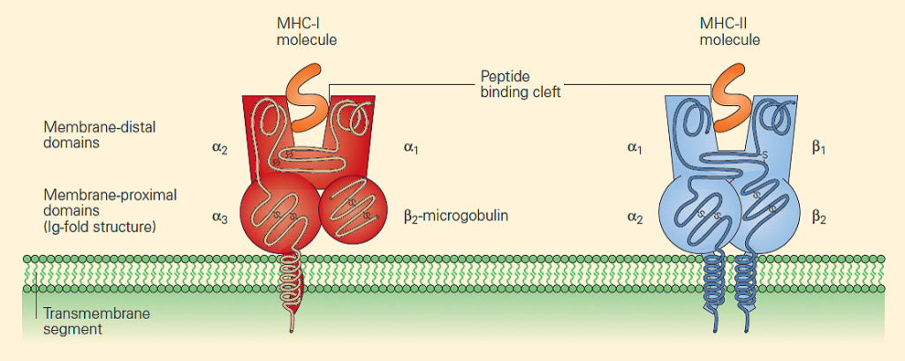
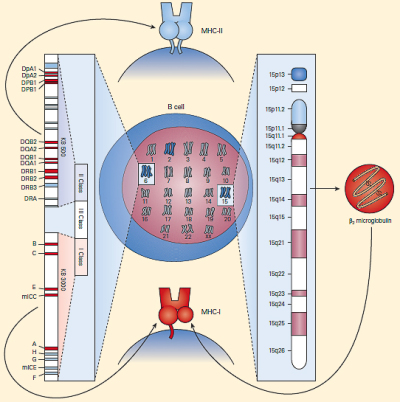
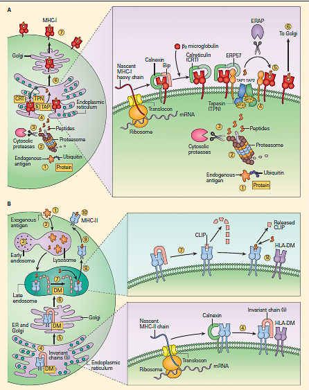

# 背景知识

- [背景知识](#背景知识)
  - [生物学知识](#生物学知识)
  - [MHC](#mhc)
    - [MHC 结构和功能](#mhc-结构和功能)
    - [MHC-I 分子的表达](#mhc-i-分子的表达)
    - [抗原呈递](#抗原呈递)
    - [抗原肽选择原则](#抗原肽选择原则)
  - [MHC-I](#mhc-i)
  - [MHC-II](#mhc-ii)
  - [B Linear](#b-linear)
  - [构象B细胞表位](#构象b细胞表位)
  - [Molecular Docking](#molecular-docking)
  - [预测软件推荐](#预测软件推荐)
  - [BepiPred](#bepipred)
  - [参考](#参考)

2021-03-22, 15:40
@Jiawei Mao
***

## 生物学知识

人体包含两套防线：

- 先天免疫系统（innate immune system），对许多病原体能迅速作出反应。
- 适应性免疫系统（adaptive immune system），对特定病原体作出反应。

B 细胞和 T 细胞是获得性免疫系统的主要组成部分，它们与抗原表位结合。为了使 T 细胞识别抗原，需要抗原肽结合到 MHC 分子上，在人体内 MHC 分子又称为人类白细胞抗原（human leukocyte antigen）。

人体被病原体（如病毒）入侵后，会产生抗体。这些抗体会和病毒表面的分子相互作用。抗体一般通过识别抗原决定簇或B细胞表位来发挥作用。B细胞表位可以理解为一簇氨基酸，它们被分泌的抗体或B细胞受体识别，并引起免疫反应。这些抗原表位的检测和预测对疫苗的研制具有重要意义。

免疫信息学主要包括B细胞和T细胞潜在表位预测算法的研究和设计。以辅助检测目标蛋白质的抗原区域。该技术有助于减少免疫原性研究的时间和成本。

首先我们从尝试重现刘等[1](#refer-1)的工作。他们使用的数据可以在网上找到，不过我们选择用 Python 重写预处理函数，这里要用到 Biopython 包。

T 细胞的 MHC I, MHC II 表位预测，

> 使用免疫信息学进行多肽疫苗开发的示意图。首先，筛选候选抗原，这些抗原可以是病毒、细菌或肿瘤特异性抗原。下一步使用免疫信息学软件寻找 MHC I，MHC II以及B细胞的表位。在这一阶段，为了评估

## MHC

MHC 是由6号染色体上一大簇基因编码的糖蛋白。它们最初因为组织移植的免疫反应而被发现。所以对应的基因复合物被称为主要组织相容性复合体（major histocompatibility complex, MHC）。在人类中这些基因通常称为人类白细胞抗原（human leukocyte antigens, HLA），因为它们最初是通过来自不同个体的白细胞之间的抗原差异被发现的。

MHC 在人类中位于 6p21.31 号染色体超过200个基因，在小鼠中位于 17 号染色体。

> MHC 区域的遗传图谱。

MHC 的主要功能是将抗原呈递给 T 细胞，以区分本我和非我。

MHC 主要有两个特征：

- 首先 MHC 是多基因的。它包含多个不同的 MHC-I 和 MHC-II 基因，因此每个人都拥有一套具有不同肽段结合特异性的 MHC 分子。
- MHC 具有极大的多态性。MHC 基因在人基因组中展现出最大多态性。在整个种群中，每个基因都有多个变体。个体从父母那里继承的变异体称为等位基因（allele）。

位点多态性主要在 MHC-I 和 MHC-II 分子的结构域（domain）发现。

虽然每个 HLA 分子的氨基酸序列具有细微差异，导致肽段结合裂隙的三维结构有细微差异，但 MHC-I 和 MHC-II 分子的基本结构十分相似。如下所示：

MHC-I 和 MHC-II 结构上十分相似，两个都包含一个容纳肽段的沟槽，沟槽的电荷特性决定了 MHC 可以呈递的肽段。不同的抗原肽段具有不同的形状和电荷特征，人类包含大量不同的 HLA 分子，每个分子都有不同形状的肽结合沟槽（cleft），以应对各种本我和非我的肽段。

### MHC 结构和功能

MHC 基因包含三个区域：MHC-I， MHC-II 和 MHC-III。

编码的经典 HLA 抗原包括 MHC-I 区域的 HLA-A，HLA-B和HLA-C，以及 MHC-II 区域的 HLA-DR, HLA-DQ和 HLA-DP。

MHC-III 区域包含多个参与补体级联的基因（C4A, C4B, C2 和 FB），TNF-a 和 TNF-b和 CYP21 基因编码一种类固醇代码相关的酶，HSP70 基因编码一个伴侣蛋白，以及其它功能不明确的基因。

所以一般说的 MHC，指代 MHC-I 和 MHC-II 分子。下图是负责 MHC-I 和 MHC-II 合成的染色体位置和基因座的示意图。

MHC-I 分子由两条多肽链组成，较大的 a 链由 6 号染色体的 MHC 区域编码，较小的 b2 微球蛋白由 15 号染色体编码。

MHC-I 的 a 链为单个肽段，该肽段包含三个胞外结构域 $\alpha_1$, $\alpha_2$, $\alpha_3$，和一个固定蛋白的跨膜区，以及胞内的一个小尾巴。

$\beta_2$微球蛋白为单个和 $\alpha$ 链非共价结合的非多肽肽段，由 15 染色体编码。

$\alpha_1$ 和 $\alpha_2$ 结构域折叠一起组成沟槽结构。

MHC-I 分子通过沟槽与抗原肽结合，并呈递给 CD8 淋巴细胞。

MHC-II 由 $\alpha$ 和 $\beta$ 两条链组成，两者均由 6 号染色体上的 MHC-II 区域编码，两条链通过非共价连接。

MHC-II 细胞膜外的近端 $\alpha_2$ 和 $\beta_2$ 结构域与免疫球蛋白的恒定结构域同源。

MHC-I 和 MHC-II 的主要差别在于它们的肽段结合沟槽的末端，MHC-II 的沟槽相关更开放。MHC-II 沟槽由 $\alpha_1$ 和 $\beta_1$ 结构域非共价组合而成。这种差异导致和 MHC-I 分子结合的肽段末端埋在分子内部，而和 MHC-II 结合的肽段没有。

这种差异使得 MHC-II 分子结合肽段的长度和类型更灵活，和特定 MHC-II 分子结合的肽段中间锚定残基相同，其它残基的长度和序列变化较大。

### MHC-I 分子的表达

MHC-I 蛋白所有有核细胞都有表达，而MHC-II 分子仅限于抗原呈递细胞（antigen-presenting cell, APC）。

淋巴细胞、巨噬细胞、树突状细胞以及某些内皮细胞是表达 MHC-II 的主要细胞。

无核细胞，如哺乳动物的红细胞，很少或者不表达 MHC-I，因此，红细胞内的病原体可能无法被 T 细胞检测到，如疟疾。

|特征|MHC-I|MHC-II|
|---|---|---|
|多肽链|单个 $\alpha$ 链（44-47 kD）和$\beta_2$ 微球蛋白（12 kD）非共价结合|单个 $\alpha$ 链（32-34 kD）和单个 $\beta$ 链（29-32 kD）结合|
|分布|所有带核细胞|抗原呈递细胞|
|抗原结合沟槽组成|$\alpha_1$ 和 $\alpha_2$ 结构域|$\alpha_1$ 和 $\beta_1$ 结构域|
|T细胞结合位点|$CD8^+$ 和 $\alpha_3$ 结合|CD4 和 $\beta_2$ 结合|
|多肽结合沟槽大小|8-11 个残基|10-30 或更多残基|
|人类中命名|HLA-A，HLA-B，HLA-C|HLA-DR,HLA-DQ,HLA-DP|

### 抗原呈递

T 细胞通过结合在细胞表面上的 MHC-I 和 MHC-II 分子的肽段识别外来抗原。抗原通常跟进它们的来源进行分类，如病毒、细菌、寄生虫等。

任何有核细胞都可以呈递细胞内抗原给 T 细胞，因为 MHC-I 的表达是普遍存在的。

而细胞外抗原由特异性的 APCs 吸收，APC 处理抗原并在 MHC-II 辅助下呈递抗原。例如，树突状细胞的一项重要功能是向 T 细胞传递第二个信号（共刺激），以提醒存在感染。

内源性抗原，包括折叠错误的蛋白，来自病原体的多肽，由蛋白酶处理。

蛋白酶产生的肽段通常包含 4-20 个氨基酸，带有疏水 C 端。

### 抗原肽选择原则

1. 尽可能是在蛋白表面
2. 保证该段序列不形成 α-helix
3. N，C 端的肽段比中间的肽段更好
4. 避免蛋白内部重复或接近重复段的序列
5. 避免同源性太强的肽段
6. 交联可以交联在N、C两端，选择依据就是交联在对产生抗体不太重要的一端
7. 序列中不能有太多的 Pro，但有一两个 Pro 有好处，可以使肽链结构相对稳定一些，对产生特异性抗体有益。

## MHC-I

细胞毒性T细胞（CD8+）识别与 MHC-I 结合被呈递到细胞表面的多肽。这些多肽通常来源于内源性蛋白质的降解，包含了细胞内蛋白质的快照，使得 T 细胞能够区分健康细胞和带有病毒、细菌或肿瘤相关突变蛋白质的细胞。MHC-I 呈递的多肽是通过一系列复杂的生化过程产生的，首先蛋白质在蛋白酶体中裂解为多肽，并被细胞质中的多肽酶进一步裂解，然后在抗原加工相关的转运蛋白（transporter associated with antigen processing, TAP)运输到内质网，在内质网中由氨基肽酶修剪，然后与MHC-I 蛋白质稳定结合。

人类的 MHC-I 基因（HLA-A，HLA-B，HLA-C）在人群水平上有着极大的等位基因变异位点，已知的上千个HLA等位基因，每个都有不同的结合肽段偏好。与 MHC-I 的高结合力是肽段呈递的首要条件，抗原呈递途径中的其它过程也发挥着重要作用。

MHC-I 呈递肽段的预测是疫苗设计、感染性疾病、自身免疫疾病以及癌症等研究的关键工具。目前使用的大多数预测工具只关注 MHC-I 结合亲和力（binding affinity, BA）预测。不过，目前已经有人提出了适合单个抗原处理（antigen processing, AP）步骤的预测，并将其与 BA 预测获得一个综合评分，在预测精度方面有少许改善。

最近积累了大量MHC-I 配体的质谱数据，为使用更大、可能更具有生物学相关性的数据集重新评估 AP 提供了机会。这些数据集中的 AP 信息可能已经在训练MHC-I BA 预测时使用，但是 AP 与 BA 交织在一起，使得解释各个信息的贡献，还可能导致较低的预测准确性。

MHC-I 抗原表位预测工具很多，如IEDB, NetCTL, MHCPred, NetMHC, nHLAPred, CTLPred, SVMHC, RANKPEP, BIMAS, MAPPP, ProPred, SYFPEITHI, PREDEP, MHCPEP.

IEDB 使用最为广泛，不过大多作为其他软件预测结果验证手段。IEDB 也可以使用 Stabilized Matrix Method (SMM)方法单独使用。

NetCTL 和 IEDB 在预测 MHC-I 病毒结合表位中使用最多，SMVHC 在预测 MHC-I 细菌结合表位中使用最多，ProPred-I, SVMHC 以及 SYFPEITHI 在肿瘤特异性表位预测中使用最多。

## MHC-II

病毒的 MHC-II 表位预测研究最多。预测工具如下：

IEDB, NetMHC-II, MHCpred-II, MetaMHC-II, MetaSVMP, Propred-II, RANKPEP, PREDIVAC, SYFPEITH, BIMAS, CTL-Pred, EpiTOP, MHCPEP, EpiVax, PREDEPP, TEPITOPE, EPIPREDICT, EpiDOCK, Concensus, and EpiMatrix.

其中 IEDB 使用最多。

IEDB 主要用于 MHC-II 结合病毒表位预测，Propred-II 用于细菌的MHC-II表位预测，MHCpred 用于肿瘤特异性的 MHC-II 表位预测。

## B Linear

预测线性表位的工具如下：

Bepipred, BCpred, ABCpred, Pcipep, BCEpred, BepiTope, PrediTop, PEOPLE, LBtope, SVMTrip, COBEpro, EPMLR and Igpred.

其中 Bepipred 使用最多。

病毒：Bepipred
细菌：BCpred
肿瘤：ABCpred

## 构象B细胞表位

Discotope, Ellipro, CBTope, Epitope, BEPro, CEP, SEPPA, CED, EPITOME, MAPOTOPE, EPCES, EPSVR and EPMETA.

病毒：Discotope, Ellipro
细菌：Discotope
肿瘤：细菌：Discotope

## Molecular Docking

分子对接是一种预测小分子或分子组合与靶点连接方式的方法。

Autodock Vina, autodock 4, Patch dock, Molegro Virtual Docker, Mti auto dock, Cluspro 2.0 and Python Prescription.

Autodock vina 和 autodock 4 使用最多。

## 预测软件推荐

MHC-I: NetCTL, IEDB
MHC-II: IEDB
B Linear: Bepipred
B Conformational B: Discotope, Ellipro
Docking: Autodock Vina, autodock 4

## BepiPred

http://www.cbs.dtu.dk/services/BepiPred-2.0/

## 参考

- [1] [Deep learning methods improve linear B-cell epitope prediction](https://doi.org/10.1186/s13040-020-00211-0)
- [immunopaedia.org](https://www.immunopaedia.org.za/)
- O’Donnell, T. J., Rubinsteyn, A. & Laserson, U. MHCflurry 2.0: Improved Pan-Allele Prediction of MHC Class I-Presented Peptides by Incorporating Antigen Processing. Cell Systems 11, 42-48.e7 (2020).
