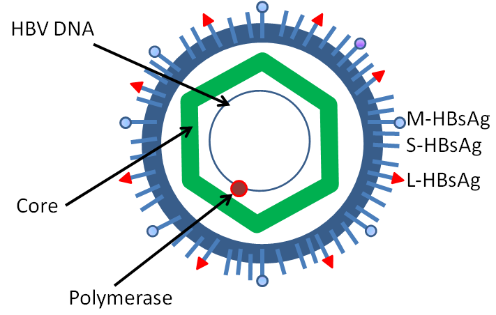
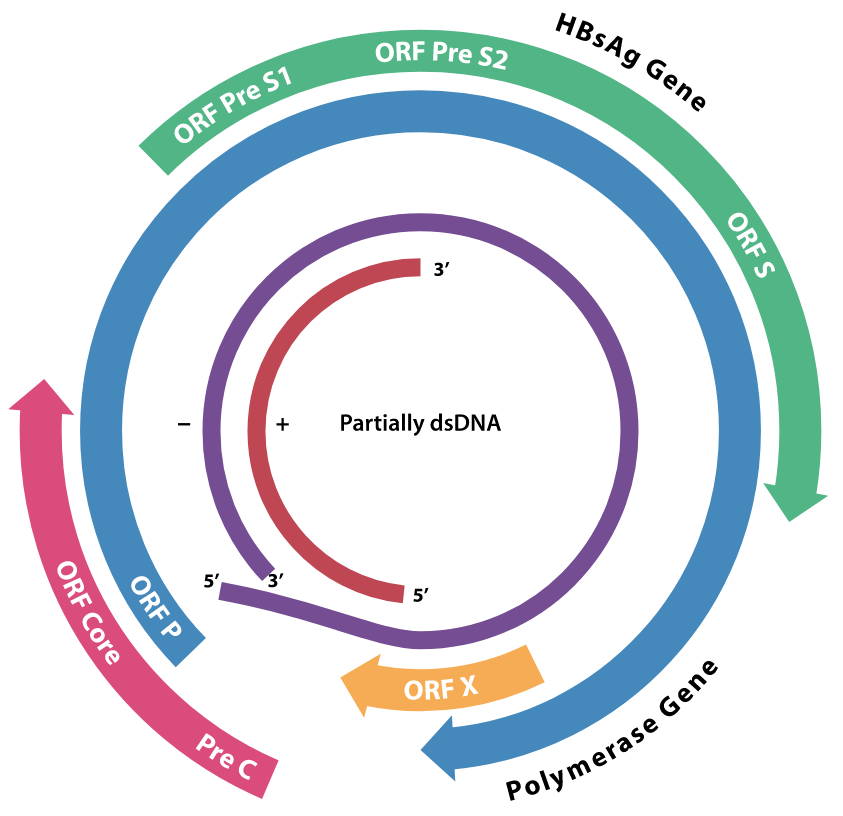

# Hepatitis B virus（乙型肝炎病毒）

- [Hepatitis B virus（乙型肝炎病毒）](#hepatitis-b-virus乙型肝炎病毒)
  - [简介](#简介)
  - [结构](#结构)
  - [基因组](#基因组)

## 简介

乙肝分为大三阳和小三阳。大三阳的 e 抗原为阳性，e 抗原为阳性说明乙肝病毒在人体细胞中处于复制状态，也说明大三阳具有较强传染性。小三阳的 e 抗体为阴性，e 抗体为阳性

## 结构

乙型肝炎病毒（HBV）属嗜肝DNA病毒科（hepadnaviridae），是肝病毒家族的一员。病毒粒子由外脂膜和一个由蛋白质组成的二十面体核衣壳核心组成。

- 核衣壳包裹着病毒 DNA 和具有类似逆转录病毒具有逆转录活性的 DNA 聚合酶。
- 外层包膜含有嵌入的蛋白质，参与病毒鱼易感细胞的结合和入侵。

该病毒是最小的包膜动物病毒之一，直径约为 42 nm，而且存在多种形态，包括丝状、球形。这些颗粒不具有传染性，由构成病毒粒子表面的脂质和蛋白质组成，称为表面抗原（HBsAg），并在病毒生命周期中大量产生。

结构组成：

- HBsAg（Hepatitis B surface antigen，乙肝表面抗原）是发现的第一个乙肝病毒蛋白，包括 Small (S)、Medium (M) 和 Large (L) 蛋白。
- HBcAg（Hepatitis B core antigen，乙肝核心抗原）是 HBV 二十面体核衣壳的主要结构蛋白，具有复制乙肝病毒的功能。衣壳的形成是细胞感染的主要因素。HBcAg 有助于在体内清楚乙肝病毒，但尚不清楚 HBcAg 是否需要以核衣壳的形式存在才有助于病毒清楚。
- HBV DNA 聚合酶与 pre-genomic RNA (pgRNA)一起被整合到核衣壳中。在衣壳中，pgRNA 进行逆转录形成 (-)DNA链，同时，大多数 RNA 模板被聚合酶的 RNA 酶活降解。接下来是(+)DNA 链的合成，聚合酶最终以共价键结合到（-）DNA 链上。病毒粒子感染新细胞后，聚合酶被丢弃。
- HBeAg（Hepatitis B envelope antigen, 乙肝包膜抗原）位于二十面体核衣壳与脂质包膜之间，但不是颗粒性的，分泌并聚集在血清中。

## 基因组

HBV 的基因组长约 3.2kb，为部分双链环状DNA。全长链的一端与病毒 DNA 聚合酶相连：

- 长链包含 3020-3320 个核苷酸
- 锻炼包含 1700-2800 个核苷酸

乙肝病毒复制的 “原始模板” 是 cccDNA。乙肝病毒 DNA 由两条螺旋的 DNA 链围成的一个环形结构。其中一条较长负链已经形成完整的环状；另一条长度较短的正链，呈半环状。半环状的 DNA 链要以负链为模板，在催化剂的作用下延长，最后生成完整的环状。此时乙肝病毒 DNA 就生成了一个完整的环状双股 DNA。这种 DNA 称为共价闭合环状 DNA（cccDNA），可以将它看做病毒复制的原始模板。模板形成后，按照模板的形状复制新的病毒基因。

HBV 基因组编码的已知基因有4个，分别是 C、P、S和 X。

- 核心蛋白由基因 C 编码（HBcAg），其起始密码子上游由一个 upstream in-frame AUG 起始密码子，生成 pre-core 蛋白；
- pre-core 蛋白水解产生 HBeAg；
- DNA 聚合酶由基因 P 编码；
- 基因 S 编码表面抗原 HBsAg。

HBsAg 基因包含一段很长的 ORF，在框内有三个起始密码子（ATG），将基因分成了三部分，S基因（S）、前 S1 基因（pre-S1）和前 S2 基因（pre-S2）。由于有多个起始密码子，产生了三种不同的多肽 pre-S1+pre-S2+S，pre-S2+S 和 S。

基因 X 的功能还不完全了解，但有证据表明它可能具有转录激活功能。
