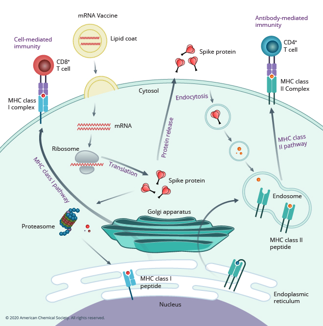

# mRNA 疫苗抗原表位预测与序列设计

Last updated: 2022-06-21, 13:46
@author Jiawei Mao
***

## 概述

在新冠肆虐的这两年，mRNA疫苗因开发、生产速度快、效率高，成功出圈，自1989年以来，首次作为一类新的治疗药物进入大众视野。mRNA疫苗除了可预防传染病，如新冠病毒、寨卡病毒、登革病毒、呼吸道合胞病毒、H7N9流感病毒及黄病毒等，也可用于预防或治疗非传染性疾病，如糖尿病和癌症等。

在 mRNA 疫苗研发中，序列设计和递送系统的选择与优化一直是被认为最重要的两大部分，抗原表位的选择往往被忽略，但从基础机制而言，抗原表位的选择既影响 mRNA 疫苗的有效性，也决定着 mRNA 疫苗所诱发的免疫反应类型，以及对病毒逃逸的抵抗力。

## mRNA 疫苗简介

mRNA疫苗主要包括两种类型:

- 非复制的 mRNA 疫苗；
- 病毒衍生的自扩增 mRNA 疫苗。

作为抗原来源的 mRNA 的一个关键优势在于它在引发 MHC-I 呈递和引起细胞毒性T淋巴细胞反应方面的高效率，使得抗原决定因素的类型和数量具有高度的通用性，允许快速开发疫苗。

体外转录(IVT) mRNA 的基本结构包括一个蛋白质编码的开放阅读框(ORF)，其两侧为5' 和 3' 非翻译区，5' 末端是 7-甲基鸟苷 帽状结构，3' 末端为 poly(a) 尾巴。mRNA 进入宿主细胞后，被细胞翻译成蛋白质。这使得mRNA疫苗适合于将细胞质或跨膜蛋白传递到正确的细胞亚结构中。下图为mRNA疫苗介导免疫应答的机制示意图[^3]。

mRNA 疫苗的常用给药途径是肌肉内注射，其他方法，如无针注射和皮内注射可行，并且在实验研究中已经显示出与传统给药途径具有相似水平的有效性。

脂质纳米颗粒(LNPs)作为一种先进的给药系统，是提高 mRNA 疫苗疗效和稳定性的一种可行方法。与裸露的 mRNA 相比，纳米颗粒包裹提供了更好的保护，防止降解，并允许灵活控制生物分布，细胞靶向和细胞摄取机制。电荷改变可释放转运体( CARTs )是另一种类型的输送系统，已被证明在某些情况下是有效的，但不普遍用于预防疫苗。

## 靶向不同疾病的 mRNA 疫苗抗原表位选择与进展

### 新冠病毒 COVID-19

新冠 mRNA 疫苗最成功的典范莫过于辉瑞/BioNTech 与 Moderna，已上市的两款疫苗**BNT162b2** 与 **mRNA-1273** 均采用相同的设计原则，抗原序列选择的均为**S-2P**，由具有两个脯氨酸突变的刺突蛋白融合前构象。其中辉瑞/BioNTech曾尝试过选择RBD区域作为抗原，即 **BNT162b1**。

辉瑞/BioNTech在2020年10月14日于《新英格兰医学期刊》发表 BNT162b1 和BNT162b2 的对比研究报告显示，BNT162b2 在第二期临床测试中相对于 BNT162b1 的严重过敏反应率更低，以 RBD 为抗原的 **BNT162b1** 的副作用---发热、头疼等出现率更高，这是 BNT162b2 被选中应用于第三期临床试验的一大原因。此外，辉瑞认为，BNT162b2 比 BNT162b1 能够产生更广泛的 T 细胞反应。两家公司此前宣布，与BNT162b1 候选物相比，接种 BNT162b2 的人类参与者在针对 SARS-CoV-2 尖峰抗原的 T 细胞反应中显示出良好的表位广度，并且 BNT162b2 表现出同时诱导高强度 CD4+ 和 CD8+ T 细胞的能力，能够对受体结合域 (RBD) 和 BNT162b1 候选疫苗中不包含的其余刺突糖蛋白作出反应。

不过 BNT162b2 与 mRNA-1273 有一个共同缺点：这两款疫苗的存储温度要求较高，Moderna 的 mRNA 疫苗需要在 -20℃ 下保存和运输（在2-8℃稳定30天），而BioNTech 更是需要在 -70℃ 下保存和运输运输（在2-8℃稳定5天）。

关于这一点，由沃森/艾博/军科院研发的 mRNA 疫苗 **ARCoV** 就要稳定的多，可在正常冰箱温度下（2-8℃）长期保持稳定（至少6个月）。艾博创始人英博曾在采访中说 “ARCoV 疫苗的 mRNA 编码是的序列优化的新冠 S 蛋白 RBD 区域，该 mRNA 长度仅为 1100nt 左右，这比 Moderna 和 BioNTech 的使用的全长S蛋白的 mRNA 序列短得多，mRNA 的序列和结构以及特定的修饰对mRNA的稳定性至关重要”。当然，mRNA疫苗的稳定还得益于优质的递送系统，艾博生物拥有具有自主知识产权的LNP，在稳定性上做了较好的改进和工艺优化。从已公布的 ARCoV 疫苗的 I 期临床与序贯接种的临床试验中，可见，ARCoV 疫苗的安全性与已上市两款mRNA疫苗相当，相对于灭活疫苗，有效性显著。

作为新技术如何应用于 COVID-19 疫苗开发的一个例子，Ahammad 和 Lira 曾提出一种疫苗设计的免疫信息学方法。利用表位预测技术演示了一个模型工作流程，包括检索SARSCoV-2 刺突糖蛋白序列，然后计算预测细胞毒性 T 淋巴细胞、辅助T淋巴细胞和线性B淋巴细胞的表位以及表位抗原性。

Ong 等人借助机器学习，利用反向疫苗学辅助设计 COVID-19 疫苗。该过程首先运行Vaxign-ML 来预测 SARS-CoV-2 的保守区域，并计算保护性抗原性评分。使用了一个优化的监督的机器学习模型，人工标注的训练数据包括细菌和病毒的保护性抗原。据预测，最有希望的候选疫苗是 S 蛋白，其次是没有在其他冠状病毒疫苗研究中测试过的nsp3蛋白。据预测，Nsp3包含混杂的 MHC-I 和 MHC-II T细胞表位(分别为28和42个)，覆盖了世界上大部分人口，以及位于蛋白质表面的线性b细胞表位。

除了编码蛋白质和基因的常见选择外，还可通过编码病毒样颗粒(VLPs)来设计SARS-CoV-2 mRNA疫苗，Lu 等人提出了三种可能的mRNA疫苗配方，包括：

1) 编码S蛋白的RBD；
2) 编码全长S蛋白；
3) 可编码形成VLPs的S和M(膜)及E(包膜)结构蛋白的mRNA混合物。

在小鼠中，通过血清评估测试这三种mRNA疫苗配方的免疫原性，发现，VLP 配方产生了优越的免疫应答(抗体和T细胞应答)。在注射部位，这三种配方的任何一种都没有观察到不良反应。

### 寨卡病毒

ZIKV 是一种 mRNA 病毒，可通过蚊虫叮咬传播，目前除支持疗法外，没有针对这种病毒的疫苗或特定治疗方法。Richhner 等人设计了一种针对 ZIKV 感染的 mRNA 疫苗，该疫苗使用优化的 LNPs 封装修饰的 mRNA，诱导体内蛋白高水平表达。包括全长prM 和 E 基因(编码prM和E蛋白,两者对寨卡病毒至关重要)。由于寨卡病毒与 DENV 病毒的相似性，有理论认为疫苗诱导的交叉反应抗体可能通过抗体依赖性增强而导致更严重的DENV感染。因此，研究人员在E- DII - FL表位(DENV E蛋白上的一个表位)或附近的四个突变上修改了ZIKV mRNA疫苗。这种改变被证明依旧对寨卡病毒具有保护作用，同时减少了细胞中增强DENV感染的抗体的产生。Richner等在接种后42天用寨卡病毒攻击AG129小鼠，评估了其mRNA疫苗的免疫原性和保护活性。除了一只小鼠，其他所有接受mRNA疫苗的小鼠，无论有没有接受加强针，都存活了下来。

Chahal等人将ZIKV的prM和E蛋白编码到RNA复制子载体中的ORF，并利用IVT制备疫苗。研究人员生成了一个重叠的15-mer肽库，生成从105到713个氨基酸的ZIKV多聚蛋白，以及7个用以诱导T细胞反应的多肽。他们用IEDB的基于ANN的模型来评估所有7个多肽的H-2Db和H - 2Kb结合表位。两个最佳排序的肽被选择用于固相肽合成(SPPS)。Chahal 等人用小鼠测试疫苗的有效性，C57BL/6小鼠肌肉内注射试验疫苗，对照组用类似的编码埃博拉病毒糖蛋白的RNA复制子疫苗免疫。与疫苗组的所有动物相比，对照组中只有2只小鼠显示出高于检测限的血清阳性。

虽然这两种mRNA疫苗都选择编码prM E蛋白作为免疫原，但它们在结构上是不同的。Richner等人设计的疫苗通过LNP递送，需要两剂；而Chahal等人设计的mRNA疫苗则是通过改良的树枝状大分子纳米颗粒作为递送载体，只需要一剂免疫。由于LNP的成熟和有效性，LNP已是mRNA疫苗的首选递送方法，但改良的树枝状大分子纳米颗粒作为递送平台也值得开发。

### 登革病毒

登革病毒(DENV)是另一种RNA病毒，近几十年来已成为全球公共卫生的威胁。Roth 等人提出CD4+和CD8+ T细胞通过靶向不同的结构/非结构蛋白，对DENV有保护作用。通过对供体人CD8+ T细胞表位的分析，筛选出DENV1-NS T细胞多表位的原型共识序列。在此基础上，制备了LNP递送的编码DENV1-NS的修饰mRNA疫苗。疫苗初次注射和加强针的注射间隔为4周，在加强针注射4周后测试疫苗效力。评估包括病毒载量的定量，脾细胞干扰素(IFN)，中和试验，结果显示，注射mRNA疫苗加强针后，对病毒有显著的保护作用。

### 呼吸道合胞体病毒

RSV是儿童呼吸道感染的常见原因。Espeseth等人设计了一种改良的以mRNA LNP为基础的RSV感染疫苗。由于其在血清型中的保守性，天然RSV感染诱导的中和抗体主要以RSV F蛋白为靶点，提供了一个有吸引力的疫苗靶点。由于RSV F蛋白难以表达和纯化，mRNA疫苗提供了高效探索多种抗原设计的能力。Espeseth等人将他们设计的mRNA疫苗注射给感染RSV- A2病毒的棉鼠，该疫苗可以表达RSV F蛋白的预融合稳定形式或天然形式。与蛋白质亚单位疫苗相比，mRNA疫苗具有更好的免疫原性。由于F蛋白跨株保守，为RSV-A株设计的mRNA疫苗也提供了对RSV-B的交叉保护。另外，在安全性上，注射了mRNA疫苗的棉鼠没有显示出疫苗引发的呼吸道疾病的迹象，这一点说明安全性较好。

### H10N8和H7N9流感

流感具有高度传染性，是世界上最常见的传染病。Feldman等人研究了第一批H10N8和H7N9流感病毒mRNA疫苗的免疫原性和安全性。这些疫苗由化学修饰的mRNAs组成，编码H10N8或H7N9流感毒株血凝素糖蛋白的全长、膜结合形式。两者都使用LNP递送系统。在Ⅰ期随机、安慰剂对照、双盲临床试验中，通过血凝抑制、微中和试验以及外周血单个核细胞持久性测试mRNA疫苗的免疫原性。在免疫接种6个月后，23名接种H10N8疫苗的参与者中有22人仍保持血清阳性，而H7N9疫苗的保护率为52%。

### 黄病毒

波瓦桑病毒(Powassan virus，简称POWV)是一种由蜱虫传播的黄病毒，它可能会导致危及生命的脑炎。VanBlargan等人设计了一种LNP递送的修饰mRNA疫苗，该疫苗由编码POWV Spooner prM和E蛋白的碱基修饰mRNA组成。该mRNA的前面是POWV的prM信号序列(也称为前导肽或转运肽)或日本脑炎病毒(JEV)的信号序列。当用POWV Spooner测试接种了两次POWV、JEV或安慰剂（LNPs）的C57BL/6小鼠时，安慰剂对照组的小鼠100%死亡，而所有接种了POWV和JEV的小鼠存活。

### 糖尿病

Firdessa-Fite和Creusot比较了LNPs和DCs这两种mRNA疫苗递送载体。该mRNA疫苗编码来自不同抗原的多个表位。该平台的一个潜在应用是针对I型糖尿病的抗原特异性免疫治疗。实验发现，这两种递送载体可用于不同的淋巴组织，经静脉注射后，DCs和LNPs递送的mRNA分别主要分布于肺和脾脏。在局部皮内给药后，两种递送方式都可以实现在注射部位的mRNA表达，以及引流淋巴结中强烈的T细胞反应。

### 癌症

基于新抗原的T细胞疗法近几年备受关注，Cafri等人开发了一种用于癌症治疗的mRNA疫苗。该疫苗名为mRNA-4650，应用自体癌组织，构建一条编码多达20种不同的新抗原的mRNA骨架，同时构建时包含了由计算机预测得到的突变。疫苗序列最终提交给Moderna Therapeutics公司进行生产，并用于治疗4名转移性胃肠道癌症患者。每个患者的mRNA疫苗基于测序数据编码不同的预测新抗原。来自患者的T细胞分析显示，对预测的新抗原的突变特异性反应增加（在接种疫苗之前没有检测到）。该疫苗的安全的已验证，进一步增强了我们未来对普通上皮性癌症患者进行个性化治疗的信心与希望。

## mRNA 疫苗设计的表位预测

抗原表位又称抗原决定簇，是免疫系统识别抗原的决定因素。

T 细胞表位指被 T 细胞受体（T-cell receptor, TCR)识别的抗原表位，表位是蛋白质降解后的多肽，**多存在于抗原分子内部**，需要经过抗原递呈细胞（antigen presenting cells, APC) 加工后与 MHC 分子结合成为复合物才能被 TCR 识别。

B 细胞表位则是由抗原表面的亲水性氨基酸组成，易于接近 B 细胞受体（BCR）和抗体分子并被识别，一般由 3~5 个在空间上相邻的（连续或不连续）氨基酸残基组成。

基于抗原表位进行 mRNA 疫苗设计目前不是主流方法，在提高 mRNA 疫苗的安全性、免疫原性和交叉反应性方面具有巨大潜力，尤其针对抗原高度变异的病毒，如新冠和HIV。

抗原设计的一个主要挑战是引起广泛的保护性反应，以对抗抗原易变的病毒，如流感。要克服保守性低、表位分散的问题。

目前 T 细胞表位预测工具较成熟，而现有的 B 细胞表位预测工具无法准确预测 B 细胞表位构象。

### 表位预测方法

表位预测方法可分为基于序列和基于结构的两种方法。

- 对基于序列的方法，一个常用方法是模式搜索（motif search），其中神经网络在关系确认和描述非线性数据方面十分有效。支持向量机（SVM）是另一种广泛应用于表位预测的模型类型，如 COBEPRO （linear B-cell epitope prediction model）和 Pcleavage (cleavage sites prediction model) 等模型。还有隐马尔可夫链、定量矩阵等方法。
- 对基于结构的方法，常用的计算方法包括肽对接、基于知识的穿线（threading）算法（knowledge-based threading algorithms）、结合能和分子动力学。

目前用于mRNA疫苗设计的表位预测方法，大多数集中在T细胞表位，公开可用的训练过的计算模型已能满足大多数科研工作者的需求。然而，对于B细胞表位，现有模型的准确性尚且无法令人满意，特别构象B细胞表位的预测。

在 T 细胞介导的临床药物研发中，需要使用表位预测选择用于癌症疫苗治疗或肿瘤特异性 T 细胞免疫监测的肽段。Hu 等人利用 NetMHCpan4.0 算法预测与高加索和东亚人群中 HLA I 类分子结合的潜在表位，表位长度 8-11。在肿瘤新抗原的表位预测中，两个群体的错义突变的平均表位数存在显著差异。

目前 B 细胞表位预测模型还很不完善：

- 目前流行的二元分类范式要求对连续结果变量进行以问题为导向的二分法；
- 已有模型无法模拟与疫苗安全性和有效性高度相关的免疫接种效果。

因此，要彻底理解 B 细胞表位预测，需要更广泛、更深入的了解免疫学系统。

Yao 等人综述了目前构象 B 细胞表位预测的算法和模型，并就其性能与常用的结合位点预测方法进行了比较。这些预测模型都使用了保守打分、结构特征、几何特征及氨基酸特征，通过机器学习算法进行线性组合。方法的性能通过 AUC-ROC 面积衡量。然而目前所有这些预测模型的准确性都很低，精度最高的 EPMeta 准确度为 25.6%。

Yao等人也提到，蛋白质结合位点预测方法也常用于构象表位预测，因为表位也可理解为蛋白质结合位点。两种方法的主要区别在于训练数据。蛋白质结合位点预测方法使用已知的蛋白质-蛋白质结合复合物进行训练，而表位预测使用抗体-抗原复合物。然而，一般的蛋白质结合位点预测方法的性能显著低于上述构象表位预测方法。这是因为蛋白质结合位点预测是基于结合区域的保守性和疏水性设计的，而 B 细胞表位区域既不保守也不疏水。

下表为已有表位预测工具总结：

|Author|Name|Algorithms|AUC|Type|
|------|------|-------|-------|-----|
|Haste Andersen et al|Discotope |Linear combination of hydrophilicity scale and epitope log-odds ratios |0.567 |B-cell |
|Sweredoski and Baldi|Bepro(PEPITO) |Linear combination of epitopic residue propensity and half sphere exposure values |0.570 |B-cell |
|Liang et al.|ElliPro |Residue protrusion index|0.585 |B-cell |
|Sun et al. |SEPPA |Linear combination of epitopic residue propensity and contactness of neighbouring residues |0.576 |B-cell |
|Rubinstein et al.|EPITOPIA |Naive Bayesian classifier |0.579 |B-cell |
|Liang et al.|EPCES |Linear method with voting mechanism |0.586 |B-cell |
|Liang et al.|EPSVR |SVR |0.597 |B-cell |
|Yao et al.|Bpredictor |Random forest classifier |0.598 |B-cell |
|Liang et al.|EPMeta |Combination of EPSVR,ref40,ref68,ref74, PEPITO and Discotope |0.638 |B-cell |
|Sela-Culang et al.|PEASE |Random forest |NA |B-cell |
|Solihah et al.|CluSMOTE |Support Vector Machine and Decision Tree|0.766 |B-cell |
|Dalkas and Rooman|SEPIa |Random forest and Gaussian Naive Bayes |0.65 |B-cell |
|Jespersen et al.|BepiPred-2.0 |Random forest |0.62 |B-cell |
|Reynisson et al.|[NetMHCpan-4.1](https://services.healthtech.dtu.dk/service.php?NetMHCpan-4.1)[^4]|Machine learning |0.994 |T-cell |
|O’Donnell et al.|[MHCflurry-2.0](https://github.com/openvax/mhcflurry)|Neural network |0.992 |T-cell |
|Moutaftsi et al.|IEDB Consensus |Scoring-matrix |0.988 |T-cell |
|Kim et al.|SMMPMBEC |SMM with amino acid similarity matrix |0.978 |T-cell |
|Peters and Sette|SMM |Stabilised matrix |0.977 |T-cell |
|Bui et al.|ARB |Average relative binding coefficient matrix |0.962 |T-cell |
|Reche et al.|Rankpep |Position specific scoring matrix ranking |0.903 |T-cell |
|Parker et al.|BIMAS |Table of coefficients |0.942 |T-cell |
|Stojanovic|MHCLovac |Physicochemical properties modeling |0.628|T-cell |
|Rammensee et al.| STYPEITHI |Allele-specific peptide motifs |0.983|T-cell |
|Altuvia et al.|PREDEP |Peptide ranking with template peptide |0.844|T-cell |
|Singh and Raghava |ProPred1 |Matrix-based prediction |0.869 |T-cell |
|Liu et al.|PAComplex |Template-based scoring |0.902 |T-cell |

总的来说，由于 B 细胞表位存在复杂的空间折叠，与 T 细胞模型相比，B 细胞表位预测模型的准确性仍然较低。

随着可用数据越来越多，NetMHCpan 等许多模型也在转向深度学习，利用不断增多的大数据通过更为复杂的方式，预测模型性性能的提高指日可待。

### 抗原表位预测在疫苗设计中的案例

Lucas Michel-todó[^5] 等基于表位设计了一种针对克氏锥虫(一种引起南美锥虫病的原生动物寄生虫)的疫苗:

- 使用 IEDB MHC-I 结合预测算法预测 T 细胞表位，在克氏锥虫蛋白组上进行预测（H > 0.5），并要求肽段与任何人类或人类微生物组蛋白的相似性小于70%，最终得到 18 条肽段。计算这些肽段的预计保护覆盖率（projected protection coverage, PPC），所有肽段的 PPC > 10%，而总的 PPC 为 88.3%。
- 对B细胞表位，同时采用基于结构和基于序列的方法。
  - $>50 \%$ 的残基是相对溶剂可及的认为是好的潜在表位，依次在寄生虫蛋白 KMP11 中鉴定到一个潜在的 B 细胞表位。
  - 基于序列的方式鉴定到 10 个与人类蛋白质同源性小于 70% 的潜在B细胞表位。

在最终设计中，共有 30 个抗原表位被纳入疫苗集合，包括 18 个CD8+ T细胞抗原表位、2个 CD4+ T 细胞抗原表位和 10 个B细胞抗原表位。

Gregory 等人[^1]针对细菌病原体设计了一种基于抗原表位的 DNA 疫苗，该疫苗涉及 HLA-II 限制性抗原表位的预测和验证。他们使用 EpiMatrix 和Epivax 对从两组细菌蛋白（一组是假定的分泌蛋白，另一组来自文献）中筛选出来的肽段进行评分。最终筛选出 14 个抗原表位纳入疫苗设计，其中 6 个为 100% 保守，4 个为部分保守。接种疫苗后，注射致死剂量病原体的小鼠存活率明显提高。

## 利用软件设计 mRNA 疫苗

辅助疫苗设计的计算工具包括表位预测、免疫原性/抗原性预测、蛋白质/基因数据库、表位识别等。

在系统生物学和结构抗原设计方面，研究表明使用基于系统模拟的元分析（meta-analytical）框架可以成功预测生物标志物。比如，Vaxjo[^6] 数据库可以辅助找到疫苗的潜在佐剂。在线软件 VaxiJen[^7] 可用于抗原预测，该软件得到广泛认可，被应用于各种研究中。其他应用于疫苗开发的生物信息学方法包括结构方法、分子动力学模拟和分子对接等。然而，由于许多预测模型的准确性不理想，计算工具尚未在 mRNA 疫苗设计中广泛应用。对研究人员来说，计算工具的使用也可能需要一个陡峭的学习曲线，许多工具需要对编程或算法有一定程度的理解才能有效地使用。

随着公开数据越来越多，机器学习等新技术开始改善计算工具在疫苗设计中的使用。在设计过程中，计算工具可以辅助研究人员预测表位、优化序列以及分析目标人群等。通过减少设计阶段的不确定性，计算可以可以帮助提供疫苗的效力。下表概述了目前可用于疫苗设计的计算工具。

|Author|Application|Software/algorithm|
|---|---|---|
|Zhang et al.[^8]|Sequence optimisation |LinearDesign |
|Multiple works |Epitope prediction |Table 3 |
|Chaudhury et al.[^9]|Adjuvant selection |Machine learning |
|Lee et al.[^10]|Immunogenicity prediction |DAMIP |
|Xu et al.[^11]|Profiling|VirScan |
|Rahman et al. [^2]|Rational vaccine design |UGENE |

> 用于疫苗设计的计算工具

### 序列优化

mRNA疫苗的主要缺点，如稳定性差、蛋白质翻译效率低，可以通过改进疫苗的序列设计来解决。为了提高mRNA疫苗的效率，Zhang等人提出了一种称为线性设计(LinearDesign)的算法来优化mRNA序列设计。该算法的基础是随机上下文自由语法(SCFG)和确定有限状态自动机(DFA)的交集。SCFG表示折叠自由能模型，DFA表示编码给定蛋白质的所有可能的同义mRNA序列的集合。

该算法的实现采用动态规划的Turner最近邻自由能模型（ Turner nearest neighbour free energy model）。它达到了O(b2*n)的复杂度，其中b是每一步的结果数量。该算法还减少了5′端先导区的冗余和二级结构。当对SARS-CoV-2的S蛋白编码mRNA进行测试时，该算法显示出了预期的效果。不过，在序列设计中显现的有效性还需在疫苗的实际应用中进一步验证。

### 表位预测与SARS-CoV-2  

免疫原性map可用于为多种疫苗开发模式提供信息。通过与SARS-CoV-2密切相关的α和β冠状病毒的比较，确定了SARS-CoV-2的保守区域。抗原的选择是基于(i)对自身免疫较高的安全性预测，以及(ii)不同肽段较高的的免疫原性。

使用都需要结构数据的两个工具BepiPred和DiscoTope2.0，同时评估B细胞表位。基于线性和构象B细胞表位评分，从S蛋白中获得了一个33-mer肽。通过将生成的33-mer肽与来自IEDB的表位进行比较，估计了预测的准确性，生成了评分最高的肽段序列，其中包含了5个获得性氨基酸残基，增加了S蛋白与ACE2的结合。此外，研究人员还提出构建多价mRNA疫苗结构，由多种编码B细胞和/或T细胞表位亚群的SARS-CoV-2微基因（minigenes）组成，以便在APCs中表达。

### 佐剂选择 

佐剂是一种化合物，用于增加疫苗平台如mRNA疫苗和亚单位疫苗的效力，在大多数情况下，mRNA序列本身不能成功诱导免疫应答。Chaudhury等人使用机器学习来识别佐剂特异性免疫反应特征，从而指导佐剂的合理选择。他们研究了两种使用相似临床特征佐剂AS01B和AS02A的疫苗，通过其所诱导的免疫反应性质（immunoprofile）来建立佐剂介导的免疫特征图谱（immune signatures），使用机器学习整合这些immunoprofile数据并识别出佐剂引起疫苗应答反应的免疫特征组合，最终利用这种计算分析便可通过免疫特征的识别区分疫苗受试者，准确率为71%。

### 免疫原性预测 

免疫原性预测是疫苗设计的另一个方面。Lee等人提出了一种新的机器学习框架，通过发现基因特征（ gene signatures）来预测疫苗的抗体反应。该框架又可定义为通过混合整数规划的判别分析(DAMIP)，集成了组合特征选择算法( combinatorial featureselection algorithm)和基于优化的分类模型(optimisation-based classification model)。训练数据为高通量收集的与免疫反应、细胞运动和生物聚合物代谢相关的基因表达数据。8条DAMIP规则的预测精度至少达到80%，部分规则的盲预测率达到90%。对流感疫苗进行的类似测试，结果准确率为85%。

### 血清学分析

特定人群接触到的病毒或病毒株的信息对于疫苗设计也颇为重要。血清学分析可以提供病毒暴露的重要信息。Xu等人提出了一种计算方法，即VirScan，以识别个体所暴露的病毒类型。该方法以经验设置阈值数并通过计算每个病毒的肽段富集数量来识别病毒。在对艾滋病和丙肝患者的血清样本进行测量时，VirScan可达到非常高的灵敏度及不低于95%的特异性。它还可以用于血液样本，以检测不会引起病毒血症的病毒。尤其是针对特定人群，这些工具对疫苗设计还是很有帮助。

### 合理的疫苗设计 

合理的疫苗设计是一种寻找和改进当前疫苗设计中次优方法的设计策略。mRNA疫苗长期存在可被RNA酶快速降解，并只能诱导适度的DC激活的问题。最近学界提出了一种双组分的mRNA疫苗，由鱼精蛋白复合物mRNA和裸mRNA混合而成，皮内注射可同时实现预防和治疗性抗肿瘤作用。目前的mRNA疫苗包含结构修饰，如加帽、加尾、假尿苷修饰等。Ⅰ型干扰素IFNs是抗病毒宿主防御机制中的重要分子,然而，它们可能会干扰mRNA的表达，在合理的疫苗设计中应加以考虑。

一个关于保守性表位预测的案例是Rahman等人利用UGENE(一种提供集成生物信息学工具的应用程序)来识别寨卡病毒的保守区域。他们使用三种计算模型来预测保守区域，三种方法中的常见肽被选为候选抗原表位。在E蛋白中发现1个表位，在NS5蛋白区域发现2个表位。在305个寨卡病毒序列中，3个候选抗原表位均100%保守。

## 总结

对于SARS-CoV-2 mRNA疫苗，目前两家最大的竞争对手都使用了相同的传递系统和免疫原设计。虽然这种设计引起了类似于自然病毒感染的免疫反应，并在临床试验中显示了较高的有效性，但它仍有待优化的空间，以便更有效、更稳定的呈现表位。

首先，预融合构象在进入机体后可能需要额外的维持条件，因为大分子可能会被环境因素改变。其次，另一种免疫原(如N蛋白)也可加以考虑，添加不同的免疫原可以帮助提高疫苗的效力，并减少突变逃逸的可能性。第三，尽管在疫苗中使用S蛋白的原始构象可以模仿自然的病毒感染，但T细胞和中和抗体只能结合特定的肽段，而不能结合整个蛋白质，只编码必要的表位可以释放更多的空间，并增加mRNA疫苗的稳定性。此外，如果SARS-CoV-2的S蛋白发生显著突变，可以逃避现有疫苗提供的免疫，那么重新调整表位以适应新的突变将比设计和编码新的S蛋白构象更容易。基于此，表位预测将是助力疫苗设计的有力工具。

本文所讨论的表位预测方法主要针对T细胞表位，不能用于体液反应的评估。对于B细胞表位，有限的计算预测方法还难以获得令人满意的结果。训练一个准确的构象B细胞表位预测模型可能是改进基于表位的疫苗设计的下一步。

## 参考

- Cai, X., Li, J. J., Liu, T., Brian, O. & Li, J. Infectious disease mRNA vaccines and a review on epitope prediction for vaccine design. Briefings in Functional Genomics 20, 289–303 (2021).

[^1]: Gregory, S. H. et al. Epitope-based vaccination against pneumonic tularemia. Vaccine 27, 5299–5306 (2009).
[^2]: Rahman, A., Hossain, M. I., Tamanna, S. & Ullah, M. N. Recognition of A Highly Conserved DSRCPTQ Epitope in Envelope Protein of Zika Virus Through in silico Approaches. 2020.02.11.943530 (2020) doi:10.1101/2020.02.11.943530.
[^3]: https://www.cas.org/resource/blog/covid-mrna-vaccine
[^4]: https://academic.oup.com/nar/article/48/W1/W449/5837056
[^5]: Michel-Todó, L. et al. In silico Design of an Epitope-Based Vaccine Ensemble for Chagas Disease. Frontiers in Immunology 10, (2019).
[^6]: https://www.violinet.org/vaxjo/
[^7]: http://www.ddg-pharmfac.net/vaxijen/VaxiJen/VaxiJen.html
[^8]: Zhang, H. et al. LinearDesign: Efficient Algorithms for Optimized mRNA Sequence Design. arXiv:2004.10177 [q-bio] (2020).
[^9]: Chaudhury, S. et al. Combining immunoprofiling with machine learning to assess the effects of adjuvant formulation on human vaccine-induced immunity. Human Vaccines & Immunotherapeutics 16, 400–411 (2020).
[^10]: Lee, E. K. et al. Machine Learning for Predicting Vaccine Immunogenicity. Interfaces 46, 368–390 (2016).
[^11]: Xu, G. J. et al. Comprehensive serological profiling of human populations using a synthetic human virome. Science 348, aaa0698 (2015).