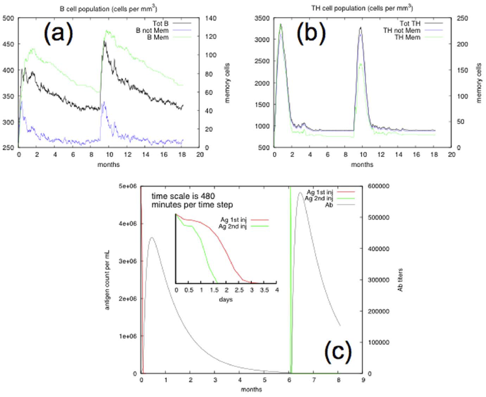
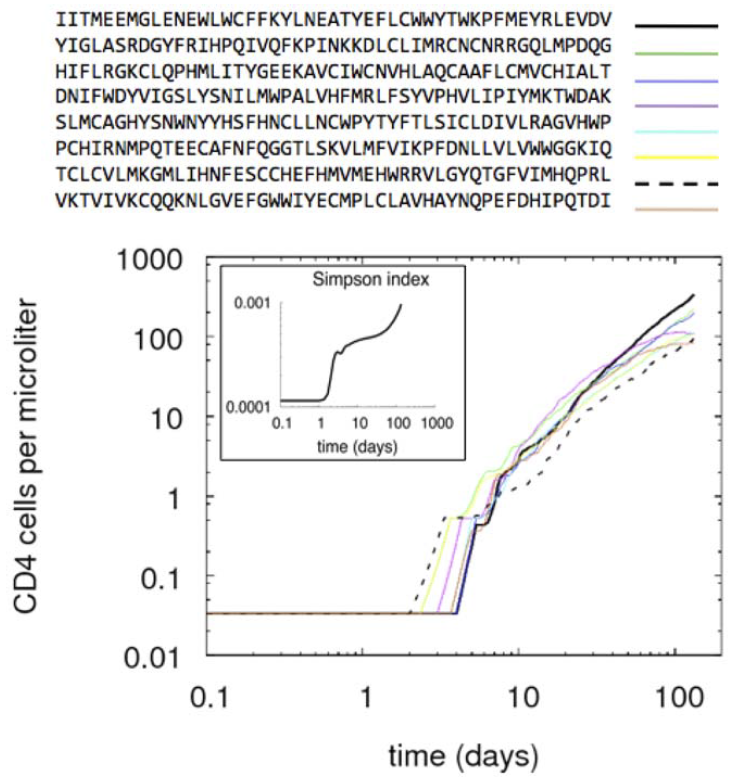
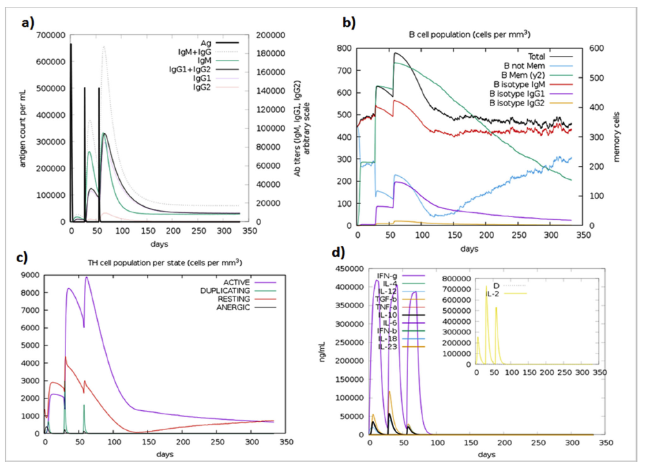
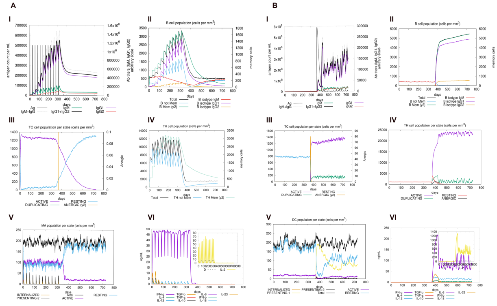

# C-ImmSim

- [C-ImmSim](#c-immsim)
  - [简介](#简介)
  - [免疫系统模拟](#免疫系统模拟)
    - [相关工作](#相关工作)
    - [免疫多样性的 bit string 模型](#免疫多样性的-bit-string-模型)
    - [C-ImmSim 上一版](#c-immsim-上一版)
  - [讨论](#讨论)
    - [免疫实验](#免疫实验)
    - [Immunodominance or affinity maturation](#immunodominance-or-affinity-maturation)
    - [Homozygote vs heterozygote](#homozygote-vs-heterozygote)
  - [使用](#使用)
    - [参数](#参数)
    - [选择 HLA Haplotype](#选择-hla-haplotype)
    - [计算肽段免疫原性](#计算肽段免疫原性)
  - [示例](#示例)
    - [示例 1](#示例-1)
    - [示例2](#示例2)
    - [示例 3](#示例-3)
  - [参考](#参考)

2022-02-02, 21:50
***

## 简介

C-IMMSIM 模型模拟以下部分：

1. 淋巴细胞形成的成熟所在，初级淋巴器官，即骨髓和胸腺；
2. 二级淋巴器官，如淋巴结，负责过滤淋巴液，也是抗原呈递给原始 B 细胞 和 T 细胞的地方；
3. 外周组织，依赖于所考虑的病原体，对 COVID-19 为肺。

在 C-IMMSIM 中，初级淋巴器官只是淋巴细胞来源，配备随机生成受体功能（这里受体只是互补决定区，complementarity-determining region, CDR）；二级淋巴器官和组织被映射到一个三维笛卡尔网格上（由于初始细胞均匀分布在网格，扩散也是各向同性的，所以空间性并没有发挥作用）。

C-IMMSIM 模拟的时间步长为 8 h。

除了细胞间的相互作用，C-IMMSIM 还模拟了胞内抗原的摄取和呈递过程。内源性抗原碎裂并与 MHC-I 类分子结合，在细胞表面呈递给 CTL 受体（胞质途径）；外源性抗原被降解成片段，然后与 MHC-II 类分子结合，呈递给 T 辅助细胞的受体（内吞途径）。

## 免疫系统模拟

免疫系统可以看作一个经典的耦合组件系统，具有出生、死亡和交互元素。常见的建模方法通常使用常微分方程（Ordinary Differential Equations, ODE）或偏微分方程（Partial Differential Equations, PDE）直接描述总体随时间的演化。在免疫学中，这个总体可以是病毒颗粒的总浓度或细胞个数。基于 ODE 和 PDE 的模型使用成熟的分析和数值计数，但可能过度简化系统：总体后离散实体只由一个连续变量描述。基于微分方程的数学模型已被证明非常有用。

每个实体（如细胞）都由一个代理（agent）单独表示，代理之间的交互由一组规则定义，这些规则可以包含随机成分。这些规则反映了当前的免疫学知识，但它们可以被特别定义，以测试关于免疫系统运行的新假设。

Celada 和 Seiden 最早尝试定义基于 agent 的免疫机制模型，目的是尽可能多地捕捉免疫系统的动态。后又有了针对 HIV-1 感染，EBV 感染、超敏反应和癌症免疫预防的 Celada-Seiden 模型。

C-IMMSIM 是一个用于研究不同免疫过程的 Celada-Seiden 模型。最初的模型使用 bit-string 表示生物实体的受体（receptor）。

### 相关工作

Simmune 旨在提供一个灵活的平台，可模拟任何免疫过程。它更像一种建模技术和描述模型的语言，而不是单纯的模型。Simmune 以特定形式表示粒子之间的相互作用，可以用来创建详细的免疫系统模型。粒子唯一网格上，它们的状态在离散时间步上更新，这样时间和空间都是离散的。Simmune 中的粒子可以处于不同状态。状态间的转变是有限范围内的信使粒子交换触发的概率事件。信使场强由反应扩散方程的积分计算，通常包含一个激活阈值。Simmune 的一个主要优势是，它既可以模拟细胞间的直接相互作用（如抗原和 B 细胞之间的相互作用），也可以模拟分子信使介导的相互作用（如淋巴因子）。它还支持空间划分和通信管道。

Basic Immune Simulator (BIS) 是几种基于 agent 的模型，用于研究先天免疫和适应性免疫系统中细胞之间的相互作用。BIS 模拟基本细胞类型、介质和抗体，并由三个虚拟空间代表实质组织、二级淋巴组织和淋巴/体液循环。BIS 翻译先关和适应性免疫反应的机制细胞核分子知识，并复制免疫系统的复杂行为模式。它一方面被用作教育工具，以展示这些模式的出现，也作为研究工具，系统地确定潜在的目标，以更有效地治疗疾病过程，包括超敏反应、自身免疫和癌症。

Simisys 是一个基于元胞自动机的方法，可以模拟成千上万个细胞。可以表示先天性免疫和适应性免疫。具体来说，模型中包括巨噬细胞、树突状细胞、中性粒细胞、自然杀伤细胞、B 细胞、、T 辅助细胞、补体蛋白和致病菌。

### 免疫多样性的 bit string 模型

免疫系统的一个基本任务时通过细胞受体识别和结合抗原。结合机制基于物理化学过程，如非共价相互作用、氢键以及范德华力等。

决定分子间结合的特征可以用形状空间（shape-space）来表示。假设形状空间可以用 K 个参数描述，K 维空间中的一个点指定了一个绑定区域的广义形状。后来，Framer 等引入二进制字符串来表示受体的广义形状。

### C-ImmSim 上一版

C-ImmSim 是用 ANSI C 语言实现的。简而言之，它包含一个三维的随机细胞自动机，主要包括淋巴细胞（T 辅助淋巴细胞 (Th)，细胞毒性 T 淋巴细胞（CTL）、B 淋巴细胞和产生抗体的浆细胞（PLB））、骨髓细胞系（巨噬细胞）和树突状细胞（DC）。所有这些实体根据一套规则进行相互作用，这些规则描述了免疫系统对病原体的识别和反应过程的不同阶段。

该模型主要表示三级淋巴器官的一部分，如淋巴结、扁桃体和脾脏。三级淋巴器官器官是抗原呈递给免疫细胞的部位。C-IMMSIM 同时模拟哺乳动物中三个独立解剖区域的三个隔间：

1. 模拟造血干细胞的骨髓，产生新的淋巴细胞和骨髓细胞；
2. 胸腺，选择原始 T 细胞以避免自体反应；
3. 三级淋巴器官，如淋巴结。

三级淋巴器官被映射到 3D 网格上。在每个时间步，细胞和分子之间的交互都发生在网格点上。每个时间步实体的扩散模拟分子在淋巴器官的扩散。

在模拟开始前，使用一组肽段来定义 "自我"。其它所有都被定义为 "非我"。潜在的病原体，以及细胞受体和 MHC 分子（人类白细胞抗原，HLA）被表示为 binary string。

在模型中，所有细胞有两个状态：活跃或者休眠。这意味着没有考虑原始细胞。因此，所有达到三级淋巴器官的细胞都已经成熟。T 淋巴细胞例外，因为它们在进入循环之前经过胸腺的选择。

C-IMMSIM 整合了以下假设和理论：

1. 元素的多样性；
2. 抗原处理和呈递；
3. MHC 限制性；
4. 细胞间合作；
5. 响应和记忆的成熟；
6. 通过抗原亲和克隆选择；
7. T 淋巴细胞的胸腺教育（克隆缺失理论）；
8. 抗体的高度变异；

## 讨论

### 免疫实验

在该实验中，通过在两个时间点注射免疫原蛋白复制典型的免疫过程。作为抗原分子的 AA string 来自 HIV-1 的 gag 分子。

在时间 0 注射看管，然后在 6 个月（模拟时间）再次注射。随着记忆淋巴细胞的显著增加，系统产生了典型的一次和二次免疫反应，如下图所示：

(a) 和（b）分别展示了 B 淋巴细胞和辅助 T 淋巴细胞每立方毫米的细胞数量。同时显示了淋巴细胞的总数和免疫记忆室（immune memory compartment）。在第一次反应时发展起来了免疫记忆。因此，第二次注射反应要快很多，如图(c)所示，显示了免疫系统清除抗原所需的时间。

总之，这种模拟的动态与现实的免疫过程时一致的，由于长期记忆的发展，它们显示了更快的二次反应。

### Immunodominance or affinity maturation

在该实验中，测试长期暴露同一免疫原分析的情况下出现一个或多个主导淋巴细胞克隆。换句话说，我们检查系统是否再现了亲和力成熟（affinity maturation）的现象。为了模拟长期暴露于病原体，我们在整个模拟期间反复注释一定量的 HIV/gag 蛋白。

该系统从暴露开始就产生特定的免疫反应。随着模拟的进行，高亲和力克隆在表达水平方面超过了原始克隆，最终以比其它任何克隆更高的水平增殖。如下图所示，其中排名靠前的克隆的 辅助T淋巴细胞与特定的 TCR 一起显示。

> 辅助 T 淋巴细胞的数量是参与免疫反应最具代表性的克隆，如抗原特异性克隆。

需要注意的是，虚线对应于第一个出现的克隆，而连续线显示了后面出现的克隆，先对第一个虚线克隆具有更好的亲和力。在上图中还给出了 Simpson 指数 $D=\sum_i {(n_i/N)}^2$，其中 $n_i$ 是特异性为 i 的克隆数，$N=\sum_i n_i$。随着时间的推移，D 指数的增加说明出现了占主导地位的克隆。即 D 值越大，多样性越低。

### Homozygote vs heterozygote

C-ImmSim 模型描述了哺乳动物免疫系统对抗原（病毒、细菌等）在细胞水平存在的体液和细胞反应。

## 使用

### 参数

- **Simulation Steps**

执行模拟的步数，每一步对应 8h。

### 选择 HLA Haplotype

C-IMMSIM 模型考虑了不同 HLA haplotype 呈递肽段的差异。为了实现该目的，每个 HLA 分子都配置了一列肽段和对应的结合倾向。这个列表是使用第三方工具计算出来的。

选择在美国人中最普遍的两个 HLA-A、两个 HLA-B 和两个 DRB 等位基因。即：HLA-A*02:01, HLA-A*24:02, HLA-B*35:01, HLA-B*40:02,
DRB1*07:01, DRB1*15:01.

### 计算肽段免疫原性

使用SARS-CoV-2 菌株 NCBI 参考序列 NC_045512.2。使用其所有蛋白序列识别 CTL 肽段和 HTL 肽段。这里使用了两个工具，对 CTL 表位，使用 IEDB 的 MHC-I 预测工具 "ANN 4.0 prediction method" 预测 9-mer CTL 肽段与 HLA-I （即 HLA-A*02:01, HLA-A*24:02, HLA-B*35:01, HLA-B*40:02）的亲和力。

## 示例

### 示例 1

Abraham Peele,K. et al. (2021) Design of multi-epitope vaccine candidate against SARS-CoV-2: a in-silico study. Journal of Biomolecular Structure and Dynamics, 39, 3793–3801.

> C-IMMSIM 模拟疫苗接种后免疫应当结果；(a) 抗原和免疫球蛋白；(b) B 淋巴细胞总数；(c) CD4+ 辅助 T 细胞数目；(d) 诱导的细胞因子水平和 Simpson index。

高水平的 IgM 表明初步反应。

### 示例2

Kar,T. et al. (2020) A candidate multi-epitope vaccine against SARS-CoV-2. Sci Rep, 10, 10895.

对目前使用的大多数疫苗，第 1 针和第 2 针之间推荐的最短时间间隔为 4 周。总的模拟时间为 1,400 time steps，大概 15 months。两个肽段注射时间为 10, 94, 178, 262, 346, 430, 514, 598, 682, 766, 850, 934。活病毒在 time step 1,100 注射，大概是 12 个月的时候。

> 在 12 个月内注射 12 次疫苗。(Ai) 显示抗原浓度升高和抗体反应。在最后一次接种疫苗两个月后，用 live-replicating 病毒进行感染。由于免疫球蛋白的存在，病毒立即被清除，从而显示了疫苗的效力。(Aii) 显示相应数量的抗体。（Aiii-Av）显示 CTL、复制 T 细胞和巨噬细胞

模拟生成的二次响应和三次响应显著高于初次响应。第二次和第三次反应显著抗原浓度下降，免疫球蛋白活性正常（即 IgG1+IgG2, IgM, IgG+IgM 抗体）。另外，还发现多个持久的B细胞同种型，表明可能形成记忆（Aii）。TH（辅助）和TC（细胞毒性）表现出类似的较高的反应。

### 示例 3

Dong,R. et al. (2020) Contriving Multi-Epitope Subunit of Vaccine for COVID-19: Immunoinformatics Approaches. Frontiers in Immunology, 11.

注射 3 次疫苗，间隔 4 轴。simulation volume 为 1,000，

## 参考

- https://www.iac.rm.cnr.it/~filippo/c-immsim/index.html
- https://kraken.iac.rm.cnr.it/C-IMMSIM/
- Rapin,N. et al. (2010) Computational Immunology Meets Bioinformatics: The Use of Prediction Tools for Molecular Binding in the Simulation of the Immune System. PLOS ONE, 5, e9862.
- Castiglione,F. et al. (2021) From Infection to Immunity: Understanding the Response to SARS-CoV2 Through In-Silico Modeling. Frontiers in Immunology, 12.
- [等位基因频率检索](http://www.allelefrequencies.net/)
- https://150.146.2.1/C-IMMSIM/
