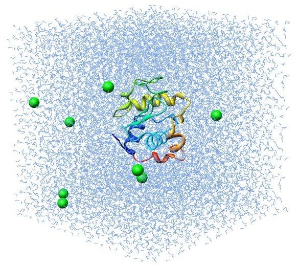
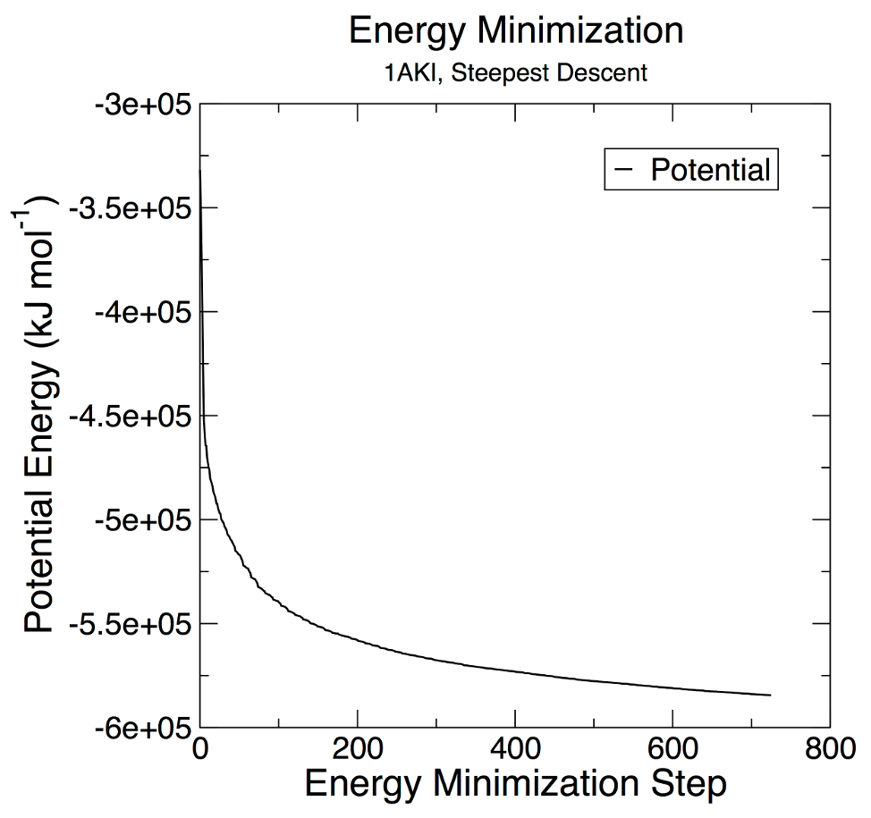
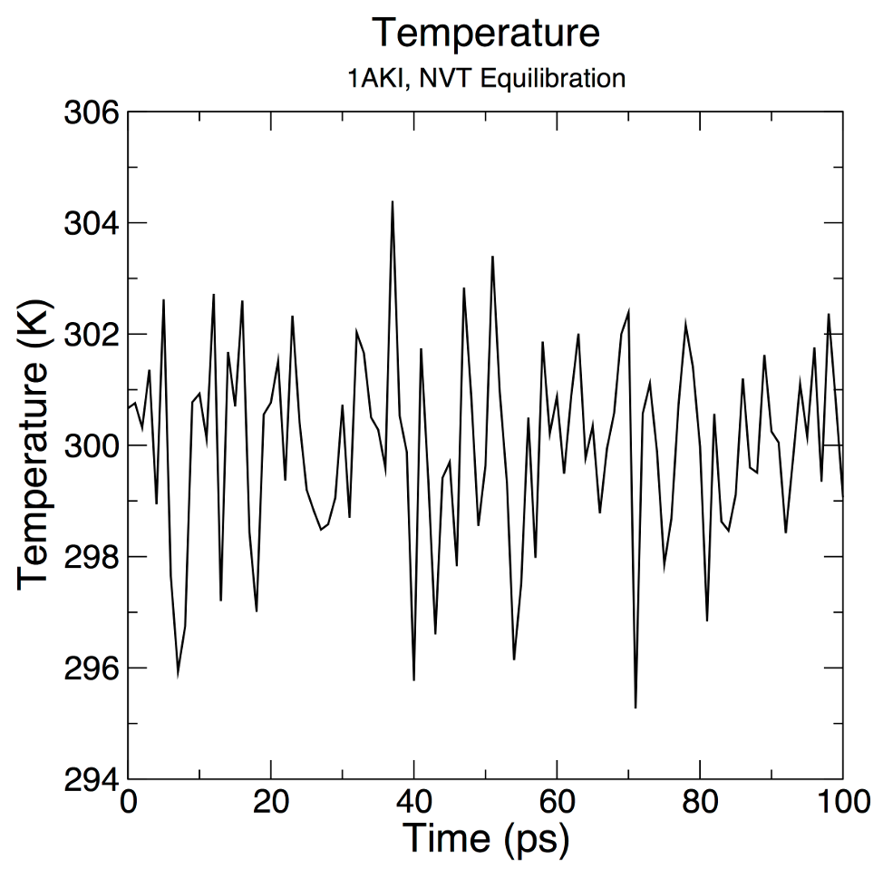
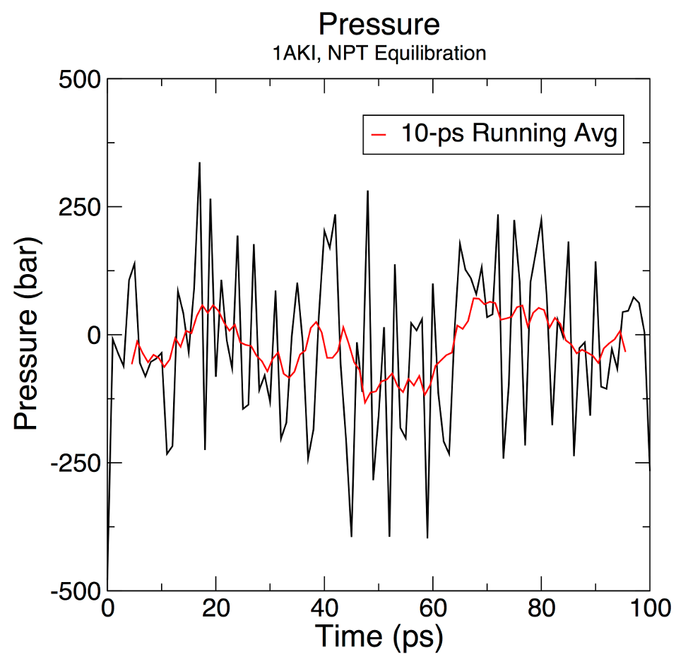
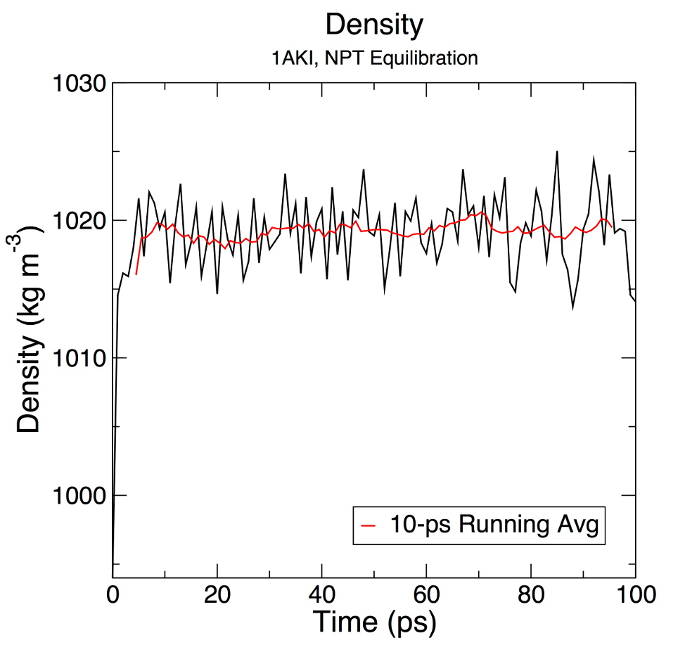
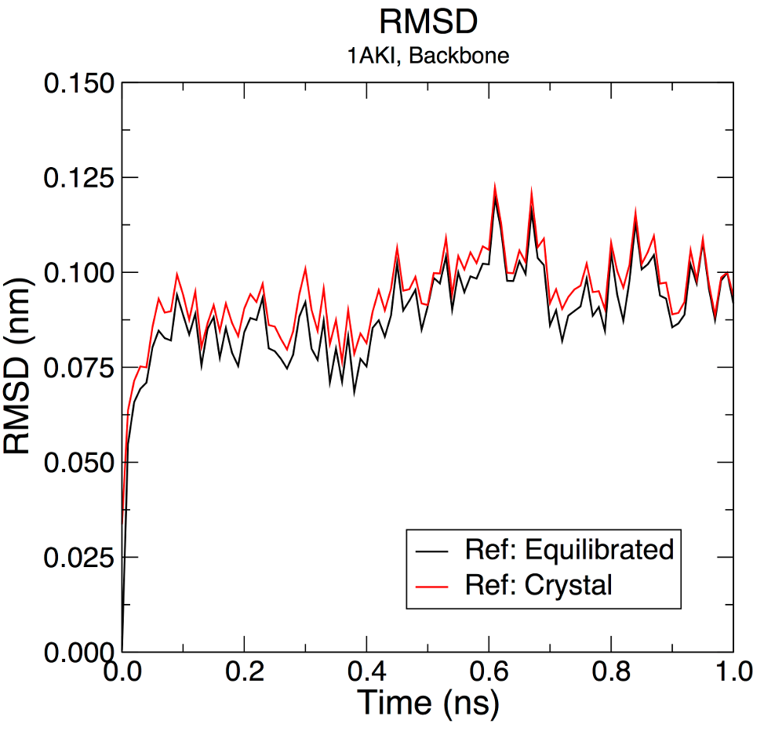
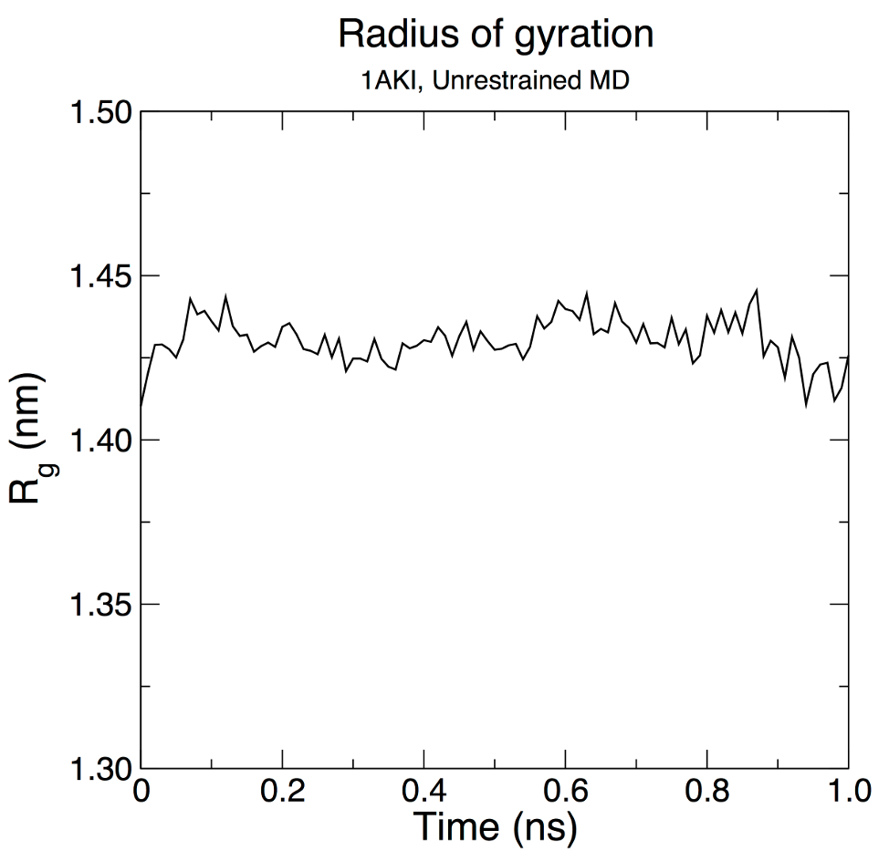

# 溶菌酶在水里的模拟

- [溶菌酶在水里的模拟](#溶菌酶在水里的模拟)
  - [简介](#简介)
  - [准备拓扑](#准备拓扑)
    - [GROMACS 基础](#gromacs-基础)
    - [生成溶菌酶的拓扑](#生成溶菌酶的拓扑)
    - [拓扑文件内容](#拓扑文件内容)
  - [定义溶剂盒子](#定义溶剂盒子)
  - [添加离子](#添加离子)
  - [能量最小化](#能量最小化)
  - [NVT 平衡](#nvt-平衡)
  - [NPT 平衡](#npt-平衡)
  - [完成 MD](#完成-md)
    - [GPU 上运行 GROMACS](#gpu-上运行-gromacs)
  - [分析](#分析)
  - [进一步分析](#进一步分析)
  - [总结](#总结)
  - [操作总结](#操作总结)
  - [参考](#参考)

2022-05-24, 17:16
****

## 简介


该教程模拟一个简单的蛋白质（溶菌酶）在包含离子的水中行为。每个步骤详细解释了输入和输出，这些输入文件中所用的设置都很典型，因此，你在进行模拟时也可以采用这些设置。

## 准备拓扑


### GROMACS 基础

GROMACS 5.0 之后，所有 GROMACS 工具都称为 "gmx" 程序的模块。之前的版本所有工具都作为单独的命令调用。在 5.0 中，这些工具仍然可以通过符号链接实现单独命令调用，但不推荐。可以调用如下命令查看 GROMACS 模块帮助信息：

```sh
gmx help (module)
```

或者

```sh
gmx (module) -h
```

将 `(module)` 替换为具体的命令名称，就会输出相关信息，包括可用算法、选项、所需文件格式、已知的 bugs 和限制等。对 GROMACS 新用户来说，查看命令的 help 信息是一种很好的学习方式。

### 生成溶菌酶的拓扑

首先下载溶菌酶（Lysozyme）的蛋白质结构文件。本教程我们使用鸡蛋白溶菌酶（PDB 1AKI）。到 [RCSB](https://www.rcsb.org/) 下载 1AKI 的 PDB 文件。下载完成后，可以使用 VMD, Chimera, PyMOL 等可视化程序来查看这个蛋白的结构。

然后，需要去掉蛋白上面的结晶水。可以用纯文本软件打开结构文件，删除 PDB 文件中的水分子（HOH 残基）。也可以使用 grep 

```sh
grep -v HOH 1aki.pdb > 1AKI_clean.pdb
```

也可以使用 PyMOL 载入 pdb 文件，然后用 `remove solvent` 命令移除水分子。需要注意的是，不是任何时候都需要去除水分子，比如与活性位点结合的水分子就不能去除。本教程不需要结晶水，所以去掉。

一定要仔细检查 pdb 文件中 MISSING 注释下的内容，因为这些是晶体结构中缺失的原子或残基。在模拟中，末端残基的缺失影响不大，但是内部缺失的原子或残基会导致 `pdb2gmx` 运行失败。可以使用其它软件包对这些缺失的原子/残基进行建模。

需要注意的是，`pdb2gmx` 不是万能的，不是所有分子它都能生成拓扑结构，而仅限于力场中定义的残基（*.rtp 文件，通常包括蛋白质、核酸以及有限的辅助因子，如 NAD 和 ATP）。

现在已经移除了结晶水，并且确定没有缺失原子，且 pdb 文件只包含蛋白质原子，可以将其作为 GROMACS 模块 `pdb2gmx` 的输入。`pdb2gmx` 用来生成三个文件：

1. 分子拓扑文件
2. 位置约束文件
3. 后处理结构文件

拓扑文件（topol.top）包含模拟中所用分子的所有必需信息，包括非键参数（原子类型和电荷）和键合参数（键、角度和二面角）。

使用如下命令执行 `pdb2gmx`：

```sh
gmx pdb2gmx -f 1AKI_clean.pdb -o 1AKI_processed.gro -water spce
```

然后 gmx 会提示选择一个力场：

```sh
Select the Force Field:

From '/usr/local/share/gromacs/top':

 1: AMBER03 protein, nucleic AMBER94 (Duan et al., J. Comp. Chem. 24, 1999-2012, 2003)
 2: AMBER94 force field (Cornell et al., JACS 117, 5179-5197, 1995)
 3: AMBER96 protein, nucleic AMBER94 (Kollman et al., Acc. Chem. Res. 29, 461-469, 1996)
 4: AMBER99 protein, nucleic AMBER94 (Wang et al., J. Comp. Chem. 21, 1049-1074, 2000)
 5: AMBER99SB protein, nucleic AMBER94 (Hornak et al., Proteins 65, 712-725, 2006)
 6: AMBER99SB-ILDN protein, nucleic AMBER94 (Lindorff-Larsen et al., Proteins 78, 1950-58, 2010)
 7: AMBERGS force field (Garcia & Sanbonmatsu, PNAS 99, 2782-2787, 2002)
 8: CHARMM27 all-atom force field (CHARM22 plus CMAP for proteins)
 9: GROMOS96 43a1 force field
10: GROMOS96 43a2 force field (improved alkane dihedrals)
11: GROMOS96 45a3 force field (Schuler JCC 2001 22 1205)
12: GROMOS96 53a5 force field (JCC 2004 vol 25 pag 1656)
13: GROMOS96 53a6 force field (JCC 2004 vol 25 pag 1656)
14: GROMOS96 54a7 force field (Eur. Biophys. J. (2011), 40,, 843-856, DOI: 10.1007/s00249-011-0700-9)
15: OPLS-AA/L all-atom force field (2001 aminoacid dihedrals)
```

力场包含要写入拓扑文件的信息，其选择非常重要。这里我们选择 OPLS 力场，因此输入 15，然后回车。

`pdb2gmx` 有很多选项，常用的有：

- `-ignh`：忽略 PDB 文件中的氢原子，对 NMR 结构特别有用。如果有氢原子，氢原子名称和顺序必须与 GROMACS 力场中完全一样。由于存在不同的惯例，因此处理 H 原子可能很令人头疼。如果需要保留初始 H 原子坐标，但需要重命名，则可以使用 Linux 的 `sed` 命令。
- `-ter`：以交互的方式为 N 端和 C 端分配电荷状态。
- `-inter`：以交互的方式为 Glu, Asp, Lys, Arg 和 His 分配电荷状态；选择与二硫键相关的 Cys。

运行后，会生成三个文件：1AKI_processed.gro，posre.itp 和 topol.top：

- 1AKI_processed.gro 是 GROMACS 格式的结构文件，包含力场中定义的所有原子；
- topol.top 是体系的拓扑文件；
- posre.itp 包含限制重原子位置的信息。

最后说明一点，.gro 文件不是必需的。GROMACS 可以处理多种文件格式，.gro 只是写入坐标文件命令的默认格式。.gro 格式紧凑，但精度有限。如果你喜欢 PDB 格式，只需要将 .pdb 作为输出文件的扩展名。

`pdb2gmx` 的目的是生成与力场兼容的拓扑文件，输出的结构文件只是其副产物。

### 拓扑文件内容

让我们看看 `pdb2gxm` 输出的拓扑文件 `topl.top` 里面有什么。使用纯文本编辑器打开，跳过注释行（以 ; 开头的行），第一行为：

```c
#include "oplsaa.ff/forcefield.itp"
```

这一行调用了 OPLS-AA 力场的参数。它在文件开头，表明后续所有参数都源自此力场。

下一个重要的内容是 `[ moleculetype ]`，如下：

```txt
[ moleculetype ]
; Name            nrexcl
Protein_chain_A     3
```

其中：

- "Protein_chain_A" 为分子名称，说明这个蛋白在 PDB 文件中被标记为 chain A。
- 3 表示对键合紧邻的排除数为 3。

接下来定义蛋白的原子信息。如下：

```top
[ atoms ]
;   nr       type  resnr residue  atom   cgnr     charge       mass  typeB    chargeB      massB
; residue   1 LYS rtp LYSH q +2.0
     1   opls_287      1    LYS      N      1       -0.3    14.0027
     2   opls_290      1    LYS     H1      1       0.33      1.008
     3   opls_290      1    LYS     H2      1       0.33      1.008
     4   opls_290      1    LYS     H3      1       0.33      1.008
     5  opls_293B      1    LYS     CA      1       0.25     12.011
     6   opls_140      1    LYS     HA      1       0.06      1.008
```

这些信息的含义：

- nr: 原子编号
- type: 原子类型
- resnr: 氨基酸残基编号
- residue: 氨基酸残基名称
在 PDB 文件中该残基为 "LYS"，在 .rtp 中 "LYSH" 表示质子化的 LYS，是中性 pH 下 LYS 的主要存在形式。
- atom: 原子名称
- cgnr: 电荷组编号
电荷组（charge group） 定义整数的电荷单元，用于辅助加速计算。
- charge: 电荷
"qtot" 是分子总电荷的持续累加。
- mass: 质量
- typeB, chargeB, massB: 用于自由能扰动。

后面还有 `[ bonds ]`, `[ pairs ]`, `[ angles ]` 以及 `[ dihedrals ]`。分别是键、键角和二面角等。

从位置约束开始，该文件的其余部分涉及其它的一些拓扑定义。pdb2gmx 生成的 "posre.itp" 文件定义了一些力常数，用于平衡过程中维持原子的位置。

```c
; Include Position restraint file
#ifdef POSRES
#include "posre.itp"
#endif
```

至此，"Protein_chain_A" 定义的结束。拓扑文件余下部分定义其它分子，以及体系级描述。下一个分子（默认为溶剂），在本例中是 SPC/E 水。水的其它典型模型还有 SPC, TIP3P 和 TIP4P 等。在这里我们通过 `-water spce` 选择 SPC/E 模型。[这里](https://water.lsbu.ac.uk/water/water_models.html) 对许多不同的水模型做了很好总结，不过有些模型 GROMACS 没有。

```c
; Include water topology
#include "oplsaa.ff/spce.itp"

#ifdef POSRES_WATER
; Position restraint for each water oxygen
[ position_restraints ]
;  i funct       fcx        fcy        fcz
   1    1       1000       1000       1000
#endif
```

可以看到，可以使用 1000 $kJ mol^{-1} nm^{-2}$力常数 $k_{pr}$ 约束水分子的位置。

接下来是离子参数：

```top
; Include generic topology for ions
#include "oplsaa.ff/ions.itp"
```

最后是体系级定义。`[ system ]` 为体系名称，`[ molecules ]` 列出了体系中所有的分子：

```sh
[ system ]
; Name
LYSOZYME

[ molecules ]
; Compound        #mols
Protein_A           1
```

有关 `[ molecules ]` 的注意事项：

1. 列出分子的顺序必须与原子坐标文件（本例中为 gro）中分子的顺序完全一致；
2. 对每个物种，列出的名称必须与 `[ moleculetype ]` 名称一致，不能是残基名称或其它的。

如果不满足这些要求，运行 grompp 会报错。

## 定义溶剂盒子


下面我们将模拟一个简单的水体系。我们也可以模拟在其它溶剂中的蛋白质或其它分子，前提是所涉及的分子都有合适的力场参数。

定义溶剂盒子分两步：

1. 使用 `editconf` 定义盒子尺寸
2. 使用 `solvate` 模块向盒子填充水

在本教程中，为了简化，我们使用一个简单的立方体作为盒子。等你对周期性边界条件与盒子类型更加熟悉后，我强烈推荐菱形的十二面体盒子，因为在周期性距离相同的情况下，它的体积大约只有立方体盒子的 71%，因此可以减少加入的溶剂水分子数量。

首先，用 `editconf` 定义盒子：

```sh
gmx editconf -f 1AKI_processed.gro -o 1AKI_newbox.gro -c -d 1.0 -bt cubic
```

上面的命令:

- 将蛋白质放在盒子中心 `-c`
- 使蛋白距离盒子边缘至少 1.0 nm 远 `-d 1.0`
- 盒子类型定义为立方体 `-bt cubic`

到盒子边缘的距离是一个重要的参数。由于我们要使用周期性边界条件，必须满足最小映像约定（minimum image convention），即蛋白质应该永远看不到它的周期图像（不能与其自身相互作用），否则计算的力有问题。将溶质-盒子距离指定为 1.0 nm 意味着蛋白质的任意两个周期映像之间距离至少有 2 nm。该距离足以满足模拟常用的任何截断方案。

定义好盒子，用溶剂（水）填充它。使用 `solvate` 添加溶剂：

```sh
gmx solvate -cp 1AKI_newbox.gro -cs spc216.gro -o 1AKI_solv.gro -p topol.top
```

蛋白质配置文件 `-cp` 为上一步 `editconf` 的输出文件 1AKI_newbox.gro，而溶剂配置文件 `-cs` 是 GROMACS 自带的。这里我们使用 spc216.gro，这是一个通用的平衡三位点溶剂模型。spc216.gro 可作为 SPC, SPC/E 或 TIP3P 水模型的溶剂配置，因为它们都是三位点水模型。输出文件为 1AKI_solv.gro，并为 `solvate` 指定了拓扑文件 `topol.top`，这样它就可以修改拓扑文件。运行后可以看到 `topol.top` 文件中 `[ molecules ]` 的改变：

```top
[ molecules ]
; Compound  #mols
Protein_A       1 
SOL         10832
```

`solvate` 将添加的溶剂分子个数写入了拓扑文件。需要注意的是，如果使用非水溶剂，则相应信息不会写入拓扑文件，这个功能是与水硬编码绑定的。

## 添加离子


现在已经有了一个带电荷蛋白质的溶液系统，`pdb2gmx` 的输出结果告诉我们，该蛋白质的净电荷为 +8e （根据氨基酸组成计算而来）。如果你忽略了该信息，也可以在 `topol.top` 文件的 `[ atoms ]` 的最后一行看到，显示为 "qtot 8"。由于生命系统不可能带电，因此我们必须向体系中添加离子，以保证总电荷为零。

添加离子的工具为 `genion`。`genion` 读取拓扑文件信息，并用指定的离子替换水分子。`genion` 需要的输入文件是运行输入文件 .tpr，该文件由 GROMACS `grompp` 模块生成，后面我们运行第一次模拟时也会用到。`grompp` 的功能是处理坐标文件和拓扑文件，生成原子级的输入文件 .tpr。tpr 文件包含体系中所有原子的所有参数。

要使用 `grompp` 生成 tpr 文件，还需要 mdp (molecular dynamics parameter) 文件；`grompp` 将使用 mdp 文件中的参数与坐标信息、拓扑信息一起生成 tpr 文件。

.mdp 文件通常用于运行能量最小化（EM）和分子动力学（MD）模拟，在这里我们只是用 mdp 文件生成体系的原子描述。下面是一个 mdp 文件 ions.mdp 示例：

```mdp
; ions.mdp - used as input into grompp to generate ions.tpr
; Parameters describing what to do, when to stop and what to save
integrator  = steep         ; Algorithm (steep = steepest descent minimization)
emtol       = 1000.0        ; Stop minimization when the maximum force < 1000.0 kJ/mol/nm
emstep      = 0.01          ; Minimization step size
nsteps      = 50000         ; Maximum number of (minimization) steps to perform

; Parameters describing how to find the neighbors of each atom and how to calculate the interactions
nstlist         = 1         ; Frequency to update the neighbor list and long range forces
cutoff-scheme = Verlet    ; Buffered neighbor searching 
ns_type         = grid      ; Method to determine neighbor list (simple, grid)
coulombtype     = cutoff    ; Treatment of long range electrostatic interactions
rcoulomb        = 1.0       ; Short-range electrostatic cut-off
rvdw            = 1.0       ; Short-range Van der Waals cut-off
pbc             = xyz       ; Periodic Boundary Conditions in all 3 dimensions
```

实际上，这一步用的 mdp 文件可以包含任何合理的参数。我通常使用能量最小化的参数设置，因为它比较简单，不涉及复杂的参数组合。要注意的是，本教程提供的文件仅适用于 OPLS-AA 力场。对于其它力场，尤其是非键相互作用参数差别可能会很大。

用如下命令生成 `tpr` 文件：

```sh
gmx grompp -f ions.mdp -c 1AKI_solv.gro -p topol.top -o ions.tpr
```

已经有二进制的原子级的体系描述文件 ions.tpr。将其传递给 `genion`：

```sh
gmx genion -s ions.tpr -o 1AKI_solv_ions.gro -p topol.top -pname NA -nname CL -neutral
```

当提示选择分组时，选择 13 "SOL"，即用离子来替换溶剂。PS: 你肯定不能用离子来替换蛋白呀。

在 `genion` 命令中，我们用 `-s` 指定输入结构文件，用 `-o` 指定输出 gro 文件，处理拓扑文件 `-p` 添加移除水分子和添加离子的信息，使用 `-pname` 和 `-nname` 定义阳离子和阴离子名称，并告诉 `genion` 只需要添加必要的离子使系统为中性 `-neutral`，从输出可以看到添加了 8 个氯离子，与蛋白的 +8 电荷中和。对于 `genion`，除了简单地中和体系的电荷外，还可以同时使用 `-neutral` 和 `-conc` 来指定离子浓度。

在以前版本的 GROMACS 中，使用 `-pname` 和 `-nname` 指定的离子名称由力场决定，但从 4.5 开始标准化了。指定的离子名称必须是大写的元素符号，与写入拓扑文件中的 `[ moleculetype ]` 中的名称一致。残基名称或原子名称后可能会带电荷符号（+/-），待是否带取决于力场。不要在 `genion` 命令中使用原子名称或残基名称，否则出错。

```sh
Processing topology
Replacing 8 solute molecules in topology file (topol.top)  by 0 NA and 8 CL ions.

Back Off! I just backed up topol.top to ./#topol.top.2#
Using random seed -270795809.
Replacing solvent molecule 3419 (atom 12217) with CL
Replacing solvent molecule 310 (atom 2890) with CL
Replacing solvent molecule 5484 (atom 18412) with CL
Replacing solvent molecule 1406 (atom 6178) with CL
Replacing solvent molecule 10065 (atom 32155) with CL
Replacing solvent molecule 5361 (atom 18043) with CL
Replacing solvent molecule 705 (atom 4075) with CL
Replacing solvent molecule 6507 (atom 21481) with CL
```

这个替换是随机的，所以每次执行，替换的溶剂分子编号不同。在拓扑文件的末尾可以看到定义的氯离子：

```top
[ molecules ]
; Compound        #mols
Protein_chain_A     1
SOL         10636
CL               8
```

此时的结果如下所示：



> 可以用 pymol 打开 gro 文件查看。

## 能量最小化


添加溶剂和离子后，我们组装好了溶剂化的电中性体系。在开始动力学模拟之前，我们要确保体系没有空间冲突和不适合的几何形状。使结构松弛可以达到该目的，使用能量最小化（EM）程序来实现该目的。

EM 过程和添加离子的操作很像。我们再次使用 `grompp` 将结构、拓扑和模拟参数组装为 tpr 文件，但是这次不使用 `genion` 处理 tpr，而是用 GROMACS MD 引擎 `mdrun` 处理。

使用如下参数文件 minim.mdp :

```mdp
; minim.mdp - used as input into grompp to generate em.tpr
; Parameters describing what to do, when to stop and what to save
integrator  = steep         ; Algorithm (steep = steepest descent minimization)
emtol       = 1000.0        ; Stop minimization when the maximum force < 1000.0 kJ/mol/nm
emstep      = 0.01          ; Minimization step size
nsteps      = 50000         ; Maximum number of (minimization) steps to perform

; Parameters describing how to find the neighbors of each atom and how to calculate the interactions
nstlist         = 1         ; Frequency to update the neighbor list and long range forces
cutoff-scheme   = Verlet    ; Buffered neighbor searching
ns_type         = grid      ; Method to determine neighbor list (simple, grid)
coulombtype     = PME       ; Treatment of long range electrostatic interactions
rcoulomb        = 1.0       ; Short-range electrostatic cut-off
rvdw            = 1.0       ; Short-range Van der Waals cut-off
pbc             = xyz       ; Periodic Boundary Conditions in all 3 dimensions
```

开始生成 tpr 文件：

```sh
gmx grompp -f minim.mdp -c 1AKI_solv_ions.gro -p topol.top -o em.tpr
```

这里要确保在生成盒子和添加离子时一直在更新 topol.top 文件，否则会看到很多错误信息（坐标文件中的坐标数与拓扑不一致）。

然后调用 `mdrun` 来执行能量最小化：

```sh
gmx mdrun -v -deffnm em
```

这里 `-v` 表示 verbose，即输出详细的运行信息，包括运行进度。`-deffnm` flag 定义输入和输出的文件名。如果你没有将 `grompp` 的输出定义为 "em.tpr"，则需要使用 `-s` 显式指定 tpr 文件。运行后，生成如下文件：

- em.log: EM 运行的日志文件
- em.edr: binary 能量文件
- em.trr: binary 全精度轨迹
- em.gro: 能量最小化的结构

有两个重要的指标来判断 EM 是否成功。一个是势能 $E_{pot}$，EM 运行最后会输出势能，$E_{pot}$应该为负数，其数值范围取决于体系大小和水分子个数，对简单蛋白的水体系，应该在 $10^5-10^6$ 数量级。第二个是力的最大值（maximum force, $F_{max}$），我们在 `minim.mdp` 中设置的目标值为 "emtol = 1000.0"，表示目标 $F_{max}$ 值不能大于 1000 $KJmol^{-1}nm^{-1}$。不过有可能能量最小化完成后，得到一个合理的 $E_{pot}$，但是 $F_{max} > emtol$。发生这种情况，表明体系不够稳定，不适合进行模拟。评估可能的原因，尝试修改最小化参数，如 integrator, emstep 等，重新进行能量最小化过程。

`em.edr` 文件包含 GROMACS 在 EM 过程中收集的所有能量项。可以使用 GROMACS energy 模块分析该文件：

```sh
gmx energy -f em.edr -o potential.xvg
```

弹出提示：

```sh
Select the terms you want from the following list by
selecting either (part of) the name or the number or a combination.
End your selection with an empty line or a zero.
-------------------------------------------------------------------
  1  Bond             2  Angle            3  Proper-Dih.      4  Ryckaert-Bell.
  5  LJ-14            6  Coulomb-14       7  LJ-(SR)          8  Coulomb-(SR)  
  9  Coul.-recip.    10  Potential       11  Pressure        12  Vir-XX        
 13  Vir-XY          14  Vir-XZ          15  Vir-YX          16  Vir-YY        
 17  Vir-YZ          18  Vir-ZX          19  Vir-ZY          20  Vir-ZZ        
 21  Pres-XX         22  Pres-XY         23  Pres-XZ         24  Pres-YX       
 25  Pres-YY         26  Pres-YZ         27  Pres-ZX         28  Pres-ZY       
 29  Pres-ZZ         30  #Surf*SurfTen   31  T-rest     
```

输入 "10 0" 选择 "10 Potential"。输出如下信息：

```sh
Statistics over 836 steps [ 0.0000 through 835.0000 ps ], 1 data sets
All statistics are over 662 points (frames)

Energy                      Average   Err.Est.       RMSD  Tot-Drift
-------------------------------------------------------------------------------
Potential                   -564015      11000    28345.4   -73831.8  (kJ/mol)
```

可以看到输出了平均能量，并将详细能量值输出到 "potential.xvg" 文件。将 potential.xvg 里的能量绘图，大致可以获得下图效果，最后的 $E_{pot}$ 值应该稳定收敛：



现在，我们的体系已经处理能量最低点，可以用它进行真正的动力学模拟了。

## NVT 平衡


EM 保证初始结构在几何结构和溶剂分子取向方面的合理性。在开始动力学模拟前，还需要平衡蛋白质周围的溶剂和离子。如果此时直接开始无约束的动力学模拟，体系可能会崩溃。原因是我们基本上只优化了溶剂分子自身，而没有考虑溶质。我们需要将体系置于设定的模拟温度，并确定溶质（蛋白质）的取向合理。在达到合适温度后（基于动能），我们再向体系施加压力，直到体系达到合适的密度。

现在我们终于要用到 `pdb2gmx` 生成的 `posre.itp` 文件。posre.itp 的目的是对蛋白质的重原子施加位置约束，这些原子只有克服巨大的能量惩罚才能够运动。位置约束用于帮助平衡蛋白质周围溶剂的同时不引起蛋白质结构的变化。位置约束的起点（约束势能为 0 时的坐标）通过 grompp 的 `-r` 选项指定坐标文件。

平衡通常分两个阶段进行。第一个阶段在 NVT 系综（固定粒子数量、体积和温度）下进行。该系综又称为 "等温-等容"系综或 "正则"系综。该过程的时间范围取决于体系构成，但在 NVT 系综中，体系的温度应达到预期值并基本保持不变。如果温度没有稳定，就需要更多时间。通常 50-100 ps 就足够了，在这里我们进行 100 ps NVT 平衡。根据机器的不同需要的时间不同，在 **16 核机器上并行达到要 1 个小时**。所需 nvt.mdp 文件内容如下:

```mdp
title                   = OPLS Lysozyme NVT equilibration 
define                  = -DPOSRES  ; position restrain the protein
; Run parameters
integrator              = md        ; leap-frog integrator
nsteps                  = 50000     ; 2 * 50000 = 100 ps
dt                      = 0.002     ; 2 fs
; Output control
nstxout                 = 500       ; save coordinates every 1.0 ps
nstvout                 = 500       ; save velocities every 1.0 ps
nstenergy               = 500       ; save energies every 1.0 ps
nstlog                  = 500       ; update log file every 1.0 ps
; Bond parameters
continuation            = no        ; first dynamics run
constraint_algorithm    = lincs     ; holonomic constraints 
constraints             = h-bonds   ; bonds involving H are constrained
lincs_iter              = 1         ; accuracy of LINCS
lincs_order             = 4         ; also related to accuracy
; Nonbonded settings 
cutoff-scheme           = Verlet    ; Buffered neighbor searching
ns_type                 = grid      ; search neighboring grid cells
nstlist                 = 10        ; 20 fs, largely irrelevant with Verlet
rcoulomb                = 1.0       ; short-range electrostatic cutoff (in nm)
rvdw                    = 1.0       ; short-range van der Waals cutoff (in nm)
DispCorr                = EnerPres  ; account for cut-off vdW scheme
; Electrostatics
coulombtype             = PME       ; Particle Mesh Ewald for long-range electrostatics
pme_order               = 4         ; cubic interpolation
fourierspacing          = 0.16      ; grid spacing for FFT
; Temperature coupling is on
tcoupl                  = V-rescale             ; modified Berendsen thermostat
tc-grps                 = Protein Non-Protein   ; two coupling groups - more accurate
tau_t                   = 0.1     0.1           ; time constant, in ps
ref_t                   = 300     300           ; reference temperature, one for each group, in K
; Pressure coupling is off
pcoupl                  = no        ; no pressure coupling in NVT
; Periodic boundary conditions
pbc                     = xyz       ; 3-D PBC
; Velocity generation
gen_vel                 = yes       ; assign velocities from Maxwell distribution
gen_temp                = 300       ; temperature for Maxwell distribution
gen_seed                = -1        ; generate a random seed
```

和 EM 过程中一样调用 `grompp` 和 `mdrun`:

```sh
gmx grompp -f nvt.mdp -c em.gro -r em.gro -p topol.top -o nvt.tpr

gmx mdrun -deffnm nvt
```

在 GROMACS 手册中可以找到参数的完整说明。

mdp 文件中的有几个参数需要注意一下：

- `gen_vel = yes`：生成初始速度。使用不同的随机数种子 `gen_seed` 会得到不同的初始速度，因此从一个相同的初始结构开始可进行多个不同的模拟。
- `tcoupl = V-rescale`：速度缩放恒温器是对 Berendsen 弱耦合方法的改进，Berendsen 弱耦合方法无法重现正确的动力学系综。
- `pcoupl = no`：不应用压力耦合。

再次使用能量分析温度变化：

```sh
gmx energy -f nvt.edr -o temperature.xvg
```

使用 "16 0" 回车选择体系温度并退出。得到的结果大致如下：



从该图可以看到，体系的温度很快达到目标值（300 K），并在后面平衡过程中保持稳定。对该体系，使用更短的时间（50 ps）可能有够了。

## NPT 平衡

上一步 NVT 平衡，稳定了体系温度。在收集数据前，我们还需要稳定体系的压力（包括密度）。压力的平衡在 `NPT` 系综下进行，其中粒子数、压力和温度都是常数。该系综又称为 "等温等压"系综，最接近实验条件。

执行 100ps NPT 平衡的 npt.mdp 文件如下：

```mdp
title                   = OPLS Lysozyme NPT equilibration 
define                  = -DPOSRES  ; position restrain the protein
; Run parameters
integrator              = md        ; leap-frog integrator
nsteps                  = 50000     ; 2 * 50000 = 100 ps
dt                      = 0.002     ; 2 fs
; Output control
nstxout                 = 500       ; save coordinates every 1.0 ps
nstvout                 = 500       ; save velocities every 1.0 ps
nstenergy               = 500       ; save energies every 1.0 ps
nstlog                  = 500       ; update log file every 1.0 ps
; Bond parameters
continuation            = yes       ; Restarting after NVT 
constraint_algorithm    = lincs     ; holonomic constraints 
constraints             = h-bonds   ; bonds involving H are constrained
lincs_iter              = 1         ; accuracy of LINCS
lincs_order             = 4         ; also related to accuracy
; Nonbonded settings 
cutoff-scheme           = Verlet    ; Buffered neighbor searching
ns_type                 = grid      ; search neighboring grid cells
nstlist                 = 10        ; 20 fs, largely irrelevant with Verlet scheme
rcoulomb                = 1.0       ; short-range electrostatic cutoff (in nm)
rvdw                    = 1.0       ; short-range van der Waals cutoff (in nm)
DispCorr                = EnerPres  ; account for cut-off vdW scheme
; Electrostatics
coulombtype             = PME       ; Particle Mesh Ewald for long-range electrostatics
pme_order               = 4         ; cubic interpolation
fourierspacing          = 0.16      ; grid spacing for FFT
; Temperature coupling is on
tcoupl                  = V-rescale             ; modified Berendsen thermostat
tc-grps                 = Protein Non-Protein   ; two coupling groups - more accurate
tau_t                   = 0.1     0.1           ; time constant, in ps
ref_t                   = 300     300           ; reference temperature, one for each group, in K
; Pressure coupling is on
pcoupl                  = Parrinello-Rahman     ; Pressure coupling on in NPT
pcoupltype              = isotropic             ; uniform scaling of box vectors
tau_p                   = 2.0                   ; time constant, in ps
ref_p                   = 1.0                   ; reference pressure, in bar
compressibility         = 4.5e-5                ; isothermal compressibility of water, bar^-1
refcoord_scaling        = com
; Periodic boundary conditions
pbc                     = xyz       ; 3-D PBC
; Velocity generation
gen_vel                 = no        ; Velocity generation is off 
```

该文件 NVT 平衡的参数没有太大不同。注意添加了压力耦合部分，使用的 Parrinello-Rahman 恒压器（barostat）。

其它差异：

- `continuation = yes`: 继续从 NVT 平衡截断开始模拟
- `gen_vel = no`: 从轨迹文件读取速度

我们将和 NVT 平衡过程一样调用 `grompp` 和 `mdrun`。注意，这里我们用 `-t` flag 指定 NVT 平衡的 checkpoint 文件，该文件包含继续模拟所需的所有状态变量。为了保持 NVT 期间产生的速度，必须包含该文件。坐标文件 `-c` 是 NVT 模拟输出的坐标文件：

```sh
gmx grompp -f npt.mdp -c nvt.gro -r nvt.gro -t nvt.cpt -p topol.top -o npt.tpr

gmx mdrun -deffnm npt
```

我们依然使用能量来分析压力变化：

```sh
gmx energy -f npt.edr -o pressure.xvg
```

输入 "18 0" 选项体系压力。最终的图大致如下：



压力值在 100ps 的平衡过程中波动很大，这种现象并不意外。这些数据的运行平均值如图中红线所示。在平衡过程中，压力的平均值为 7.5±160.5 bar。参考压力设置为 1 bar，那么**这个结果可以接受么**？压力在 MD 模拟过程中波动较大，从较大的均方根 160.5 bar 可以看出，从统计上讲，无法区分获得的平均值 7.5±160.5 bar 和参考值 1bar 之间的差异。

我们再来看看密度，输入 "24 0"：

```sh
gmx energy -f npt.edr -o density.xvg
```



和压力一样，密度的平均值也以红线绘出。在 100 ps 过程中的均值为 1019±3 $kg m^{-3}$，接近实验值 1000 $kg m^{-3}$ 和 SPC/E 模型的预期密度 1008 $kg m^{-3}$ 。SPC/E 水模型参数给出的密度值与水的实验值非常接近。在整个过程中密度值很稳定，意味着体系的压力和密度达到了良好的平衡。

> 注意，经常有人问我为什么获得的密度值与我的结果不同。因为与压力相关的性质收敛很慢，因此你可能需要将 NPT 平衡运行更长时间。
> 图中的红线为累计平均值。

## 完成 MD

完成两个平衡过程后，体系已经在所需的温度和压力下平衡好了。现在准备彻底放开位置限制执行 MD 收集数据。该过程和前面类似，为运行 `grompp` 提供 checkpoint 文件（此时已包含压力耦合信息）。我们准备运行 1 ns 的 MD 模拟，所用的 md.mdp 文件如下：

```mdp
title                   = OPLS Lysozyme NPT equilibration 
; Run parameters
integrator              = md        ; leap-frog integrator
nsteps                  = 500000    ; 2 * 500000 = 1000 ps (1 ns)
dt                      = 0.002     ; 2 fs
; Output control
nstxout                 = 0         ; suppress bulky .trr file by specifying 
nstvout                 = 0         ; 0 for output frequency of nstxout,
nstfout                 = 0         ; nstvout, and nstfout
nstenergy               = 5000      ; save energies every 10.0 ps
nstlog                  = 5000      ; update log file every 10.0 ps
nstxout-compressed      = 5000      ; save compressed coordinates every 10.0 ps
compressed-x-grps       = System    ; save the whole system
; Bond parameters
continuation            = yes       ; Restarting after NPT 
constraint_algorithm    = lincs     ; holonomic constraints 
constraints             = h-bonds   ; bonds involving H are constrained
lincs_iter              = 1         ; accuracy of LINCS
lincs_order             = 4         ; also related to accuracy
; Neighborsearching
cutoff-scheme           = Verlet    ; Buffered neighbor searching
ns_type                 = grid      ; search neighboring grid cells
nstlist                 = 10        ; 20 fs, largely irrelevant with Verlet scheme
rcoulomb                = 1.0       ; short-range electrostatic cutoff (in nm)
rvdw                    = 1.0       ; short-range van der Waals cutoff (in nm)
; Electrostatics
coulombtype             = PME       ; Particle Mesh Ewald for long-range electrostatics
pme_order               = 4         ; cubic interpolation
fourierspacing          = 0.16      ; grid spacing for FFT
; Temperature coupling is on
tcoupl                  = V-rescale             ; modified Berendsen thermostat
tc-grps                 = Protein Non-Protein   ; two coupling groups - more accurate
tau_t                   = 0.1     0.1           ; time constant, in ps
ref_t                   = 300     300           ; reference temperature, one for each group, in K
; Pressure coupling is on
pcoupl                  = Parrinello-Rahman     ; Pressure coupling on in NPT
pcoupltype              = isotropic             ; uniform scaling of box vectors
tau_p                   = 2.0                   ; time constant, in ps
ref_p                   = 1.0                   ; reference pressure, in bar
compressibility         = 4.5e-5                ; isothermal compressibility of water, bar^-1
; Periodic boundary conditions
pbc                     = xyz       ; 3-D PBC
; Dispersion correction
DispCorr                = EnerPres  ; account for cut-off vdW scheme
; Velocity generation
gen_vel                 = no        ; Velocity generation is off 
```

执行命令：

```sh
gmx grompp -f md.mdp -c npt.gro -t npt.cpt -p topol.top -o md_0_1.tpr
```

`grompp` 输出大量信息，其中：

```sh
Estimate for the relative computational load of the PME mesh part: 0.22
```

表示估计的 PME 负载，该估计值决定使用多少处理器用于 PME 计算，以及多少处理器用于 PP 计算。详情可以参考 GROMACS 手册。

对立方体盒子，最佳 PME 负载为 0.25 (PP:PME=3:1)；对十二面体盒子，最佳 PME 负载为 0.33 (PP:PME=2:1)。在执行 `mdrun` 时，程序会自动分配处理器。因此，请确保指定合适的线程数 `=nt X`，以获得最佳性能。

然后执行 `mdrun`:

```sh
gmx mdrun -deffnm md_0_1
```

在 GROMACS 2018，可以将 PME 计算加载到 GPU 计算，从而大大加快模拟速度。使用 Titan Xp GPU，这个体系的速度可以达到惊人的 295 ns/day。

### GPU 上运行 GROMACS

在 4.6 版之后，GROMACS 支持在 GPU 上运行 MD 模拟。随着 2018 版本的发布，非键相互作用和 PME 可以在 GPU 上计算，只有键合力在 CPU 上计算。在构建 GROMACS 时，会自动检测 GPU 硬件。使用 GPU 加速的最低要求时 CUDA 库和 SDK，GPU 算力不低于 2.0.

假设你有一个可用的 GPU，则 `mdrun` 使用 GPU 很简单：

```sh
gmx mdrun -deffnm md_0_1 -nb gpu
```

## 分析


已经完成了蛋白质模拟，下面我们对体系进行一些分析。哪些类型的数据很重要？在模拟之前，这个问题很重要，因此你应该对要在系统中收集的数据类型有所考虑。下面介绍一些要在本教程中使用的工具。

首先是 `trjconv`，它是用于去除坐标、纠正周期性或手动更改的轨迹（时间单位、帧频率等）。对本教程，我们使用 `triconv` 解释体系中的周期性。蛋白质在晶胞中扩散，并可能出现“跳”到盒子另一侧。为了解释此类行为，运行如下命令：

```sh
gmx trjconv -s md_0_1.tpr -f md_0_1.xtc -o md_0_1_noPBC.xtc -pbc mol -center
```

选择 1 (Protein) 作为中心组，选择 0 (System) 作为输出。

接下来我们所有的分析都是在这个“校正”后的轨迹上进行。首先查看结构稳定性。GROMACS 内置有计算 RMSD 的工具 `rms`。调用命令：

```sh
gmx rms -s md_0_1.tpr -f md_0_1_noPBC.xtc -o rmsd.xvg -tu ns
```

选择 4 (Backbone) 用于最小二乘拟合和 RMSD 计算。输出了 `rmsd.xvg` 文件。`-tu` flag 强制以 ns 为单位输出结果，即使轨迹是以 ps 编写的。这样是为了输出更清晰，特别是长时间模拟。输出的图显示相对能量最小化、平衡体系中结构的 RMSD。

如果希望计算相对晶体结构的 RMSD，可以使用如下命令：

```sh
gmx rms -s em.tpr -f md_0_1_noPBC.xtc -o rmsd_xtal.xvg -tu ns
```

将两个图画一起：



两个时间序列均显示 RMSD 在 ~0.1 nm (1Å)，表明结构非常稳定。两条线之间的细微差别表明 t=0 ns 处的结构和晶体结构略微不同。这和预期一致，因为它已经被能量最小化，并且由于位置约束并不是 100% 完美。

## 进一步分析

蛋白质的回旋半径可用于衡量致密程度 $R_g$。如果蛋白折叠稳定，其 $R_g$ 为相对稳定。如果是一种展开的蛋白质，其 $R_g$ 会随着时间变化。分析溶菌酶的回旋半径：

```sh
gmx gyrate -s md_0_1.tpr -f md_0_1_noPBC.xtc -o gyrate.xvg
```

选择 group 1(Protien) 分析。



从基本不变的 $R_g$ 可以看出蛋白质非常稳定，在 300 K 温度下 1ns 过程中一直保持紧凑（折叠）形式。

## 总结

现在，您已经使用 GROMACS 进行了分子动力学模拟，并分析了一些结果。这个教程并不全面，GROMACS 还可以做很多类型的模拟，如自由能计算、非平衡 MD 以及简正模式分析等。你应该查看相关文献和 GROMACS 手册，对该教程提供的 mdp 文件进行调整，以提高效率和准确性。

如果你有改进本教程的建议，或者发现错误，或者有任何不清楚的地方，都可以给我发邮件（ jalemkul@vt.edu ）

## 操作总结

1. 下载 pdb 文件 (1AKI)
2. 去除 pdb 文件中的水分子
3. 生成拓扑文件

需要结构文件：1AKI_clean.pdb

```sh
gmx pdb2gmx -f 1AKI_clean.pdb -o 1AKI_processed.gro -water spce
```

此时生成三个文件：1AKI_processed.gro, posre.itp, topol.top，其中 topol.top 为拓扑文件。

4. 定义溶剂盒子

需要上一步生成的结构文件：1AKI_processed.gro

```sh
gmx editconf -f 1AKI_processed.gro -o 1AKI_newbox.gro -c -d 1.0 -bt cubic
```

5. 填充水分子

需要上一步带盒子的结构：1AKI_newbox.gro
拓扑文件：topol.top
水模型：spc216.gro

```sh
gmx solvate -cp 1AKI_newbox.gro -cs spc216.gro -o 1AKI_solv.gro -p topol.top
```

填充溶剂后，生成一个新的 topol.top 文件和带溶剂的结构文件 1AKI_solv.gro。

6. 生成 tpr 文件

为添加离子做准备，ions.mdp 是准备的参数文件：

```sh
gmx grompp -f ions.mdp -c 1AKI_solv.gro -p topol.top -o ions.tpr
```

生成 ions.tpr 文件和 mdout.mdp 文件。

7. 添加离子

使用上一步生成的 ions.tpr 文件，选择 3 "SOL" 溶剂分组：

```sh
gmx genion -s ions.tpr -o 1AKI_solv_ions.gro -p topol.top -pname NA -nname CL -neutral
```

添加离子后的结构文件：1AKI_solv_ions.gro

8. 能量最小化

先生成 tpr 文件：

```sh
gmx grompp -f minim.mdp -c 1AKI_solv_ions.gro -p topol.top -o em.tpr
```

`mdrun` 执行 EM：

```sh
gmx mdrun -v -deffnm em
```

9. NVT 平衡

```sh
gmx grompp -f nvt.mdp -c em.gro -r em.gro -p topol.top -o nvt.tpr

gmx mdrun -deffnm nvt
```

生成 checkpoint 文件 nvt.cpt，结构文件 nvt.gro。

10. NPT 平衡

```sh
gmx grompp -f npt.mdp -c nvt.gro -r nvt.gro -t nvt.cpt -p topol.top -o npt.tpr

gmx mdrun -deffnm npt
```

## 参考

- http://www.mdtutorials.com/gmx/lysozyme/index.html
- https://jerkwin.github.io/GMX/GMXtut-1/
