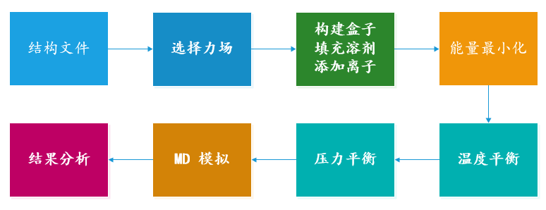
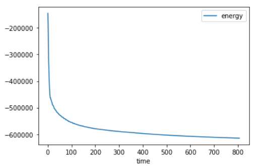
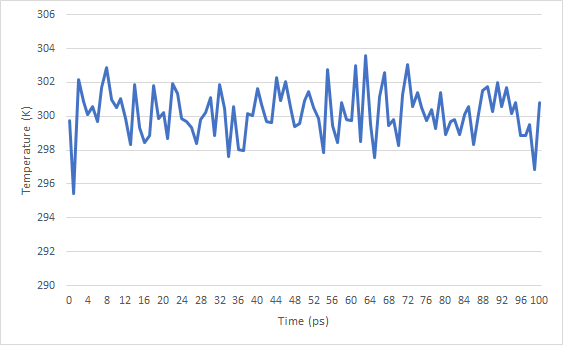

# 使用 GROMACS 对小蛋白进行分子动力学模拟

- [使用 GROMACS 对小蛋白进行分子动力学模拟](#使用-gromacs-对小蛋白进行分子动力学模拟)
  - [流程](#流程)
  - [准备输入](#准备输入)
    - [清理结构](#清理结构)
    - [生成拓扑](#生成拓扑)
  - [理解分子拓扑](#理解分子拓扑)
    - [拓扑中的原子](#拓扑中的原子)
    - [成键和其它相互作用](#成键和其它相互作用)
    - [水和位置约束](#水和位置约束)
    - [离子和其它参数](#离子和其它参数)
    - [系统级定义](#系统级定义)
  - [模拟系统溶剂化](#模拟系统溶剂化)
    - [定义溶剂盒子](#定义溶剂盒子)
    - [填充水](#填充水)
  - [添加离子](#添加离子)
    - [为 gmx genion 准备输入](#为-gmx-genion-准备输入)
  - [能量最小化](#能量最小化)
    - [确定运行是否成功](#确定运行是否成功)
    - [结果分析](#结果分析)
  - [位置约束](#位置约束)
  - [温度平衡](#温度平衡)
  - [压力平衡](#压力平衡)
  - [参考](#参考)

***

## 流程



## 准备输入

模拟首先需要一个分子结构文件。本教程使用 Factor Xa，一个对形成血凝块起关键作用的蛋白。起 3D 结构可以从 RCSB 网站 https://www.rcsb.org/ 下载，其 PDB 号为 1FJS。

### 清理结构

仔细查看下载的 PDB 文件，可以看到许多不属于蛋白质的原子，包括结晶水、配体等。这些原子在 PDB 文件中标记为 "HETATM"，可以直接用 notepad 打开 pdb 文件，删除包含 HETATM 的行。然后删除这些原子与蛋白的连接，即删除包含 CONECT 的行。用 grep 的命令：

```bash
grep -v HETATM input/1fjs.pdb > 1fjs_protein_tmp.pdb
grep -v CONECT 1fjs_protein_tmp.pdb > 1fjs_protein.pdb
```

> **NOTE**
> 这种做法没有普适性，例如，紧密结合的配体或其它功能活性位点的水分子，就不应该移除。

还应该检查 .pdb 文件中 MISSING 部分，这部分列出了晶体结构中缺失的原子或残基。末端区域缺失，可能不会对动态模拟造成影响。

```bash
$ grep MISSING 1fjs.pdb
```

### 生成拓扑

确定蛋白质所有必要的原子都存在，且不包含其它杂原子，开始准备 GROMACS 输入。使用 GROMASC 工具 pdb2gmx，生成三个文件：

- 分子拓扑文件
- 位置约束文件
- 后处理结构文件

拓扑文件（默认为 topol.top）包含在模拟中定义分子所需的所有信息。包括非成键参数（原子类型、电荷）和成键参数（键、键角、二面角以及原子连接性）。

> **NOTE**
> 内部序列不完整或氨基酸残基缺少原子会导致 pdb2gmx 失败。这些缺失的原子/残基可以使用其它软件包建模。还需要注意，pdb2gmx 不能为所有分子生成拓扑结构，只能生成力场定义的残基（*.rtp 文件，一般支持蛋白质、核酸和有限的辅助因子，如 NADH 和 ATP）。

执行 pdb2gmx：

```bash
$ gmx pdb2gmx -f 1fjs_protein.pdb -o 1fjs_processed.gro -water tip3p -ff "charmm27"
```

这里选择了 CHARMM27 全原子力场。力场中包含要写入拓扑的信息，这是一个非常重要的选择！应该彻底了解每一个力场，并决定哪一个最适合你的情况。当不带 `-ff` 选项运行 pdb2gmx 时，会提示选择力场：

```bash
Select the Force Field:
From '/usr/local/gromacs/share/gromacs/top':
 1: AMBER03 protein, nucleic AMBER94 (Duan et al., J. Comp. Chem. 24, 1999-2012, 2003)
 2: AMBER94 force field (Cornell et al., JACS 117, 5179-5197, 1995)
 3: AMBER96 protein, nucleic AMBER94 (Kollman et al., Acc. Chem. Res. 29, 461-469, 1996)
 4: AMBER99 protein, nucleic AMBER94 (Wang et al., J. Comp. Chem. 21, 1049-1074, 2000)
 5: AMBER99SB protein, nucleic AMBER94 (Hornak et al., Proteins 65, 712-725, 2006)
 6: AMBER99SB-ILDN protein, nucleic AMBER94 (Lindorff-Larsen et al., Proteins 78, 1950-58, 2010)
 7: AMBERGS force field (Garcia & Sanbonmatsu, PNAS 99, 2782-2787, 2002)
 8: CHARMM27 all-atom force field (CHARM22 plus CMAP for proteins)
 9: GROMOS96 43a1 force field
10: GROMOS96 43a2 force field (improved alkane dihedrals)
11: GROMOS96 45a3 force field (Schuler JCC 2001 22 1205)
12: GROMOS96 53a5 force field (JCC 2004 vol 25 pag 1656)
13: GROMOS96 53a6 force field (JCC 2004 vol 25 pag 1656)
14: GROMOS96 54a7 force field (Eur. Biophys. J. (2011), 40,, 843-856, DOI: 10.1007/s00249-011-0700-9)
15: OPLS-AA/L all-atom force field (2001 aminoacid dihedrals)
```

pdb2gmx 还有许多其它选项，参考 [pdb2gmx](../commands/pdb2gmx.md)。

现在已经生成了三个新文件：1fjs_processed.gro，topol.top，topol_Protein_chain_A.itp 以及 posre_Protein_chain_A.itp。

- 1fjs_processed.gro 是 GROMACS 格式的结构文件，包含力场中定义的所有原子（即 H 原子被添加到蛋白质的氨基酸上）。
- topol.top 文件是系统拓扑
- posre 文件包含限制重原子位置的信息

> **NOTE**
> GROMACS 支持许多文件格式，.gro 是写入坐标文件命令的默认格式，该格式比较紧凑，但精确度有限。如果喜欢 PDB 格式，只需以 pdb 扩展名定义输出文件。pdb2gmx 的目的是生成一个力场兼容的拓扑，输出结构是该目的的一个副作用。

## 理解分子拓扑

打开输出的 topol.top 文件，这是个纯文本文件，可以用 notepad 打开。

`;` 开头的为注释行，跳过注释行，余下内容如下：

```top
; Include forcefield parameters
#include "charmm27.ff/forcefield.itp"

; Include chain topologies
#include "topol_Protein_chain_A.itp"
#include "topol_Protein_chain_L.itp"

; Include water topology
#include "charmm27.ff/tip3p.itp"

#ifdef POSRES_WATER
; Position restraint for each water oxygen
[ position_restraints ]
;  i funct       fcx        fcy        fcz
   1    1       1000       1000       1000
#endif

; Include topology for ions
#include "charmm27.ff/ions.itp"

[ system ]
; Name
COAGULATION FACTOR XA; COAGULATION FACTOR XA

[ molecules ]
; Compound        #mols
Protein_chain_A     1
Protein_chain_L     1
```

- `#include "charmm27.ff/forcefield.itp"` 调用所选力场的参数，它位于文件开头，表示所有后续参数都是从这个力场派生的。
- 下一个重要内容为 `[ moleculetype ]`，在 topol_Protein_chain_A.itp 中

```bash
$ grep "moleculetype" -A 3 topol_Protein_chain_A.itp 
[ moleculetype ]
; Name            nrexcl
Protein_chain_A     3
```

以及：

```bash
$ grep "moleculetype" -A 3 topol_Protein_chain_L.itp 
[ moleculetype ]
; Name            nrexcl
Protein_chain_L     3
```

名称 "Protein_chain_A" 根据蛋白质在 PDB 文件中被标记我 A 链而命名，包含 3 个键连邻居例外。更多信息可参考 [GROMACS 手册](http://manual.gromacs.org/current/reference-manual/topologies.html)。

### 拓扑中的原子

下一节定义的蛋白质中的原子 `[ atoms ]`，如下：

```bash
$ grep "atoms" -A 4 topol_Protein_chain_A.itp
[ atoms ]
;   nr       type  resnr residue  atom   cgnr     charge       mass  typeB    chargeB      massB
; residue  16 ILE rtp ILE  q +1.0
     1        NH3     16    ILE      N      1       -0.3     14.007
     2         HC     16    ILE     H1      2       0.33      1.008
```

这些信息含义如下：

|Field|description|
|----|---|
|nr|Atom number|
|type|Atom type|
|resnr|Amino acid residue number|
|residue|The amino acid residue name- Note that this may be different from .rtp entry.|
|atom|Atom name|
|cgnr|Charge group number - Not used anymore|
|charge|Self-explanatory - The "qtot" descriptor is a running total of the charge on the molecule|
|mass|Also self-explanatory|
|typeB, chargeB, massB|Used for free energy perturbation (not discussed here)|

### 成键和其它相互作用

拓扑文件后面还包括 `[ bonds ]`, `[ pairs ]`, `[ angles ]` 以及 `[ dihedrals ]`。其中一部分的含义不言自明，如 bonds, angles 和 dihedrals。这些相互作用的解释可参考 [GROMACS 手册](https://manual.gromacs.org/current/reference-manual/functions.html)，特殊的 1-4 相互作用放在 `[ pairs ]` 中。

查看拓扑文件中的相互作用，首先查看 A 链的成键相互作用：

```bash
$ grep "bonds" -A 2 topol_Protein_chain_A.itp 
[ bonds ]
;  ai    aj funct            c0            c1            c2            c3
    1     2     1 
```

pair 相互作用：

```bash
$ grep "pairs" -A 2 topol_Protein_chain_A.itp 
[ pairs ]
;  ai    aj funct            c0            c1            c2            c3
    1     8     1 
```

Angle 相互作用：

```bash
$ grep "angles" -A 2 topol_Protein_chain_A.itp
[ angles ]
;  ai    aj    ak funct            c0            c1            c2            c3
    2     1     3     5 
```

Dihedral 相互作用：

```bash
$ grep "dihedrals" -A 2 topol_Protein_chain_A.itp
[ dihedrals ]
;  ai    aj    ak    al funct            c0            c1            c2            c3            c4            c5
    2     1     5     6     9 
--
[ dihedrals ]
;  ai    aj    ak    al funct            c0            c1            c2            c3
   20     5    22    21     2 
```

### 水和位置约束

拓扑文件还包括一些必要的拓扑，如位置约束。由 pdb2gmx 生成的 "posre.itp" 文件中定义了 一个力常数，用于在平衡过程中保持原子位置。

```bash
$ grep "posre" topol*.itp
topol_Protein_chain_A.itp:#include "posre_Protein_chain_A.itp"
topol_Protein_chain_L.itp:#include "posre_Protein_chain_L.itp"
```

在 "posre_Protein_chain_A.itp" 中可以看到所有 A 链重原子的位置约束。

拓扑文件余下内容用于定义其它分子并提供系统描述。下一个分子类型是统计，在本例中为 TIP3P water。水的其它选择还有 SPC, SPC/E 以及 TIP4P。上面通过 "-water tip3p" 选择了水模型。

### 离子和其它参数

拓扑文件下一部分为离子：

```bash
$ grep "ions" topol.top 
; Include topology for ions
#include "charmm27.ff/ions.itp"
```

### 系统级定义

最后是系统级定义。`[ system ]` 给出了将在模拟过程写入输出文件的系统名称。`[ molecules ]` 列出了系统中的所有分子：

```bash
$ tail -8 topol.top 
[ system ]
; Name
COAGULATION FACTOR XA; COAGULATION FACTOR XA

[ molecules ]
; Compound        #mols
Protein_chain_A     1
Protein_chain_L     1
```

`[ molecules ]` 的关键注意事项：

- 列出分子的顺序必须与坐标文件（本例中为 .gro）中的分子顺序一样
- 列出的名称必须和 `[ moleculetype ]` 匹配，不是残基名称或其它

如果不满足这些要求，后面的 grompp 命令中会出现名称不匹配、没有找到分子或许多其它错误。

## 模拟系统溶剂化

熟悉 GROMACS 拓扑内容后，继续构建模拟系统。在本例中，我们要模拟一个简单的水溶液系统。只要对所涉及的物种都有良好的参数，在不同溶剂中模拟蛋白质或其它分子都是可以的。

定义溶剂系统分两步：

- 使用 `editconf` 模块定义溶剂盒子尺寸
- 使用 `solvate` 模块用水填充溶剂盒子

单元格的选择有多种，我们使用菱形十二面体，因为它的体积只有相同周期距离的立方盒子的 71%，从而节省了溶解蛋白质所需加入的水分子数量。

### 定义溶剂盒子

使用 `editconf` 定义盒子：

```bash
$ gmx editconf -f 1fjs_processed.gro -o 1fjs_newbox.gro -c -d 1.0 -bt dodecahedron
```

上面的命令把蛋白质放在盒子中心（`-c`），且距离盒子边缘至少 1.0 nm (`-d 1.0`)。盒子类型定义为菱形十二面体（`-bt dodecahedron`）。[GROMACS 手册](https://manual.gromacs.org/current/reference-manual/algorithms/periodic-boundary-conditions.html)中有更多关于周期性边界条件和十二面体的知识。

到盒子边缘的距离是一个重要参数。蛋白质不应该与其周期 image (最小 image 约定)，否则计算出的力有问题。最小 image 约定意味着两个周期性 image 的距离应该大于用于截断非键合相互作用的半径。下面我们使用 1.2 nm 的截止半径，指定溶剂盒子距离为 1.0 nm 意味着任意两个周期性 image 之间至少有 2.0 nm 的距离，这样蛋白质-蛋白质之间的相互作用可以忽略不计。

### 填充水

```bash
$ gmx solvate -cp 1fjs_newbox.gro -cs spc216.gro -o 1fjs_solv.gro -p topol.top
```

蛋白质的配置（`-cp`）包含在前面 `editconf` 输出结构中，溶剂的配置（`-cs`）包含在 GROMACS 安装文件中。这里使用 spc216.gro，这是一种通用的平衡三点溶剂模型盒子。对 SPC, SPC/E 或 TIP3P water 都可以使用 spc216.gro 溶剂配置，因为它们都是三点水模型。输出 1fjs_solv.gro，并为 solvate 指定拓扑文件 topoltop，使其可以根据需要修改拓扑。注意 topol.top 中 `[ molecules ]` 的改变：

```bash
$ tail topol.top 

[ system ]
; Name
COAGULATION FACTOR XA; COAGULATION FACTOR XA in water

[ molecules ]
; Compound        #mols
Protein_chain_A     1
Protein_chain_L     1
SOL             11777
```

`gmx solvate` 记录添加了多少水分子，然后将这些水分子写入拓扑文件。如果不使用水分子作为溶剂，`solvate` 就不会修改拓扑文件。

## 添加离子

现在有了溶剂化系统，包含一个带电的蛋白质。`pdb2gmx` 的输出告诉我们该蛋白质的净电荷为 -2e（基于氨基酸组成）。在拓扑文件中也保存有电荷信息，在 `[ atoms ]` 的最后一行，在 chain A 中为 "qtot 1."，在 chain L 中为 "qtot -3."。因为生命不存在净电荷，因此必须向系统中添加离子。此外，为了接近生理条件，我们使用 0.15 M 的 NaCl 溶液。

### 为 gmx genion 准备输入

在 GROMACS 中添加离子的工具称为 `genion`。`genion` 读取拓扑文件，并将水分子替换为用户指定的离子。其输入也叫做运行输入文件，扩展名为 .tpr；该文件由 GROMASC grompp (GROMASC pre-processor)模块生成。`grompp` 处理坐标文件和拓扑文件，生成原子级的输入文件 .tpr。.tpr 文件包含系统中所有的原子的参数。

用 `grompp` 生成 .tpr 文件，还需要一个输入文件 .mdp (molecular dynamics parameter file)；`grompp` 将 .mdp 文件的参数、坐标信息和拓扑信息组合在一起，生成 .tpr 文件。

mdp 文件常用于运行能量最小化或 MD 模拟，这里仅用于生成系统的原子描述，可以直接用空的 mdp 文件，纯用于创建 .tpr 文件。创建空的 ions.mdp 文件：

```bash
$ touch ions.mdp
```

生成 tpr 文件：

```bash
$ gmx grompp -f ions.mdp -c 1fjs_solv.gro -p topol.top -o ions.tpr
```

```bash
$ gmx genion -s ions.tpr -o 1fjs_solv_ions.gro -conc 0.15 -p topol.top -pname NA -nname CL -neutral
                      :-) GROMACS - gmx genion, 2022.3 (-:

Executable:   /usr/local/gromacs/bin/gmx
Data prefix:  /usr/local/gromacs
Working dir:  /home/maojiawei/data/gromacs_demo
Command line:
  gmx genion -s ions.tpr -o 1fjs_solv_ions.gro -conc 0.15 -p topol.top -pname NA -nname CL -neutral

Reading file ions.tpr, VERSION 2022.3 (single precision)
Reading file ions.tpr, VERSION 2022.3 (single precision)
Will try to add 38 NA ions and 36 CL ions.
Select a continuous group of solvent molecules
Group     0 (         System) has 39748 elements
Group     1 (        Protein) has  4417 elements
Group     2 (      Protein-H) has  2238 elements
Group     3 (        C-alpha) has   286 elements
Group     4 (       Backbone) has   858 elements
Group     5 (      MainChain) has  1142 elements
Group     6 (   MainChain+Cb) has  1401 elements
Group     7 (    MainChain+H) has  1423 elements
Group     8 (      SideChain) has  2994 elements
Group     9 (    SideChain-H) has  1096 elements
Group    10 (    Prot-Masses) has  4417 elements
Group    11 (    non-Protein) has 35331 elements
Group    12 (          Water) has 35331 elements
Group    13 (            SOL) has 35331 elements
Group    14 (      non-Water) has  4417 elements
Select a group: SOL
Selected 13: 'SOL'
Number of (3-atomic) solvent molecules: 11777

Processing topology
Replacing 74 solute molecules in topology file (topol.top)  by 38 NA and 36 CL ions.

Back Off! I just backed up topol.top to ./#topol.top.2#
Using random seed -541078914.
Replacing solvent molecule 2651 (atom 12370) with NA
Replacing solvent molecule 93 (atom 4696) with NA
Replacing solvent molecule 6560 (atom 24097) with NA
......
Replacing solvent molecule 3526 (atom 14995) with CL
Replacing solvent molecule 1400 (atom 8617) with CL
Replacing solvent molecule 8734 (atom 30619) with CL


GROMACS reminds you: "We can make it into a friend class. But I don't like having friends." (Joe Jordan)
```

选择 "SOL" 来嵌入离子。可千万别用离子取代蛋白质的一部分。

> **NOTE**
> 确保只运行一次 genion。`gmx genion` 原位编辑拓扑文件，它不知道系统中是否已经有 Cl 或 Na 离子，如果再次运行，会继续加入离子，直到系统中没有可取代的水分子。

在 `genion` 命令中，以结构/状态文件为入(`-s`)，生成 .gro 文件（`-o`），处理拓扑文件（`-p`）以反映移除水分子、添加离子的操作，用 -pname 和 -nname 分别定义阳离子和阴离子，并告诉 `genion` 添加合适数目的阴离子和阳离子，使体系为电中性（`-neutral`）。还进一步使用 `-cenc` 选项指定添加离子的浓度。

用 -pname 和 -nname 指定的离子名称是 GROMACS 标准化的，不依赖于力场。离子名称总是元素符号的大写形式，在拓扑文件的 `[ moleculetype ]` 部分可以看到。残基或原子名称可以带或不带电荷符号（+/-），具体取决于力场。不要在 genion 命令中使用原子或残基名称，否则后续会出错。

此时拓扑的 `[ molecules ]`：

```bash
[ molecules ]
; Compound        #mols
Protein_chain_A     1
Protein_chain_L     1
SOL         11703
NA               38
CL               36
```

查看拓扑文件的最后 6 行：

```bash
$ tail -6 topol.top 
; Compound        #mols
Protein_chain_A     1
Protein_chain_L     1
SOL         11703
NA               38
CL               36
```

如果看到多行 NA 和 CL，很可能是多次运行 genion 导致的，从 pdb2gmx 重新开始吧。

## 能量最小化

组装好溶剂化的、电中性的系统后，在开始动力学模拟之前，我们要确保系统没有空间冲突或不合适的几何结构。结构通过能量最小化（energy minimization, EM）的过程来放松。

执行 EM，再次使用 grompp 将结构、拓扑和模拟参数一起组装为 .tpr 中，然后用 GROMACS MD 引擎 mdrun 执行能量最小化。

使用 grompp 组装 tpr 输入，需要 mdp 参数文件。模拟参数文件 mdp 决定如何运行模拟。mdp 的更多选项可参考 [GROMACS 文档](http://manual.gromacs.org/documentation/current/user-guide/mdp-options.html) 或[一个网络研讨会](https://bioexcel.eu/webinar-a-walk-through-simulation-parameter-options-mdp-files-for-gromacs-2019-12-05/)。可以设置的参数有很多，这里只设置基本参数，其它都保持默认。emin-charmm.mdp 文件如下：

```txt
title       = CHARMM steepest descent enrgy minimisation

; Parameters describing what to do, when to stop and what to save
integrator  = steep  ; Algorithm (steep = steepest descent minimization)
emtol       = 1000.0 ; Stop minimization when the maximum force < 1000.0 kJ/mol/nm
emstep      = 0.01   ; Minimization step size
nstenergy   = 500    ; save energies every 1.0 ps, so we can observe if we are successful
nsteps      = -1     ; run as long as we need
; Settings that make sure we run with parameters in harmony with the selected force-field
constraints             = h-bonds   ; bonds involving H are constrained
rcoulomb                = 1.2       ; short-range electrostatic cutoff (in nm)
rvdw                    = 1.2       ; short-range van der Waals cutoff (in nm)
vdw-modifier            = Force-switch ;  specific CHARMM
rvdw_switch             = 1.0       ;
DispCorr                = no        ; account for cut-off vdW scheme -
;in case of CHARMM DispCorr = EnerPres only for monolayers
coulombtype             = PME       ; Particle Mesh Ewald for long-range electrostatics
fourierspacing          = 0.15     ; grid spacing for FFT
```

组装文件：

```bash
$ gmx grompp -f emin-charmm.mdp -c 1fjs_solv_ions.gro -p topol.top -o em.tpr
```

在前面运行 genbox 和 genion 时，确定在更新 topol.top 文件，否则会得到一堆错误信息。

接下来运行 EM，运行后可以看到能量最小化结构文件 `em.gro`。另外还有日志文件 `em.log`，能量存储文件 `em.edr` 和二进制全精度轨迹 `em.trr`。

```bash
$ gmx mdrun -v -deffnm em
                      :-) GROMACS - gmx mdrun, 2022.3 (-:

Executable:   /usr/local/gromacs/bin/gmx
Data prefix:  /usr/local/gromacs
Working dir:  /home/maojiawei/data/gromacs_demo
Command line:
  gmx mdrun -v -deffnm em

Reading file em.tpr, VERSION 2022.3 (single precision)
Using 104 MPI threads
Using 1 OpenMP thread per tMPI thread


Steepest Descents:
   Tolerance (Fmax)   =  1.00000e+03
   Number of steps    =           -1
Step=    0, Dmax= 1.0e-02 nm, Epot= -1.51025e+05 Fmax= 4.68472e+05, atom= 2834
Step=    1, Dmax= 1.0e-02 nm, Epot= -1.86233e+05 Fmax= 1.25509e+05, atom= 8774
Step=    2, Dmax= 1.2e-02 nm, Epot= -2.56263e+05 Fmax= 5.20256e+04, atom= 39570
Step=    3, Dmax= 1.4e-02 nm, Epot= -3.14337e+05 Fmax= 2.64914e+04, atom= 1444
Step=    4, Dmax= 1.7e-02 nm, Epot= -3.58250e+05 Fmax= 2.06947e+04, atom= 4416
Step=    5, Dmax= 2.1e-02 nm, Epot= -3.85459e+05 Fmax= 1.60599e+04, atom= 4416
Step=    6, Dmax= 2.5e-02 nm, Epot= -4.07778e+05 Fmax= 1.03153e+04, atom= 4416
Step=    7, Dmax= 3.0e-02 nm, Epot= -4.31315e+05 Fmax= 9.44510e+03, atom= 34895
Step=    8, Dmax= 3.6e-02 nm, Epot= -4.49215e+05 Fmax= 1.32597e+04, atom= 494
Step=    9, Dmax= 4.3e-02 nm, Epot= -4.59304e+05 Fmax= 1.79946e+04, atom= 494
Step=   10, Dmax= 5.2e-02 nm, Epot= -4.63702e+05 Fmax= 4.42789e+04, atom= 4060
Step=   11, Dmax= 6.2e-02 nm, Epot= -4.69255e+05 Fmax= 3.52839e+04, atom= 4060
Step=   12, Dmax= 7.4e-02 nm, Epot= -4.69781e+05 Fmax= 5.96391e+04, atom= 4060
Step=   13, Dmax= 8.9e-02 nm, Epot= -4.73824e+05 Fmax= 5.47414e+04, atom= 4060
Step=   15, Dmax= 5.3e-02 nm, Epot= -4.80476e+05 Fmax= 1.42483e+04, atom= 4060
Step=   16, Dmax= 6.4e-02 nm, Epot= -4.80904e+05 Fmax= 9.67980e+04, atom= 4060
Step=   17, Dmax= 7.7e-02 nm, Epot= -4.89390e+05 Fmax= 1.98932e+04, atom= 4060
Step=   18, Dmax= 9.2e-02 nm, Epot= -4.89606e+05 Fmax= 1.52662e+05, atom= 4060
Step=   19, Dmax= 1.1e-01 nm, Epot= -4.96047e+05 Fmax= 3.32886e+04, atom= 4060

Step 20, time 0.02 (ps)  LINCS WARNING
relative constraint deviation after LINCS:
rms 0.000044, max 0.000437 (between atoms 4042 and 4044)
bonds that rotated more than 30 degrees:
 atom 1 atom 2  angle  previous, current, constraint length
   4062   4063   30.0    0.0997   0.0997      0.0997
Step=   21, Dmax= 6.7e-02 nm, Epot= -4.98243e+05 Fmax= 4.71357e+04, atom= 4060
Step=   22, Dmax= 8.0e-02 nm, Epot= -4.99599e+05 Fmax= 5.62179e+04, atom= 4060
...
...
...
Step=  805, Dmax= 1.5e-02 nm, Epot= -6.14444e+05 Fmax= 1.06070e+04, atom= 3836
Step=  807, Dmax= 8.8e-03 nm, Epot= -6.14527e+05 Fmax= 9.87533e+02, atom= 3836

writing lowest energy coordinates.

Steepest Descents converged to Fmax < 1000 in 808 steps
Potential Energy  = -6.1452694e+05
Maximum force     =  9.8753278e+02 on atom 3836
Norm of force     =  2.0900061e+01

GROMACS reminds you: "A robot will be truly autonomous when you instruct it to go to work and it decides to go to the beach instead." (Brad Templeton)
```

`-v` 标签用于显示 mdrun 运行信息。`-deffnm` 标签定义输入和输出的文件名。因此，如果没有将 grompp 的输出命名为 "em.tpr"，则应该用 `-s` 标签显式指定。

### 确定运行是否成功

要判断 EM 是否成功，有两个非常重要的评估因素。

第一个是势能（在 EM 结束时打印，即时没有 `-v`）。势能应该是负的，对水中的简单蛋白大概在 100000 kJ/mol 量级，具体取决于系统大小和水分子数。

第二个是最大力（maximum force, Fmax），其指标在 minim.mdp 参数中设置 "emtol = 1000.0"，表示目标 Fmax 不大于 1000 kJ/(mol nm)。有可能在 Fmax > emtol 时已经达到合理的势能，如果发生这种情况，表示系统不够稳定，无法进行模拟。评估它可能发生的原因，可能需要修改最小化参数，如 integrator, emstep 等。

### 结果分析

em.edr 文件包含 GROMACS 在 EM 期间收集的所有信息。可以用 GROMACS 的 `energy` 模块分析 .edr 文件。

可以用 `-xvg none` 选项输出 xvg 格式：

```bash
$ gmx energy -f em.edr -o potential.xvg -xvg none
```

最后可以看到势能的平均值，以及 potential.xvg 文件，该文件位 CSV 格式，可用其绘图：

```python
import pandas as pd
df = pd.read_csv('potential.xvg', sep='\s+', header=None, names=['time','energy'])
df.plot('time')
```



## 位置约束

EM 保证有一个合理的初始结构（在几何和溶剂方面）。要开始真正的动力学，必须平衡蛋白质周围的溶剂和离子。此时如果直接尝试不受约束的动力学，系统可能会奔溃。主要原因是溶剂大多在自身内部优化，而不是与溶质一起优化，且离子是通过随机去掉水分子速随机放置的。

现在要用 pdb2gmx 生成的 posre.itp 文件。posre.itp 的目的是对蛋白质的重原子（非氢原子）施加位置约束力。重原子允许移动，但是要克服大量的能量惩罚。位置约束的作用在于，允许放松蛋白质周围的溶剂和离子，而无需增加蛋白质结构变化的变量。位置约束的原点（约束势为 0 的坐标）通过 `grompp` 的 `-r` 选择指定。根据蛋白质和离子类型的不同，这个过程大概在纳秒级。

要使用位置约束，需要在模拟参数文件 .mdp 中添加 "define = -DPOSRES"，nvt-charmm.mdp 文件的前 5 行如下：

```mdp
title                   = CHARMM NVT equilibration 
define                  = -DPOSRES  ; position restrain the protein

; Parameters describing what to do, when to stop and what to save
integrator              = md        ; leap-frog integrator
```

使用位置约束时，需要用 `-r` 选项为 gmx grompp 提供带约束坐标的文件。可以与 `-c` 文件相同。

## 温度平衡

EM 确保了合理的初始结构（几何结构和溶剂取向）。现在需要将系统温度设为模拟所需温度，并建立溶质（蛋白质）的正确取向。达到所需问题后（根据动能），对系统施加压力，知道系统达到合适的密度。

平衡通常分两步进行。第一阶段在 NVT 系综（ensemble，指恒定的粒子数、体积和温度）进行。该系综也称为 “等温等容” 或标准系综。该步骤的时间范围取决于系统内容，通常 100-200ps 就足够了，这里用 100ps 进行 NVT 平衡。该步骤所需时间取决于电脑配置，16 核机器上大概不到一个小时。

下面按照和 EM 相同的步骤调用 grompp 和 mdrun，但这次使用能量最小的结构作为输入，并使用不同的 .mdp 文件运行。文件内容如下；

```bash
$ cat nvt-charmm.mdp
title                   = CHARMM NVT equilibration 
define                  = -DPOSRES  ; position restrain the protein

; Parameters describing what to do, when to stop and what to save
integrator              = md        ; leap-frog integrator
dt                      = 0.002     ; 2 fs
nsteps                  = 50000     ; 2 * 50000 = 100 ps
nstenergy               = 500       ; save energy and temperature every 1.0 ps

; periodic boundary condition
pbc                     = xyz       ;

; Keep system temperature fluctuating physically correct
tcoupl                  = V-rescale           ; modified Berendsen thermostat
tc-grps                 = system   ; coupling groups 
tau_t                   = 0.1      ; time constant, in ps
ref_t                   = 300      ; reference temperature, one for each group, in K

; Pressure coupling is off
pcoupl                  = no

; Velocity generation
gen_vel                 = yes                 ; assign velocities from Maxwell distribution
gen_temp                = 300                 ; temperature for Maxwell distribution

; Settings that make sure we run with parameters in harmony with the selected force-field
constraints             = h-bonds   ; bonds involving H are constrained
rcoulomb                = 1.2       ; short-range electrostatic cutoff (in nm)
rvdw                    = 1.2       ; short-range van der Waals cutoff (in nm)
vdw-modifier            = Force-switch ;  specific CHARMM
rvdw_switch             = 1.0       ;
DispCorr                = no        ; account for cut-off vdW scheme -
;in case of CHARMM DispCorr = EnerPres only for monolayers
coulombtype             = PME       ; Particle Mesh Ewald for long-range electrostatics
fourierspacing          = 0.15     ; grid spacing for FFT
```

这里不用设置 energy tolerance，但要设置 time step size 和 step 数。此外，还需要设置温度。注意 mdp 文件中的几个参数：

- `gen_vel = yes`：启动生成速度。使用不同的随机种子 `gen_seed` 会生成不同的初始速度，因此从相同的初始结构开始可以进行多个不同的模拟。
- `tcoupl = V-rescale`：速度缩放恒温器是对 Berendsen 弱耦合方法的改进，后者无法再现正确的动力学系综。
- `pcoupl = no`：没有采用压力耦合。

使用参数开始温度平衡：

```bash
$ gmx grompp -f nvt-charmm.mdp -c em.gro -r em.gro -p topol.top -o nvt.tpr
$ gmx mdrun -ntmpi 1 -v -deffnm nvt
```

NVT 平衡大概要 5 到 10 分钟。

使用 gmx engergy 分析温度变化过程：

```bash
$ gmx energy -f nvt.edr -o temperature.xvg -xvg none
```



从图中可以看出，系统的温度很快达到目标值（300 K），并在余下的平衡过程中保持稳定。对该系统来说，使用更短的平衡时间 50 ps 就足够了。

## 压力平衡

NVT 平衡稳定了系统温度。在收集数据前，还需要稳定系统压力（或密度）。压力平衡在 NPT 系综下进行，其粒子数、压力和温度保持恒定，该系综也称为 “等温-等压” 系综，最接近实验条件。

100 ps NPT 平衡参数示例：

```bash
title                   = CHARMM NPT equilibration 
define                  = -DPOSRES  ; position restrain the protein 

; Parameters describing what to do, when to stop and what to save
integrator              = md        ; leap-frog integrator
dt                      = 0.002     ; 2 fs
nsteps                  = 50000     ; 2 * 50000 = 100 ps
nstenergy               = 500       ; save energy and temperature every 1.0 ps

; periodic boundary condition
pbc                     = xyz       ;

continuation            = yes      

; Pressure coupling is on
pcoupl                  = C-rescale             ; Pressure coupling on in NPT
pcoupltype              = isotropic             ; uniform scaling of box vectors
tau_p                   = 1.0                   ; time constant, in ps
ref_p                   = 1.0                   ; reference pressure, in bar
compressibility         = 4.5e-5                ; isothermal compressibility of water, bar^-1
refcoord_scaling        = com

; Keep system temperature fluctuating physically correct
tcoupl                  = V-rescale           ; modified Berendsen thermostat
tc-grps                 = system   ; coupling groups 
tau_t                   = 0.1      ; time constant, in ps
ref_t                   = 300      ; reference temperature, one for each group, in K

; Settings that make sure we run with parameters in harmony with the selected force-field
constraints             = h-bonds   ; bonds involving H are constrained
rcoulomb                = 1.2       ; short-range electrostatic cutoff (in nm)
rvdw                    = 1.2       ; short-range van der Waals cutoff (in nm)
vdw-modifier            = Force-switch ;  specific CHARMM
rvdw_switch             = 1.0       ;
DispCorr                = no        ; account for cut-off vdW scheme -
;in case of CHARMM DispCorr = EnerPres only for monolayers
coulombtype             = PME       ; Particle Mesh Ewald for long-range electrostatics
fourierspacing          = 0.15     ; grid spacing for FFT
```

与 NVT 平衡的参数没有差别不大，注意增加的压力耦合部分。这个平衡阶段使用 Berendsen 气压计。主要变化：

- `continuation = yes`，从 NVT 平衡阶段开始继续模拟
- `gen_vel = no`，

```bash
gmx grompp -f input/npt-charmm.mdp -c nvt.gro -r nvt.gro -t nvt.cpt -p topol.top -o npt.tpr
```

使用 `-t` 选项指定来自 NVT 平衡的检查点文件，该文件包含继续模拟所需的所有状态变量。为了保持 NVT 期间的速度，使用 `-c` 选项指定 NVT 最终的坐标文件。

开始平衡：

```bash
gmx mdrun -ntmpi 1 -v -deffnm npt
```

使用 energy 分析压力变化：

```bash
gmx energy -f npt.edr -o pressure.xvg -xvg none
```

> 选择 Pressure

在看密度变化：

```bash
gmx energy -f npt.edr -o density.xvg -xvg none
```

选择  Density。


## 参考

- https://tutorials.gromacs.org/docs/md-intro-tutorial.html
