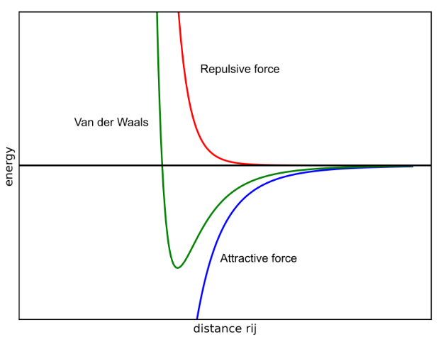

# 非键相互作用

- [非键相互作用](#非键相互作用)
  - [简介](#简介)
  - [非键相互作用类型](#非键相互作用类型)
  - [范德华力](#范德华力)
  - [静电相互作用](#静电相互作用)
  - [参考](#参考)

Last updated: 2022-11-16, 13:27
****

## 简介

在分子力学中，分子系统近似于“球-弹簧”模型，球对应原子，弹簧对应原子之间的化学键。分子的势能来自原子间的成键相互作用和非键相互左右：

$$E_{MM}(R)=E_{bond}+E_{non-bond}$$

## 非键相互作用类型

在计算分子系统的能量时，必须考虑原子之间的非键相互作用。这种相互作用主要分为两类：

- 范德华力（Van der Waals，$E_{vdW}$）
- 静电相互作用（Electrostatic, $E_{el}$）

两者都只考虑两个原子之间的距离，一般来说，任何两个没有化学键连接、或连接的化学键超过3个（1-5 连接或更多），就认为它们之间存在非键相互作用。非键的势能可以表示为：

$$E_{non-bond}=E_{vdW}+E_{el}$$

显式表达式很复杂：

$$E_{non-bond}=\sum_{i=1}\sum_{j=i+1}(4\epsilon_{ij}[(\frac{\sigma_{ij}}{r_{ij}})^{12}-(\frac{\sigma_{ij}}{r_{ij}})^6]+\frac{q_iq_j}{4\pi\epsilon_0r_{ij}})$$

表达式中的加和用来包含所有成对原子之间的相互作用，在一个由 $N$ 个原子组成的分子中，包含 $\frac{N(N-1)}{2}$ 对原子。对表达式可以看出，非键项 $E_{non-bond}$ 主要受原子对之间的距离影响。

成键项的计算复杂度为 $O(N)$，而非键项的计算复杂度为 $O(N^2)$，即非键项的数目与系统中原子数的二次方成正比。因此，在大分子中（蛋白质、核酸等），MM 模拟的大部分为非键项，因此在势能函数中正确选择非键项十分重要。

## 范德华力

$E_{vdW}$ 描述原子之间的范德华引力和斥力。范德华能是引力和斥力平衡的结果，主要取决于原子间的距离。

当距离较大，$E_{vdW}$ 可忽略，其值为 0；当原子非常接近时，斥力变强；而不远不近时，由于诱导偶极作用，原子之间有轻微的吸引。

总的来说，$E_{vdW}$ 在距离很小时为正，中等距离时为负，无穷远时为 0。

> **图 1** 范德华势能随原子之间距离的变化。

拟合范德华势能的函数有很多，其中 Lennard-Jones (LJ) 最常见：

$$E_{vdW}=\sum_{i=1}\sum_{j=i+1}4\epsilon_{ij}[(\frac{\sigma_{ij}}{r_{ij}})^{12}-(\frac{\sigma_{ij}}{r_{ij}})^6]$$

引力部分（蓝色）与 $\sigma^6$ 成正比，斥力 $\sigma^{12}$ 成正比。距离 $r_{ij}$ 放在分母，高指数保证随着距离增加 $E_{vdW}$ 迅速衰减到零。可以设置一个距离阈值，当两个原子之间的距离超过这个阈值，其范德华力可忽略。

例如，在对一个力场进行参数化时，通常需要设置一个 `cut-off` 距离，如 10$\mathring{A}$，超过10$\mathring{A}$ 就可以省略范德华力的计算。

参数：

- $\epsilon_{ij}$，相互作用强度（kcal/mol）
- $\sigma_{ij}$，范德华半径 $\mathring{A}$

变量：

- $r_{ij}$，原子间距离 $\mathring{A}$

其它描述范德华力的函数还有 **Buckingham** 和 **Morse potential** 函数。这两个势能函数与前一个的主要差别：

- 描述斥力的函数设计指数运算，相对加法或乘法，指数运算的速度较慢；
- 参数个数，LJ 有两个参数，而上面的两个势能函数有三个。因此 LJ 势能的计算更快，但 LJ 的准确性也相对较低。其中 Morse potential 的准确性最高。

## 静电相互作用

电子云的波动产生正负点区域，从而导致静电相互作用，用 $E_{el}$ 表示。

将两个原子看作点电荷，静电相互作用就能用库仑势表示：

$$E_{el}=\sum_i\sum_{j=i+1}\frac{q_iq_j}{4\pi \epsilon_0r_{ij}}$$

参数：

- $q_i$，原子 i 的电荷
- $q_j$，原子 j 的电荷

变量：

- $r_{ij}$，原子间距离 $\mathring{A}$

极化可能来自同一个分子或其它分子的原子。静电势不容易计算，因为 $r_{ij}$ 没有指数，所以衰减到零比 $E_{vdW}$ 慢很多。

换句话说，静电力在很远的距离也存在。我们可以在一定距离截断范德华力，但不能截断静电力。因此，静电项往往是 MM 模拟中的速控步，其计算复杂度为 $O(N^2)$。

## 参考

- https://www.compchems.com/molecular-dynamics-non-bonded-interactions/
