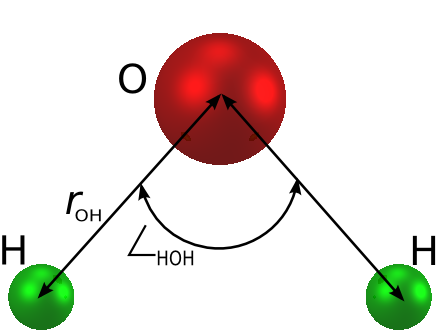
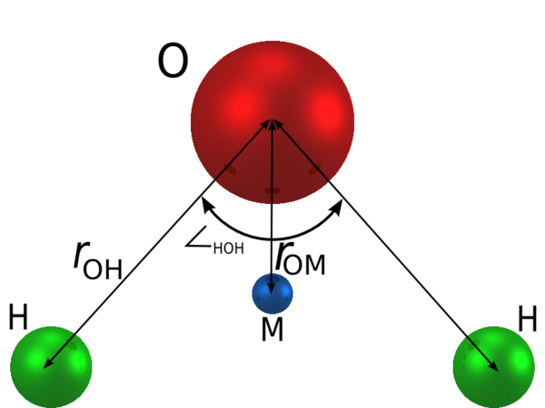

# Water Models

- [Water Models](#water-models)
  - [简介](#简介)
  - [水模型参数化](#水模型参数化)
  - [总结](#总结)
  - [SPC](#spc)
  - [SPC/E](#spce)
  - [TIP3P](#tip3p)
  - [参考](#参考)

## 简介

水分子模型是为了辅助发现水的结构而发展起来的计算技术。

## 水模型参数化

## 总结

## SPC

SPC（simple point charge）是一个水分子经验模型。水分子被建模成一个刚性的等腰三角形，三个原子上都有电荷。除了库伦相互作用，氧原子上还有 Lennard-Jones 远程相互作用。Lennard-Jones 位点定义水分子的几何大小，在短程内具有排斥性。Lennard-Jones 相互作用没有方向性，与具有方向性的静电吸引作用互相竞争。

参数如下：

|参数|值|
|---|---|
|$\sigma$|3.166 Å|
|$\epsilon$|0.650 kJ/mol|
|$r_{OH}$|1.000 Å|
|$\angle_{HOH}$|109.47°|
|$q_O$|-0.82e|
|$q_H$|0.41e|

SPC 模型的偶极矩为 2.27 D。

## SPC/E

SPC/E（extended simple point charge model）对 SPC 模型的 $q_{\mathrm{O}}$ 进行了修改。其它一样。

|参数|值|
|---|---|
|$\sigma$|3.166 Å|
|$\epsilon$|0.650 kJ/mol|
|$r_{OH}$|1.000 Å|
|$\angle_{HOH}$|109.47°|
|$q_O$|-0.8476e|
|$q_H$|0.4238e|

SPC/E 模型的偶极矩为 2.351 D。

## TIP3P

TIP3P 模型由氧原子的 Lennard-Jones 位点和两个电荷位组成。

|参数|值|
|---|---|
|$r_{OH}$|0.9572 Å|
|$\angle_{HOH}$|104.52°|
|$\sigma$|3.15066 Å|
|$\epsilon$|0.63627 kJ/mol|
|$q_O$|-0.834e|
|$q_H$|0.417e|
|$q_M$|0 e|
|$r_{OM}$|0 Å|

## 参考

- https://water.lsbu.ac.uk/water/water_models.html
- http://www.sklogwiki.org/SklogWiki/index.php/Water_models
