# BLAST

- [BLAST](#blast)
  - [简介](#简介)
  - [BLAST 种类](#blast-种类)
  - [NCBI BLAST](#ncbi-blast)
    - [NCBI BLAST 数据库](#ncbi-blast-数据库)
    - [blastn](#blastn)
    - [blastp](#blastp)
    - [新版 BLAST 结果页面](#新版-blast-结果页面)
  - [结果解释](#结果解释)
  - [PSI-BLAST](#psi-blast)
  - [PHI-BLAST](#phi-blast)
  - [其它 BLAST](#其它-blast)
  - [参考](#参考)

2021-09-30, 11:30
@author Jiawei Mao
***

## 简介

BLAST (**B**asic **L**ocal **A**lignment **S**earch **T**ool，基本局部比对搜索工具)是基于局部比对搜索工具的英文缩写， 是用于比对生物分子序列的算法，如蛋白的氨基酸序列、DNA的碱基序列等，以推断序列之间的功能和进化关系，是目前最常用的数据库搜索程序。

BLAST 的原理要点是**片段对**的概念，即两个给定序列中的一对子序列，它们的长度相等，且可形成无空位的完全匹配。如下图所示，有两个片段对：

BLAST 首先找出长度为 W 分数至少为 T 的片段对，然后根据指定的相似性阈值延伸片段对，得到一定长度的相似性片段，获得高分值片段对（high-scoring pairs, HSPs）。

BLAST 采用统计学打分系统，能将真正配对的序列与随机产生的干扰序列区分开来；同时采用启发式算法系统，即采用局部比对算法，而不是全局比对算法。

## BLAST 种类

BLAST 是一组工具的统称，它不仅可用于蛋白质序列数据库和核酸序列数据库的搜索，还可以将待搜索的核酸序列翻译成蛋白质序列后再进行搜索，或反之，以提高搜索效率。

|BLAST程序|功能|
|---|---|
|blastp|用蛋白质序列搜索蛋白质序列数据库|
|blastn|用核酸序列搜索核酸序列数据库|
|blastx|将核酸序列按6条链翻译成蛋白质序列后搜索蛋白质序列数据库|
|tblastn|用蛋白质序列搜索核酸序列数据库，数据库中的核酸序列按6条链翻译成蛋白质序列后再搜索|
|tblastx|将核酸序列按6条链翻译成蛋白质序列后搜索核酸序列数据库，数据库中的核酸序列要按6条链翻译成的蛋白质序列后再搜索|

> 因为不知道翻译起点位置，一个密码子有三个碱基，翻译可能从第1个、第2个或第3个碱基开始，所以正反链各有3种可能，因此有 6 种可能的序列。这6种有些真实存在，有些不存在，由于不确定，因此要全部搜索比对。
>
> blastx，核酸序列为什么不在核酸数据库里搜索，而要到蛋白质数据库里搜索呢？因为从核酸序列数据库可能找不到跟你手里这条核酸序列相似的序列，或者找到了相似的序列，但是这些找到的序列无法提供有意义的注释信息，这时就可以去蛋白质数据库试试，看看这条核酸序列的翻译产物能不能从蛋白质数据库里找到相似的序列以及有意义的注释信息。tblastn 和 tblastx 也是因为类似原因而存在。

后三种需要先翻译再搜索的 BLAST 主要用于对新发现的序列进行搜索。那些已知的序列用前两种 BLAST 就可以了。

除了按照搜索内容分类，BLAST 还可以根据**搜索算法**不同分为标准 BLAST、PSI-BLAST 和 PHI-BLAST 等。

## NCBI BLAST

NCBI 提供了一套 BLAST 程序，用于指定序列和选择的数据库中的序列进行对齐。[NCBI BLAST 主页](https://blast.ncbi.nlm.nih.gov/Blast.cgi)提供了这些工具的网页端以供使用。

BLAST 的主页结构如下所示：

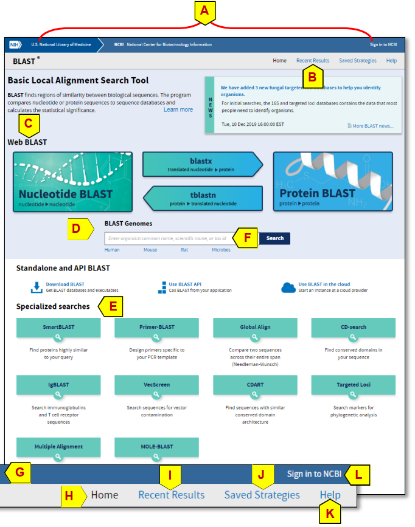

1. A 部分是 BLAST 页面的通用标题部分；
2. B 包含最近完成的 BLAST 结果的链接；
3. 网页的主体部分以链接的形式给出了三类 BLAST："Web BLAST" (C), "BLAST Genomes" (D) 和 "Specialized searches" (E)；
4. "BLAST Genomes" 部分的搜索框 (F) 以物种名为关键字，输入后会出现推荐的基因组弹窗，选择合适的基因组，就可以继续执行 BLAST.

工具简介：

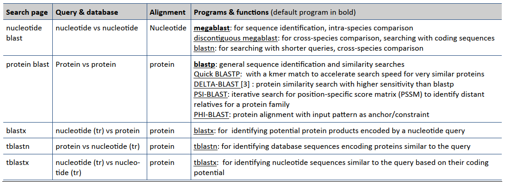

常用的 BLAST 序列数据库：

### NCBI BLAST 数据库

|核酸数据库|内容|
|---|---|
|nt(默认)|包括 GenBank+EMBL+DDBJ+PDB+RefSeq 序列，但不包括 EST,STS,GSS,WGS,TSA,专利序列，phase 0, 1, 2 HTGS 序列以及长度大于 100Mb 的序列，非冗余，相同序列合并到位一条，同时保留每条序列的 accession, GI, title 以及 taxonomy 信息|
|refseq_select|该数据库包含人和小鼠的 RefSeq 转录本序列，不过对每个蛋白质只保留一条代表性的转录本|
|refseq_rna|NCBI 转录本参考序列|

### blastn

blastn 界面如下：

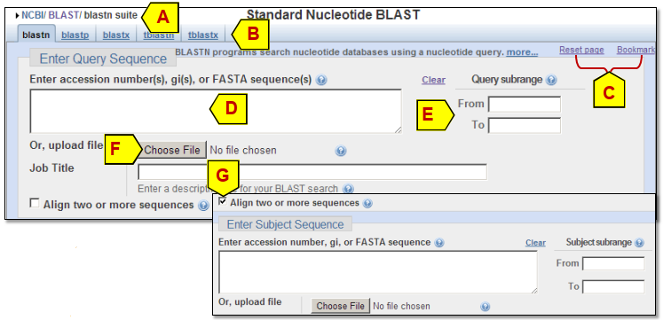

**Enter Query Sequence**

- D，待检索的核酸序列，支持的多种格式；
- E，指定 query 的范围，如 20-100，表示只检索序列的 20-100 的片段；
- F，输入文件，用于同时检索多个序列；

**Choose Search Set**

- 可以从下拉框（A）选择 BLAST 数据库；
- 

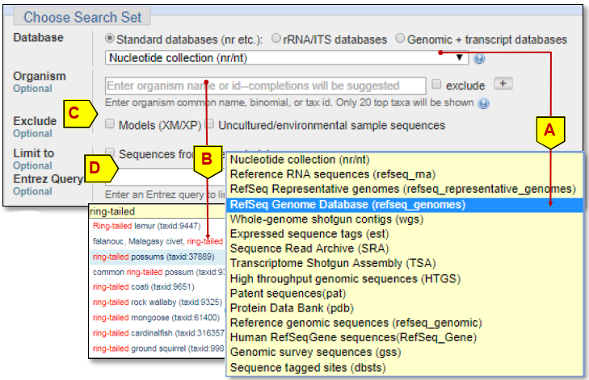

### blastp

blastp 使用蛋白质序列搜索蛋白质序列数据库。其 NCBI 的输入序列界面如下：

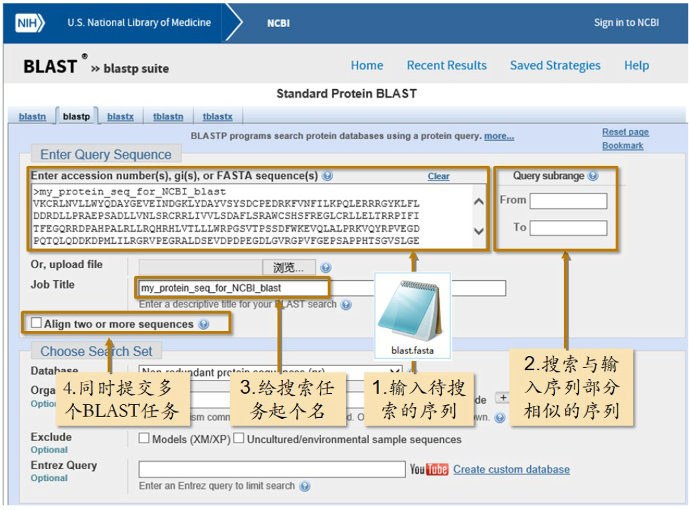

数据库选择界面如下：

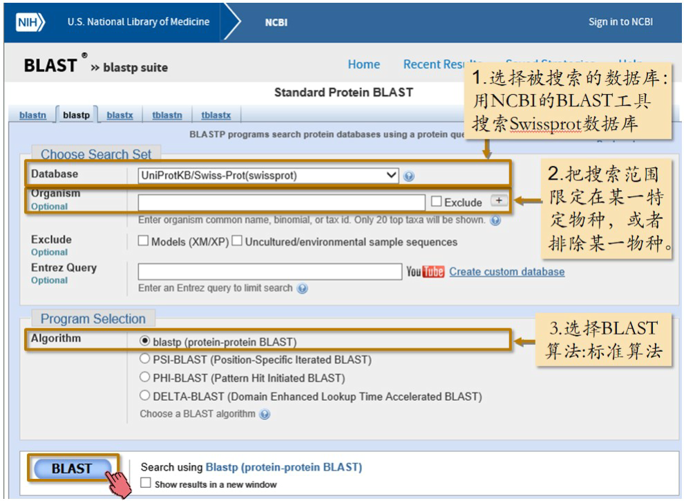

运行完成后的输出结果如下:

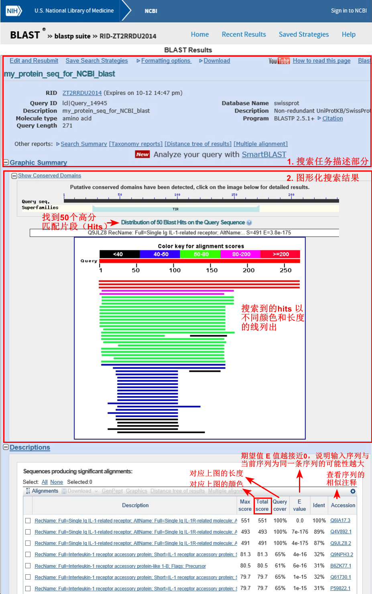

彩色线条图告诉我们，从数据库中找到 50 个 hits，也就是高分匹配片段。注意，这些线代表的是 50 个高分匹配片段而不是 50 条序列。一个高分匹配片段有可能是一条全长序列，即全长匹配，也可能只是某条序列的一部分，也就是局部匹配。代表这些高分匹配片段的线拥有不同颜色和不同的长短。如果把鼠标放到某一条线上，可以看到这条匹配片段的具体信息，包括他所在序列的数据库编号，序列的名字，匹配得分，期望值 E 值。

颜色反映的是匹配的好坏程度：

- 匹配得分在 200 以上用红色表示；
- 80 到 200 之间的用粉线；
- 50 到 80 的绿线；
- 40-50 的蓝线；
- 40 以下的黑线。

如果某一个高分匹配片段和输入序列是从头到尾匹配，就是全长的线，比如最上面的三条红线。如果只匹配输入序列的一部分，则是一条短线，短线所在的位置就是与输入序列匹配的位置。

第三部分（Descriptions）是这 50 个高分匹配片段所在序列的详细信息列表。每条序列
都有一个匹配得分和覆盖度。这两项决定了第二部分彩图中每条线的颜色和长短。除了匹配
得分和覆盖度，表中还列出了其他指标。尤为重要的是 E-value。E-value 也叫做期望值或 E值。E 值越接近零，说明输入序列与当前这条序列为同一条序列的可能性越大。第三部分的
表就是根据 E 值由低到高排序的。随着 E 值增大，匹配得分是成反比逐渐降低的。但是一
致度与 E 值并非完全成反比。因为我们在前面讲 BLAST 核心思想的时候说过，BLAST 没有
做双序列比对，为了提高速度，它牺牲了一定的准确度。表中的一致度，是 BLAST 搜索完
成后，针对搜索到的这 50 条序列专门做双序列比对而得到的。BLAST 牺牲掉的准确度对高
度相似的序列，也就是亲缘关系近的序列构成不了威胁，不会把它们落掉，但是对于那些只
有一点点相似，也就是远源的序列，就有点麻烦了，它们很有可能被丢掉而没有被 BLAST
发现。 

### 新版 BLAST 结果页面

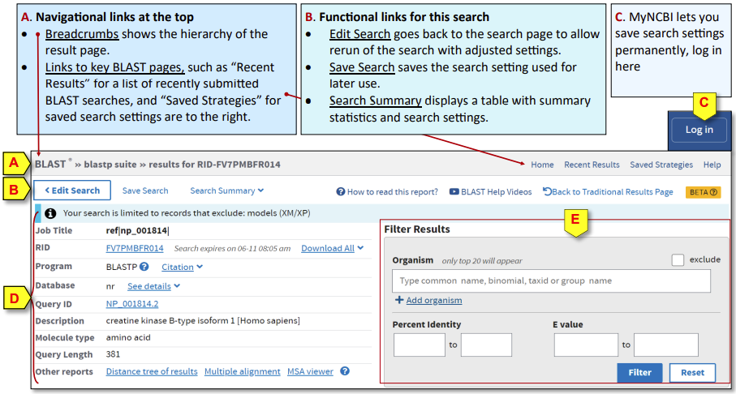

BLAST 详细信息 D：

|信息|说明|
|---|---|
|Job Title|默认显示第一条序列的 id，可以在提交任务前自定义|
|RID|检索的识别符|
|Download All|提供下载完整检索结果功能，支持多种文件格式|

## 结果解释

Max Score: 查询序列和数据库序列额最高比对打分（bit-score），它和 E 值近似反比关系，较大的 bit-score 是随机获得的概率越小。

Total Score：同一 db 中所有序列的比对打分加和。

Percent Query Coverage：查询序列中包含在对齐片段中的百分比。

E-value：序列相似是随机事件的度量值。

Percent Identity：查询序列和对齐序列的相似程度。

## PSI-BLAST

为了提高速度，标准 BLAST 牺牲了一定的准确度，虽然不影响高度相似的序列，也就是亲缘关系近的序列，不会把它们漏掉，但是对于那些只有一点点相似，也就是远源的序列，就有点麻烦了。它们很可能被漏掉而没有被 BLAST 发现。 换言之，你找到了你直接认识的朋友，而丢掉了朋友的朋友。

PSI BLAST (Position-Specific Iterated BLAST，位点特异性迭代 BLAST)，PSI-BLAST 的特点是搜完一遍再搜一遍，且从第二次搜索开始，每次搜索前都利用上一次搜索到的结果创建一个**位置特异权重矩阵**（Position-Specific Scoring Matrix, PSSM），然后用新的 PSSM 再次搜索数据库，以扩大本次搜索的范围，如此反复直至没有新的结果产生为止。

## PHI-BLAST

PHI-BLAST（Pattern-Hit Initiated BLAST，模式识别 BLAST），能找到与输入序列相似的并符合某种特定模式的序列。

PHI-BLAST 和 PSI-BLAST 不同，PSI-BLAST 是撒大网搜索，而 PHI-BLAST 则是精准搜索。

在 NCBI BLAST 工具的输入页面，当算法选择了 PHI-BLAST 之后，会自动出现模式输入框。输入正则表达式 S[IVFL]TPS(2)（含义为：一个 S 后面紧接 IVFL 中的任意一个字母，再接 T，再接 P，再接两个 S）。这次搜索找到的相似序列中，只有符合该模式的才会被作为结果返回。 

PHI-BLAST 可以和PSI-BLAST 联合使用，以找到更多符合模式的远房亲戚们。

现在我们用一个故事来总结一下标准 BLAST，PSI-BLAST 和 PHI-BLAST 这三种 BLAST
的区别。下图一只宠物仓鼠，有一天误食了有毒的花草，英年早逝。主人决定再买一只类似的。打开宠物网站，输入了仓鼠的照片，想买只差不多的。标准 BLAST 返回的结果中基本都是仓鼠，但种类不同，有很像的，也有一般像的。我发现其他种类的仓鼠也挺可爱的，比如金丝熊。那干脆扩大一下范围，看看还有什么可爱的小家伙。于是进行了 **PSI-BLAST**，这下可好，除了仓鼠，米老鼠，老鼠玩具，鼠标什么的也都被找出了。当然除了这些不靠谱的，也有靠谱的被找到了，比如 chinchilla，龙猫！可是，太贵了，买不起，还是买个和大腮帮子一模一样的吧，至少要具备它最受欢迎的特征。于是进行了**PHI-BLAST**，并且输入特征模式：三线-大眼睛-长胡子-雄性。这次 PHI-BLAST 终于帮我找到了一只合适的仓鼠。希望大家通过这个小故事能够更好的掌握什么时候用什么 BLAST，用对了事半功倍！

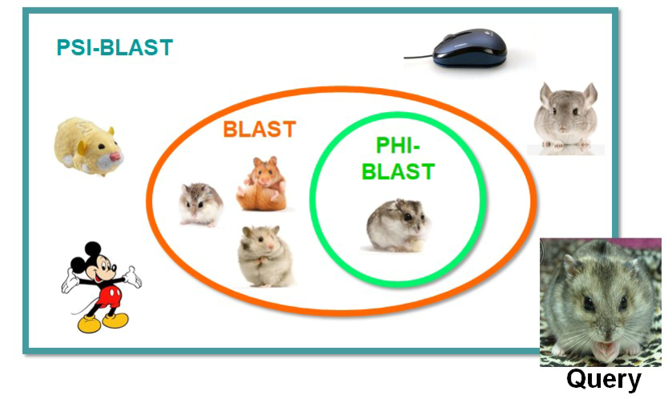

## 其它 BLAST

**SMARTBLAST**

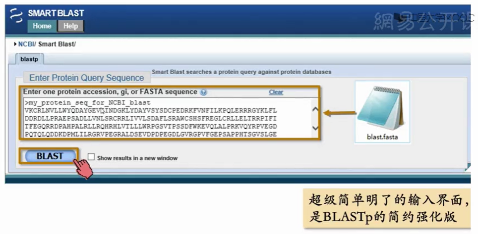

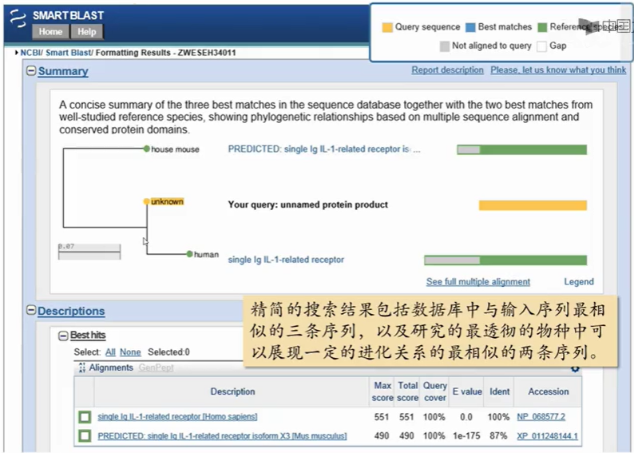

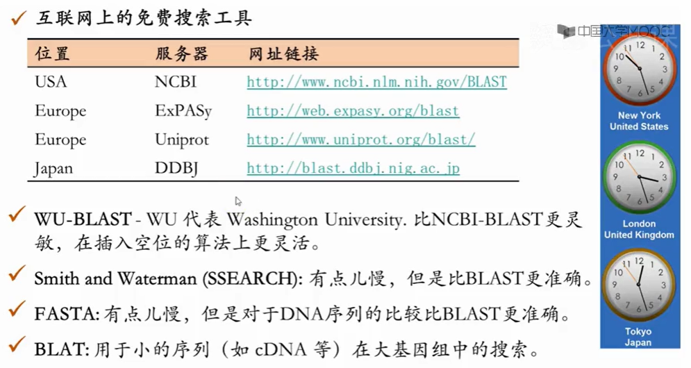

## 参考

- 山东大学公开课：生物信息学
- https://blast.ncbi.nlm.nih.gov/Blast.cgi
