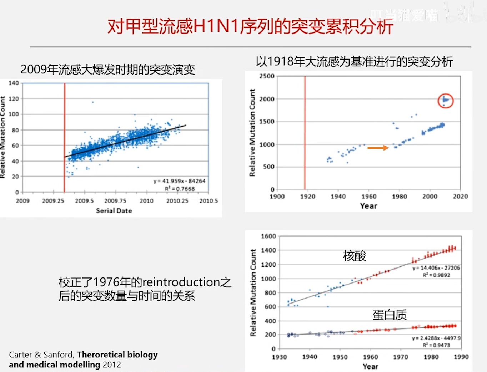
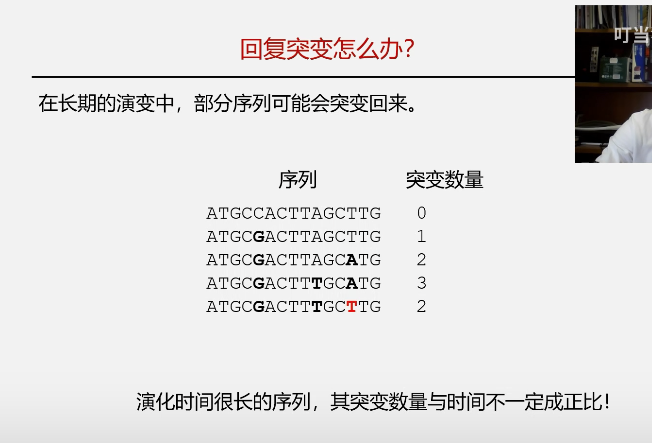
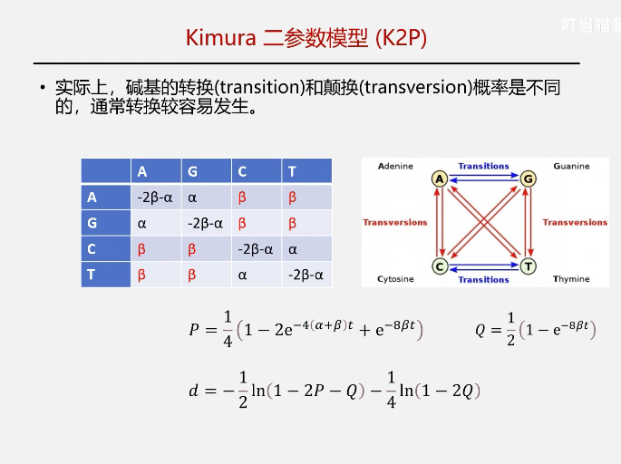
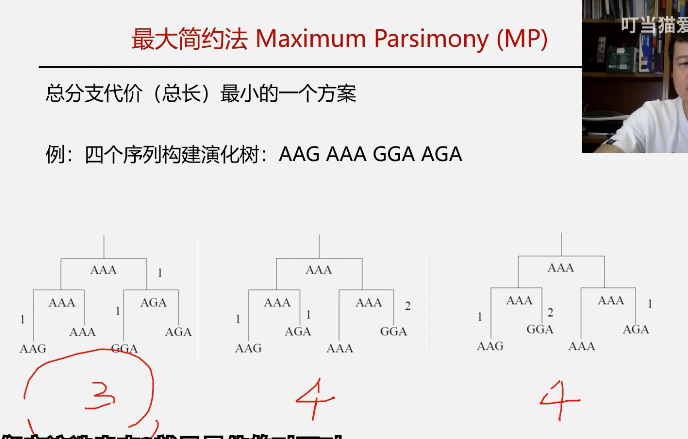
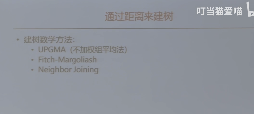
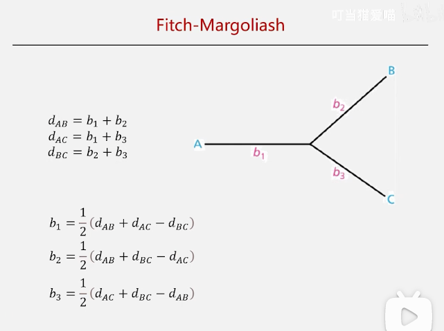
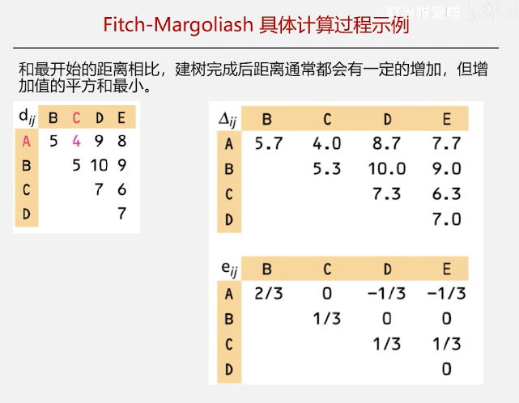
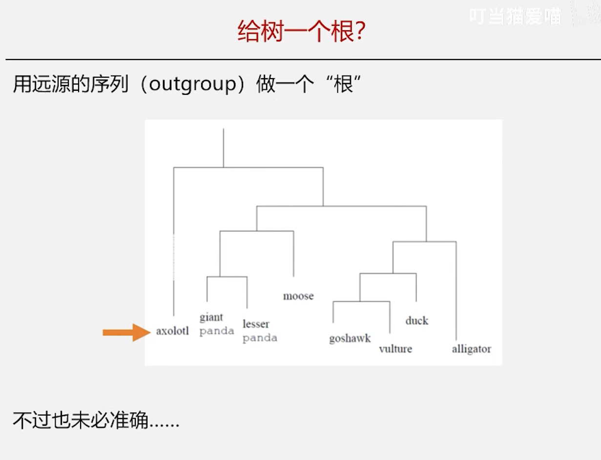
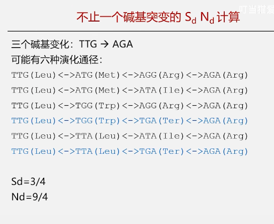

# 系统发育与分子进化

- [系统发育与分子进化](#系统发育与分子进化)
  - [概述](#概述)
  - [如何研究进化](#如何研究进化)
  - [同源](#同源)
  - [树状和网状](#树状和网状)
  - [系统发生树](#系统发生树)
  - [系统发生树的种类](#系统发生树的种类)
  - [分子演化的理论基础：分子钟假说](#分子演化的理论基础分子钟假说)
  - [回复突变](#回复突变)
  - [核酸突变模型](#核酸突变模型)
  - [建树](#建树)
  - [氨基酸突变](#氨基酸突变)

2024-07-12
@author Jiawei Mao
***

## 概述

拉马克主义：用进废退（不靠谱）。

达尔文：自然选择，物竞天择（广为接受）。

生物进化的过程——物竞天择：

- 原动力：突变 -> 没有方向性
- 结果：自然环境的选择，适者生存 -> 有方向性

## 如何研究进化

方法一：生物化石，特点：

- 零散
- 不完整

方法二：利用比较形态学、比较解剖学和生理学等手段，确定大致的进化框架

- 细节存在许多争议
- 伦理学问题

方法三：分子进化，利用软件，从分子水平上（DNA、RNA和蛋白质序列）构建各种生物间的系统发生树：

- 准确度依赖软件的优劣及参数的设置

美国人 Linus Pauling 于 1964 年提出分子进化理论。在分子水平，而不是基于物种的外在特征，来研究进化过程。

基于某一个特定的分子在不同物种中的序列差异来构建系统发生树。

**基本假设：**

1. DNA、RNA或蛋白质序列包含了物种的所有进化史信息；
2. 分子钟理论：一个特定蛋白质的进化变异的速度在**不同物种**中是基本恒定的。即两个蛋白质的序列越相近，他们距离共同祖先就越近。

变异速度：一定时间内不同碱基或氨基酸突变的个数。

> 分子钟理论被普遍接受，但没有直接的证据证实。

## 同源

**同源（homologs）**

来源于**共同祖先**的**相似序列**为同源序列。

所以，相似序列不一定是同源序列。

**直系同源（orthologs）**

来自不同物种的，由垂直家系（物种形成）进化而来的基因。并且典型的保留了与原始基因相同的功能。即一个基因进入不同物种，并保留了原有功能。此时，这些不同物种的基因，就称为直系同源。

**旁系同源（paralogs）**

在同一物种中的来源于基因复制的基因，可能会进化出新的与原来有关的功能。

基因复制产生两个重复基因，多出来的基因：

- 后来又丢了；
- 演化出新的功能，如果是好的功能，就保留下来，如果是不好的功能，就被自然选择淘汰；
- 放着不用，复制出来后加了个终止子，既不表达也不删除。

被保留下来具有新功能的基因，与原来的基因，就是旁系同源关系。

**异同源（xenologs）**

通过水平基因转移，来源于共生或病毒侵染所产生的相似基因。

即通过原核生物和真核生物的接触，如病毒感染，在跨度巨大的物种之间转移形成的。

如图所示：

有个早期的球蛋白基因（early globin gene），它通过基因复制，形成了 $\alpha$ 球蛋白基因和 $\beta$ 球蛋白基因。后来随着进化，这两个复制产生的基因也存在于不同物种中。其中：

- 某一物种里，比如老鼠里的 $\alpha$ 球蛋白基因和 $\beta$ 球蛋白基因，属于旁系同源；
- 某一个基因在不同物种里，比如青蛙里的 $\alpha$ 球蛋白基因和鸡里面的 $\alpha$ 球蛋白基因，就属于直系同源；
- 再比如，某个细菌，它没有早期的球蛋白基因，但是通过与青蛙共生，发生了基因水平转移，于是它某一天就有了 $\beta$ 球蛋白基因，那么，这个细菌的 $\beta$ 球蛋白基因和青蛙的 $\beta$  球蛋白基因就属于异同源。

同源是对性质的描述，只能定性，不能定量。

## 树状和网状

越来越多的细菌和动植物的基因组测序显示，基因并不是简单地遗传给生命树上的个别枝条，它们还在物种之间以不同的进化路径转换，其结果是一个杂乱无章的网络。

- 树：从一个点到另一个点的路径只有唯一的一条；
- 网：从一个点到另一个点的路径可以是多条。

构成生命网的基础是**水平基因转移**（horizontal gene transfer）：指生物将遗传物质传递给其它细胞而非子代细胞的过程。

结论：有一些物种的进化呈现树状，而有一些则不是（即网状）。

## 系统发生树

系统发生树（phylogenetic tree），也叫分子树。

**系统发生树的意义：**

- 对于一个未知的基因或蛋白质序列，确定其亲缘关系最近的物种。

  比如你得到了一个新发现的细菌的核糖体 RNA，你可以把它跟所有已知的核糖体 RNA 放在一起，然后用他们构建一棵系统发生树。这样就可以从树上推测出谁和这个新细菌的关系最近。

- 预测一个新发现的基因或蛋白质的功能

  以基因为例，如果在树上与新基因关系十分密切的基因的功能已知，那么这个已知的功能可以被延伸到这个新基因上。

- 预测分子功能的走势；
- 追溯一个基因的起源。

系统发生树的结构：

 

根是一切的起源，习惯上就叫根。根和节都表示理论上曾经存在的祖先，**叶子是现存的物种**。这一点很重要！比如我们要研究某个基因，于是搜集了很多物种的这个基因的序列，用它们构建了一棵系统发生树。搜集到的物种都出现在叶子上，也就是外节点上，没有在内节点上的。内节点上都是理论上曾经存在过的共同祖先，现在已经不存在了！此外，枝子的长短也是有意义的，我们后面再讲。 

系统发生树有各种形状：

圆形适合大量序列。

系统发生树可以随意旋转，从任何一个点发出的枝子围着这个点旋转都不改变树的生物学意义。

 ## 系统发生树的种类

系统发生树分为有根树和无根树：

系统发生树的树根应该是所有叶子的共同祖先，所以不能随意指定。

树根位置可以通过**外类群**（outgroup）来确定，从而把无根树变成有根树。

有根树反映了树上基因或蛋白质进化的时间顺序，通过分析有根树的树枝的长度，可以了解不同的基因或蛋白质以什么方式或速度进化。

无根树只反映分类单元之间的距离，而不涉及谁是谁的祖先问题。

外类群：你所研究的内容之外的一个 group。保证它在你要研究的内容之外，但又不能太远。可以是多个物种。

比如你要分析某一个基因在不同人种间的进化关系，那就可以额外选择黑猩猩加入进来，作为外类群一同参与建树。或者你要分析哺乳动物，那就可以选鳄鱼、乌龟之类的。总之，保证外类群在你要研究的内容之外，但又不能太远。外类群可以不只是一个物种，而是多个，但也不要太多，两三个即可。为什么有了外类群之后，做出来的树就是有根树了呢？因为你知道外类群和你研究的内容一定不是一伙的，所以外类群分支出的那个内节点就是根。 

**物种树**：基于每个物种整体的进化关系（基于整个基因组）构建的。

**分子树**：基于不同物种里某个基因或蛋白质序列之间的关系构建的。

但这两点目前没有证据证明：

1. “原始生命” 始终没能在模拟自然条件下产生，概率太低
2. “种间” 从未被观察到，且概率太低

> 不要太相信分子演化的任何结论。

## 分子演化的理论基础：分子钟假说

- DNA 复制时产生变异，变异是随机的（起始并不随机）
- 若以上假设成立，则时间与积累变异成正比。

## 回复突变

在长期的演变中，部分序列可能会突变回来。

## 核酸突变模型

## 建树

- Chronogram 以分子钟假设为基础，横向代表演化时间

选择总长最小的树。

## 氨基酸突变

