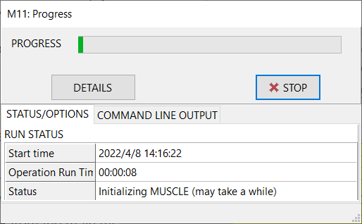
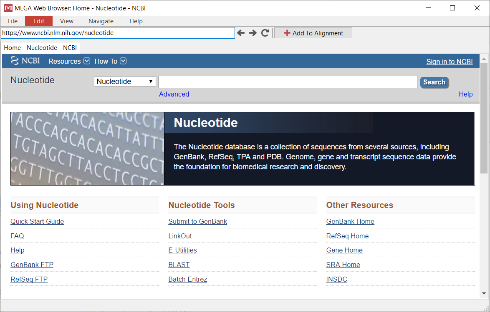

# 序列比对

- [序列比对](#序列比对)
  - [打开 Alignment](#打开-alignment)
  - [使用 ClustalW 比对序列](#使用-clustalw-比对序列)
  - [使用 Muscle 比对序列](#使用-muscle-比对序列)
  - [从 GenBank 获取数据](#从-genbank-获取数据)

2022-04-08, 13:58
****

## 打开 Alignment

`Alignment Explorer` 是 MEGA 用于构建和编辑序列比对的工具。示例：

- `Align | Edit/Build Alignment` 打开 `Alignment Explorer`
- 选择 `Create New Alignment`，弹窗提示选择序列类型

- 选择 `DNA`
- 在 `Alignment Explorer` 主菜单选择 `Data | Open | Retrieve sequences from File`，打开文件 "hsp20.fas"

## 使用 ClustalW 比对序列

MEGA 支持 ClustalW 和 Muscle 算法。使用 ClustalW 的方法如下：

- `Edit | Select All` 选择所有序列；
- `Alignment | Align by ClustalW` 使用 ClustalW 比对序列
- 点击 `OK`，即使用默认参数运行 ClusalW
- 比对完成后，使用 `Data | Save Session` 保存当前比对会话
- 使用 `Data | Exit Aln Explorer` 退出

## 使用 Muscle 比对序列

示例：

1. 从 MEGA 窗口开始，选择 `Align | Edit/Build Alignment`。选择 `Create a new alignment`，继续选择 `DNA`
2. 在 `Alignment Explorer` 窗口，选择 `Data | Open | Retrieve sequences from a file`，选择 `Chloroplast_Martin.meg` 文件
3. 选择 `Edit | Select All`
4. 在工具栏，找到那个秀肌肉的图标，就是 MUSCLE，点击运行。

弹窗显示当前进度。

## 从 GenBank 获取数据

示例：

- 选择 `Align | Edit/Build Alignment`
- 依次选择 `Create New Alignment`, `OK`, `DNA`
- `Web | Query Genbank` 打开 NCBI 页面

- 检索 `CFS`
- 选择所需序列
- 点击右上角的 `Add to Alignment`。
