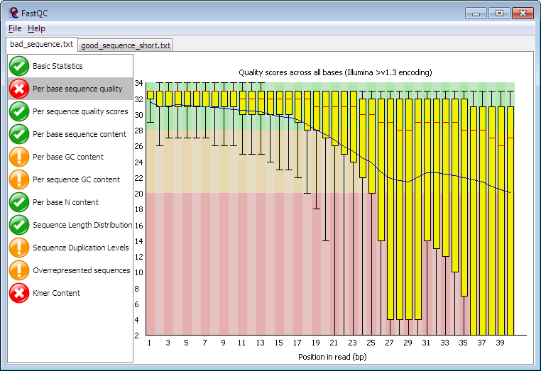

# FastQC 基本操作

- [FastQC 基本操作](#fastqc-基本操作)
  - [打开序列文件](#打开序列文件)
  - [评估结果](#评估结果)
  - [保存报告](#保存报告)

Last updated: 2023-03-28, 13:54
****

## 打开序列文件

在交互模式，选择 `File > Open` 打开一个或多个序列文件。

FastQC 支持以下格式文件：

- FastQ (所有编码变体)
- Casava FastaQ 文件
- Colorspace FastQ
- GZip compressed FastQ
- SAM
- BAM
- SAM/BAM Mapped only (normally used for colorspace data)

> **NOTE**
> Casava FastaQ 文件格式与常规 fastq 相同，只是将单个样本的数据拆分成多个文件。FastQC 会合并文件，为每个样本提供一个报告。此外，Casava FastaQ 会标记质量交叉的序列，在该模式 FastQC 会排除这些标记的序列。

FastQC 默认会根据输入文件名称猜测文件格式。以 .sam 或 .bam 记为的文件作为 sam/bam 文件打开，其它文件以 FastQ 格式处理。

## 评估结果

FastQC 的分析由一系列分析模块执行。主界面左侧或 HTML 报告的顶部显示了运行模块的摘要，按颜色分为：

- 正常（绿色勾）
- 轻微异常（橙色感叹）
- 不合格（红色叉叉）

> **NOTE**
> 虽然 FastQC 给出了结果，但是具体评估要结合文库进行。FastQC 认为正常样本是随机且多样的，但一些实验产生的文库会有一些偏向性。因此可以将 FastQC 报告看作指出不随机和多样化的地方。

## 保存报告

除了在交互式报告，FastQC 可以直接创建 HTML 格式的报告。

`File > Save Report` 保存报告。默认文件名为 fastq 文件+_fastqc.html。
