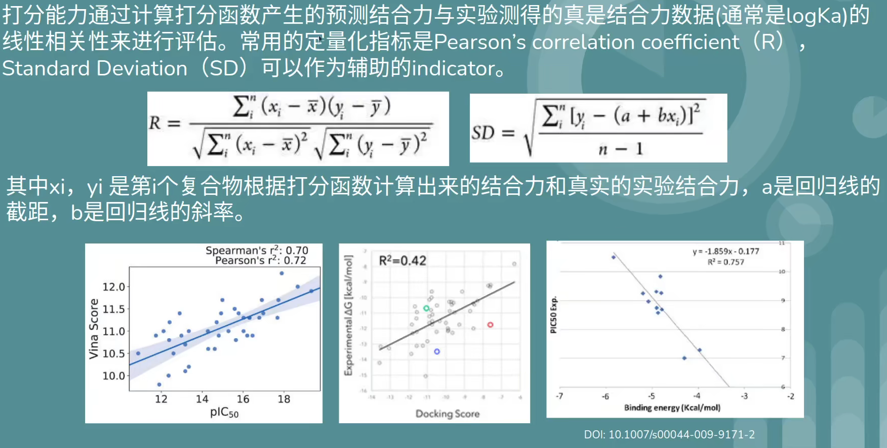

# Docking 软件

## 总结

LeDock, http://www.lephar.com/download.htm

HADDOCK 蛋白质-蛋白质复合物，精度很高。

rigid body 

- ZDOCK
- pyDock
- ClusPro

flexible server

- SwarmDock
- HADDOCK

Desta,I.T. et al. (2020) Performance and Its Limits in Rigid Body Protein-Protein Docking. Structure, 28, 1071-1081.e3.

性能：SwarmDock > ZDOCK

## SwarmDock

https://link.springer.com/protocol/10.1007/978-1-0716-0708-4_11

## 指标

原子位置的均方根偏差（Root-mean-square deviation, RMSD）

$$RMSD=\sqrt{\frac{1}{N}\sum_{i=1}^N \delta_i^2}$$

$\delta$ 是 n 对等原子之间的距离。

一般认为 RMSD < 2，就认为预测是成功的。

如图所示，最上面的三个就匹配很好，RMSD 都小于 2.

下图则将 2 A 作为阈值，小于 2A 才认为对接成功，从纵坐标看，在 2A 处纵坐标值越大，说明该预测软件的成功率越大。

还有下图这种形式，横坐标是 $RMSD < 2A$，Top 1 表示用打分最高的匹配，Top 2 表示打分前 2 的 2 个结果。

## 打分函数

|分类|函数|
|---|---|
|基于物理（力场）的打分函数|$$

R 值越接近 1，打分函数越好。

这里白线表示 R，紫色条带表示 90% 置信区间。

软件筛选：

- 首先，看哪些软件是可以用的
- 看 PDB 数据库有没有你分析蛋白的结晶结构
  - 如果有，对该晶体结构，使用所有软件进行 redocking
  - 看哪个软件 redocking 效果最好
- 如果没有晶体结构，但是有该蛋白的亲和性数据
  - 用每个软件进行 docking
  - 看哪个软件构效关系、对接打分和真实亲和数据更相关

## 对比

https://www.bilibili.com/video/BV1tV411B7Sn

本研究基于PBDbind数据库(2014版)的2002个蛋白-配体复合物结构，评估了10个对接软件的采样性能和评分性能。

(1)  GOLD和LeDock具有最好的采样性能(GOLD:59.8%的最高分pose准确率；LeDock:80.8%的最佳pose准确率)。

(2)  AutoDockVina、GOLD与MOE Dock的评分性能最好，最高分pose的rp/rs 分别是 0.564/0.580、0.500/0.515和0.569/0.589。

## 参考

- Pagadala,N.S. et al. (2017) Software for molecular docking: a review. Biophys Rev, 9, 91–102.
- https://www.computabio.com/molecular-docking-software.html
- https://click2drug.org/
- https://www.capri-docking.org/
