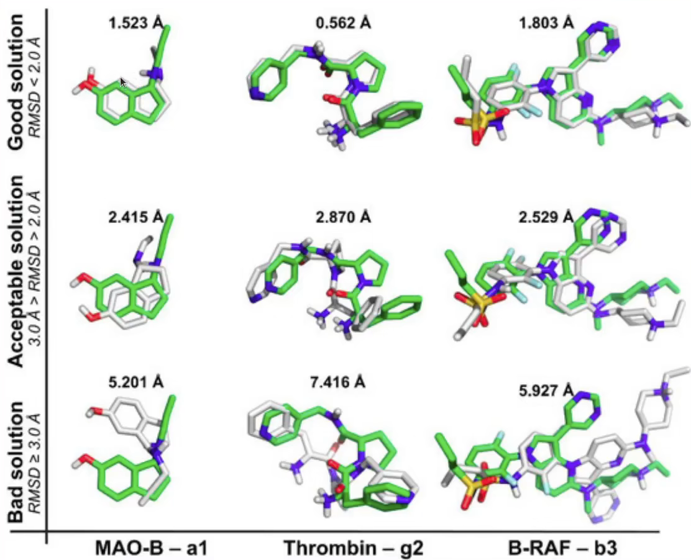
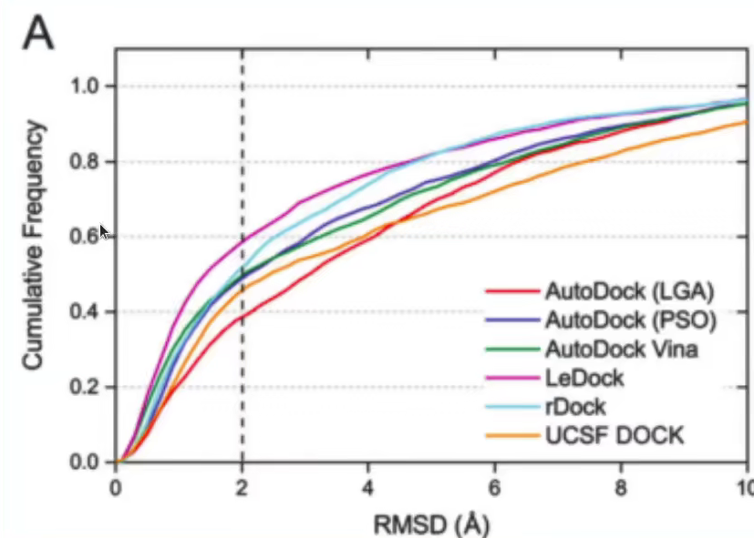
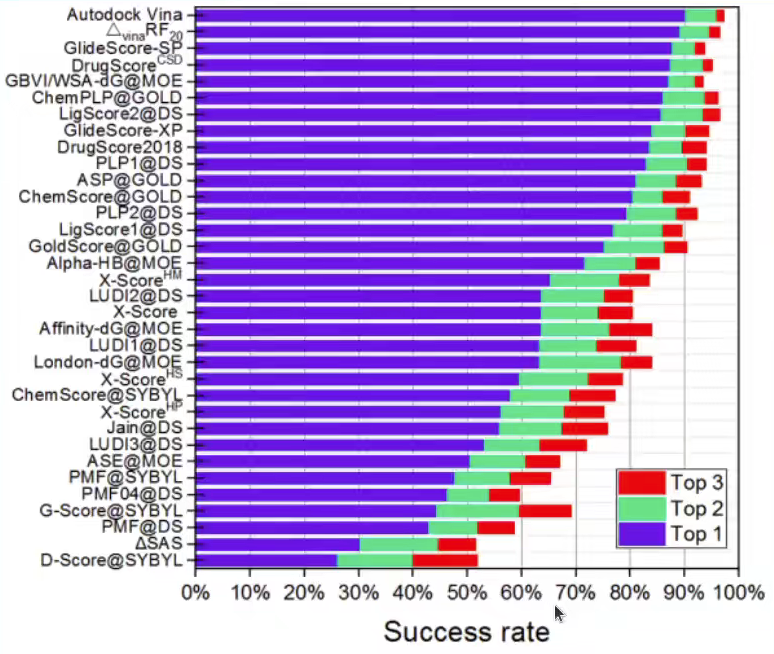
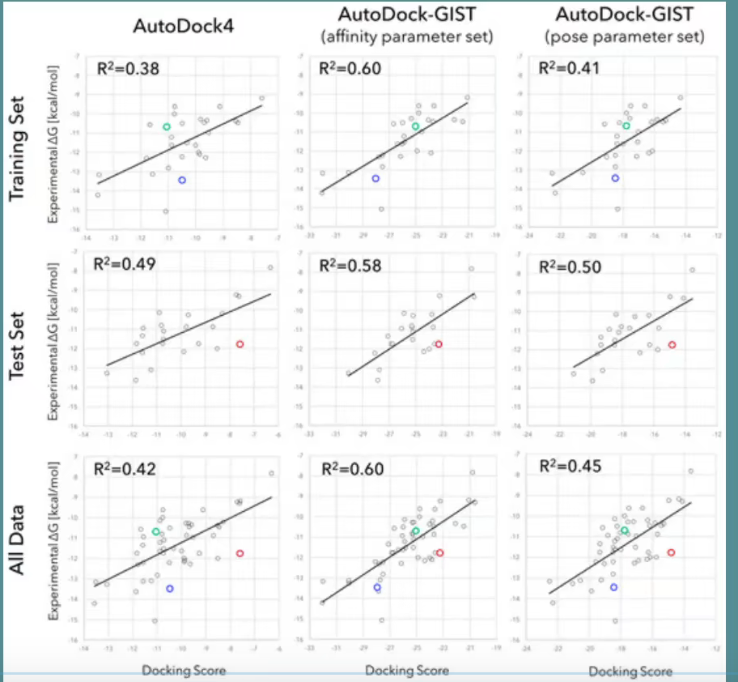
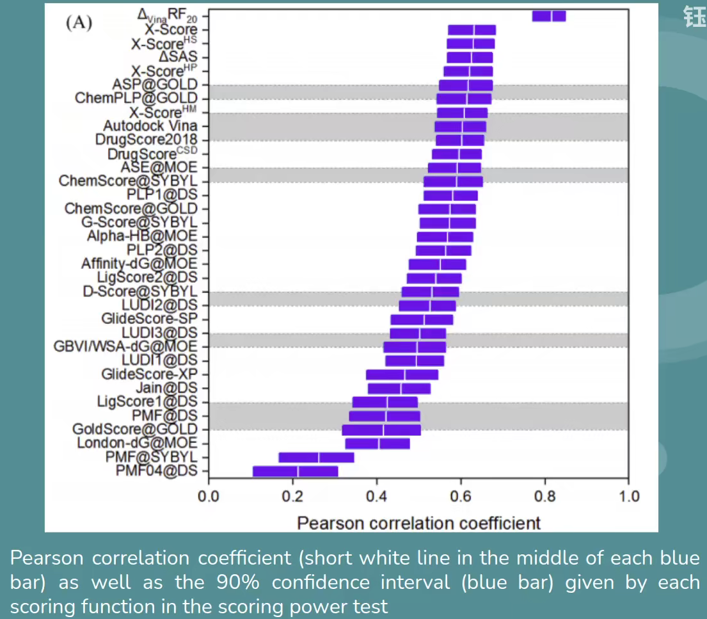

# Docking 软件

## 总结

http://www.vls3d.com/index.php/links/bioinformatics/protein-protein-interaction/protein-protein-docking

LeDock, http://www.lephar.com/download.htm

HADDOCK 蛋白质-蛋白质复合物，精度很高。

rigid body 

- ZDOCK
- pyDock
- ClusPro

flexible server

- SwarmDock
- HADDOCK

Desta,I.T. et al. (2020) Performance and Its Limits in Rigid Body Protein-Protein Docking. Structure, 28, 1071-1081.e3.

性能：SwarmDock > ZDOCK

## SwarmDock

https://link.springer.com/protocol/10.1007/978-1-0716-0708-4_11

## 指标

原子位置的均方根偏差（Root-mean-square deviation, RMSD）

$$RMSD=\sqrt{\frac{1}{N}\sum_{i=1}^N \delta_i^2}$$

$\delta$ 是 n 对等原子之间的距离。

一般认为 RMSD < 2，就认为预测是成功的。

如图所示，最上面的三个就匹配很好，RMSD 都小于 2.

下图则将 2 A 作为阈值，小于 2A 才认为对接成功，从纵坐标看，在 2A 处纵坐标值越大，说明该预测软件的成功率越大。

还有下图这种形式，横坐标是 $RMSD < 2A$，Top 1 表示用打分最高的匹配，Top 2 表示打分前 2 的 2 个结果。

## 打分函数

|分类|函数|
|---|---|
|基于物理（力场）的打分函数|$$

R 值越接近 1，打分函数越好。

这里白线表示 R，紫色条带表示 90% 置信区间。

软件筛选：

- 首先，看哪些软件是可以用的
- 看 PDB 数据库有没有你分析蛋白的结晶结构
  - 如果有，对该晶体结构，使用所有软件进行 redocking
  - 看哪个软件 redocking 效果最好
- 如果没有晶体结构，但是有该蛋白的亲和性数据
  - 用每个软件进行 docking
  - 看哪个软件构效关系、对接打分和真实亲和数据更相关

## 对比

https://www.bilibili.com/video/BV1tV411B7Sn

本研究基于PBDbind数据库(2014版)的2002个蛋白-配体复合物结构，评估了10个对接软件的采样性能和评分性能。

(1)  GOLD和LeDock具有最好的采样性能(GOLD:59.8%的最高分pose准确率；LeDock:80.8%的最佳pose准确率)。

(2)  AutoDockVina、GOLD与MOE Dock的评分性能最好，最高分pose的rp/rs 分别是 0.564/0.580、0.500/0.515和0.569/0.589。

## 蛋白-蛋白对接

Hex Protein Docking, ZDock, rDock 以及 Rosetta 等：

- Hex Protein Docking 算法复杂，耗时长
- ZDock 一般作为前期的初对接
- rDock 为 ZDock 的升级算法，一般将 ZDock 对接后的前几个得分构象使用 rDock 进行进一步对接
- Rosetta

蛋白-蛋白对接也分为柔性对接和刚性对接两种。

- 刚性对接中蛋白质的主链固定，只进行移动或转动，这种方法精度较低，但是耗时短，计算量小。在实际操作中可以用蒙特卡洛算法产生的大量随机来达到期望的精度；
- 柔性对接中两个蛋白质的主链进行移动程度的摆动，更加符合实际情况，但是这种方法耗时长，不过可以用较小样本量达到预定的精度。

## 参考

- Pagadala,N.S. et al. (2017) Software for molecular docking: a review. Biophys Rev, 9, 91–102.
- https://www.computabio.com/molecular-docking-software.html
- https://click2drug.org/
- https://www.capri-docking.org/

文献报道过的或者没报道过的分子对接软件有很多，很多最初都是由实验室开发，免费发布。当软件很完善，没有什么缺陷时，可能会被专门的商业软件公司购买，就变成了某个大型软件包中的模块。

其实不止分子对接软件，其他还有药效团软件、定量构效关系软件、数据库筛选软件等，都是这样的发展历程。不过，其中还是有一些实验室，在商品化大潮的影响下屹立不倒，依旧免费给我们提供免费的强大的软件，甚至是源代码（source code）。

1、AutoDock

据官方数据显示，autodock是引用文献最多的软件（Sousa, Fernandes & Ramos (2006) Protein-Ligand Docking: Current Status and Future Challenges Proteins, 65:15-26）。AutoDock向外提供源代码，只要下载协议单（license agreement），签名后传真发回，就可以获得下载链接和帐号信息。

这里有一些精美的小电影可以下载：http://autodock.scripps.edu/movies

官方主页：http://autodock.scripps.edu/

2、DOCK

DOCK也是以源代码发布，对学术用户免费。可以向官方发邮件申请，他们会返回一个下载链接和帐号，可以使用5次。当5次用完后，又出了新的版本，可再次用http://sohu.com信箱发邮件，声明想再多要一些登陆机会申请新版本，又获得5次机会。所以，大家如果对DOCK感兴趣，不妨发邮件，应该差不多，当然，如果用http://edu.cn的信箱，成功的几率会更大。

3、3D-DOCK

免费以源代码发布，分为三个部分：FTDock, RPScore，MultiDock。

4、FRED

是Openeye软件包中的一个模块。Openeye软件包对学术用户免费1年，普通用户可以申请2个月的试用期。只要在线申请就可以，不需要下载申请表打印签字发传真。FRED速度很快，在各种平台都可运行。

可以从这里申请试用版：http://www.eyesopen.com/forms/eval_request.phpOpeneye软件包中除了分子对接软件，还有数据库筛选软件，分子格式转化软件（Babel），图形可视化软件（Vida），溶剂化工具等。

官方主页：http://www.eyesopen.com/

5、Surflex

对学术用户免费。

官方主页：http://www.biopharmics.com/products.html

6、HEX

免费软件，由于了解有限，不多做介绍。

7、FlexX

是另一个运算速度超快的分子对接软件，收费。不过可以申请6周的试用版，速度很快。有独立运行版本，也有Sybyl软件包(Tripos Co. Ltd.)中的一个模块。

官方主页：http://www.biosolveit.de/FlexX/

8、Glide

收费软件，是Maestro软件包中的一个模块。运算速度也很快。

9、GOLD

收费软件，精度很好。以前可以申请2个月的试用版，不知现在是否还可以。

10、ICM

ICM-pro是很大型的软件包，收费，功能很强大，据说精度也很高。不过ICM-Browser是免费的，可以下载。

下载链接：http://www.molsoft.com/icm_browser.html官方主页：http://www.molsoft.com/index.html

11、MVD

官方数据表明是对接精度最好的软件，甚至要超过了Glide、Surflex、FlexX等软件。提供一个月的试用期。使用过感觉运行速度很慢，按默认设置，对接一个分子需要10分钟。

以上介绍的大多是进行大分子与小分子配体分子对接的软件。当然，其中的一些软件也可以做大分子的对接。越来越多的文献报道蛋白质－蛋白质和蛋白质－核酸的分子对接，比如ESCHER、MONTY、HADDOCK、Z-DOCK、HEX等软件，FTDOCK也可以做这方面的工作。如果有机会，会再做介绍。 作者：Studying9 https://www.bilibili.com/read/cv12756182 出处：bilibili