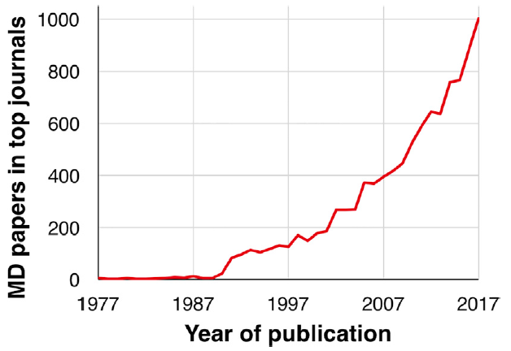
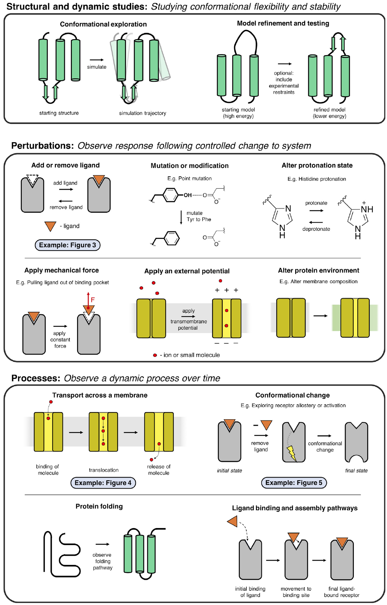

# 分子动力学模拟简介

- [分子动力学模拟简介](#分子动力学模拟简介)
  - [摘要](#摘要)
  - [简介](#简介)
  - [什么是 MD 模拟](#什么是-md-模拟)
  - [MD 模拟能提供什么信息](#md-模拟能提供什么信息)
  - [MD 如何推动进一步的实验工作](#md-如何推动进一步的实验工作)
  - [MD 模拟实用建议](#md-模拟实用建议)
  - [结论](#结论)
  - [参考](#参考)

2022-05-17, 22:34
***

## 摘要

近年来，分子动力学（molecular dynamics, MD）模拟在分子生物学和药物发现中应用越来越广泛。这些模拟以精细的时间分辨率捕获蛋白质和其它生物分子之间原子级相互作用。

在模拟速度、准确性和可用性上的改进，以及实验结构数据的增加，提高了生物分子模拟对实验人员的吸引力，这一趋势在神经科学尤为明显。模拟已被证实在解释蛋白质和其它生物分子作用机制、揭示疾病的结构基础、设计和优化小分子、多肽和蛋白质等发面具有重要价值。

下面，我们描述 MD 模拟可以提供的信息类型，以及它们通常辅助进一步实验工作的方式。

## 简介

分子动力学（MD）模拟基于原子间相互作用的物理模型预测蛋白质或其它分子中每个原子如何随时间移动。这种模拟可以捕捉各种生物分子过程，包括构象变化、配体结合和蛋白质折叠，以飞秒的时间分辨率揭示所有原子的位置。另外，MD 模拟还可以预测生物分子对诸如突变、磷酸化、质子化或配体的加入或移除等扰动在原子水平的反应。

MD 模拟通常与各种实验结构生物学技术结合使用，包括 X 射线晶体学、冷冻电子显微镜（cryo-EM）、核磁共振（NMR）、电子顺磁共振（EPR）以及 Forster 共振能量转移（FRET）等。

MD 模拟并不是一个新技术，在 1950s 末已有用 MD 模拟简单气体。蛋白质的第一次 MD 模拟在 1970s 末，使蛋白质模拟成为可能的基础工作获得 2013 年诺贝尔化学奖。近年来，特别是实验分子生物学方面，MD 模拟已经十分普遍。如下图所示：

> 结构生物学中 MD 模拟的增长。对影响因子排名前 250 的期刊，绘制在标题、摘要或关键字中包含 "molecular dynamics" 的出版物数量。

MD 模拟开始频繁地出现在结构生物学实验论文中，被用来解释实验结果和指导实验工作。这一趋势在神经科学领域中尤为明显，MD 模拟已被用于研究对神经元信号起关键作用的蛋白质、帮助开发针对神经系统的药物、揭示神经退行性疾病相关蛋白质聚集机制、并为改进光遗传工具的设计提供基础。

对 MD 模拟关注的提高至少有两个驱动力。首先，在过去几年例，对神经科学至关重要的某些分子的实验结构出现了爆炸式的增长，包括代表大多数神经科学药物治疗目标的分子家族。其中许多是膜蛋白，如离子通道、神经递质转运体和 G 蛋白偶联受体（GPCRs）。膜蛋白的晶体结构测定在历史上一直很困难，但最近晶体学上的突破已经提供了几十个这样的结构（2003 和  2012 年诺贝尔奖），cryo-EM 的突破（2017 年诺贝尔奖）进一步加快此类结构的解析。这些实验结构为 MD 模拟提供了一个起点，同时将焦点集中在 MD 能解决的结构问题上：关键的神经元蛋白如何起作用的，为什么蛋白质在一定条件下会发生病理性聚集，如何才能更好地进行基于结构的药物设计，如何更好地设计蛋白质来研究神经元功能（如光遗传学和成像）。

其次，MD 模拟在过去几年变得更加强大、可用。直到最近、大多使用 MD 模拟进行额高影响工作都需要超级计算机。最近引入的计算机硬件，特别是 GPU，允许在本地运行强大的模拟。执行 MD 模拟的软件包也更容易使用，为非专业人士提供了更好的支持。最后，尽管 MD 模拟的物理模型本质上时近似的，但它们实际上变得更加精确。

下面从实验结构或分子生物学角度来解释为什么 MD 模拟是有用的。包括可以通过模拟进行的研究类型，以及它们可能产生的信息类型。还讨论模拟如何产生新的实验可验证的假设，从而影响下一步的实验工作。最后，提供一个基础的 MD 模拟，解释使用它们的细节，并讨论它们的局限性。

## 什么是 MD 模拟

MD  模拟的基本思想很简单。给定生物分子系统中所有原子的位置（例如，被水和脂质双分子层包围的蛋白质），就可以计算出其它原子对每个原子施加的力。这样就可以使用牛顿运动定律来预测每个原子的空间位置相对时间的函数。具体来说，反复计算每个原子受到的力，然后利用这些力来更新每个原子的位置和速度。最终的轨迹，本质上是模拟每个时间间隔原子级的三维影片。

模拟之所以强大，有多个原因。首先，MD 模拟能够捕捉每个原子在每个时间点的位置和运动，实验技术是难以实现的。其次，模拟条件是确定的，可以精细控制：蛋白质的初始构象、与之结合的配体、是否有任何突变或翻译后修饰、它的环境是否有其它分子、质子化状态、温度、细胞膜上的电压等等。通过比较不同条件下进行的模拟，可以识别各种分子扰动的影响。

MD 模拟中的力是用分子力学力场的模型来计算的，这种模型适合于量子力学计算，通常也适合于某些实验测量。例如，一个典型的力场至少包含原子之间的静电相互作用、每个共价键的首选键长，以及原子间的其它相互作用。这种力场是近似的。将模拟与实验数据进行比较发现，力场在过去十年中有了很大改善，但仍不完善，在分析模拟结果时应考虑这些近似引入的不确定性。此外，在经典的 MD 模拟中，没有共价键的形成或断开。在量子力学/分子力学（quantum mechanics/molecular mechanics, QM/MM）模拟中，一小部分使用量子力学计算建模，其余部分使用 MD 模拟，这种模拟常用语研究涉及共价键变化或光吸收驱动的反应。

为了保证数值稳定性，MD 模拟的时间步长必须很短，通常为几个飞秒（$10^{-15}$）。大多数具有生物化学意义的事件，例如蛋白质中具有重要功能的结构变化，都发生在纳秒、微妙或更长的时间尺度上。因此，一个典型的模拟涉及上百万甚至上十亿个时间步。再加上单个时间步中数百万个原子之间的相互作用，导致模拟的计算要求非常高。

## MD 模拟能提供什么信息

MD 模拟可以回答许多类型的问题，如下图所示。

> MD 模拟常见的应用

MD 最基本和最直观的应用是评估生物分子不同区域的移动性或灵活性。实验结构测定方法，如 X 射线晶体衍射、cryo-EM 一般得到的是平均结构。通过对这些结构进行模拟，可以量化分子不同区域在平衡状态下移动的程度，以及结构波动的类型。这种模拟也可以揭示水分子和盐离子的动态行为，它们对蛋白质的功能和配体结合至关重要。

MD 模拟还可以用来测试建模结构的准确性，甚至可以对结构进行优化。例如，晶体结构受晶体堆积影响而出现错误，或者对膜蛋白来说，由于缺少脂质双分子层而出现错误。通常以晶体结构为起点开始模拟，配置适当的溶剂环境，并允许结构松弛到更有利的构象，从而纠正这些错误。还经常用类似的方法测试配体的结合姿势，一般来说在模拟中稳定的姿势更可能是准确的。

## MD 如何推动进一步的实验工作

在 2008 年的 GPCRs 的 Keystone 研讨会上，还没有提到计算方法。而十年后的 2018 年会议上，近一半的发言者都提到了计算方法（主要是 MD 模拟），包括前四位发言者，并且他们都是实验人员。

MD 的主要价值在于其能测试通过湿法实验（web-lab）很难或不可能探测的分子特性。在配体和蛋白质设计的应用中，模拟只是作为一个相对便宜但粗略的过滤器，根据结合能或稳定性对大量候选物质进行筛选获得一个较小的集合，再使用实验手段进行测试。更多时候，模拟用于辅助理解生物分子或药物如何工作。对这种情况，通常没有任何实验方法可以提供模拟相同的信息。不过可以设计实验来验证模拟预测的结果过。更重要的是，模拟可以产生新的假设，指导新的实验工作。下表列出了一些以各种方式影响实验工作的模拟例子。

|Study|Key MD Findings|Accompanying Experimental Validation|Experimental Follow-up Studies and Validation|
|---|---|---|---|
|Ma et al., 2000|describes the transient interdomain motions during the GroEL allosteric cycle|–|cryo-EM (Ranson et al., 2001)|
Beckstein et al., 2001	proposes a mechanism for hydrophobic gating in ion channels	–	electrophysiology (Birkner et al., 2012)
de Groot and Grubmüller, 2001, Tajkhorshid et al., 2002	describes the mechanism of water permeation through aquaporin	mutagenesis and activity assays	X-ray crystallography (Gonen et al., 2004, Törnroth-Horsefield et al., 2006)
Im and Roux, 2002a, Im and Roux, 2002b	identifies how anions and cations travel down two separate pathways across the OmpF pore	–	anomalous X-ray diffraction (Dhakshnamoorthy et al., 2010)
Schames et al., 2004	identifies a previously unobserved binding site on HIV integrase	–	small molecule design, pharmacokinetics (Hazuda et al., 2004)
Freites et al., 2006	reveals that the open-state KvAP channel in a membrane environment resembles a water channel	–	fluorescence spectroscopy, neutron diffraction (Krepkiy et al., 2009)
Cordero-Morales et al., 2007	development of a structural understanding of C-type inactivation of K+ channels	–	X-ray crystallography, electrophysiology (Cuello et al., 2010)
Arkin et al., 2007	development of an atomistic mechanism of an Na+/H+ antiporter	mutagenesis and bacterial growth	X-ray crystallography, electrophysiology (Lee et al., 2013, Mager et al., 2011)
Grabe et al., 2007, Vargas et al., 2011	describes the structural basis of voltage sensing through prediction of the resting-state conformation of the Kv channel	–	EPR, X-ray crystallography, electrophysiology, luminescence (Henrion et al., 2012, Kubota et al., 2017, Li et al., 2014)
Brannigan et al., 2008	describes a structural mechanism by which cholesterol binding stabilizes activation of the nicotinic acetylcholine receptor	–	X-ray crystallography, sequence analysis (Baier et al., 2011, Prevost et al., 2012)
Shi et al., 2008	identifies a second binding site in LeuT that helps to trigger release of Na+ and substrate	mutagenesis and binding assays	X-ray crystallography and binding assays (Quick et al., 2009)
Khafizov et al., 2012	identifies a second sodium binding site in the sodium-coupled betaine transporter BetP	X-ray crystallography, mutagenesis and binding assays, radiolabeling	X-ray crystallography, electrophysiology (Felts et al., 2014, Perez et al., 2014)
Dror et al., 2013	identifies the binding sites, binding poses, and molecular mechanism for allosteric modulators of the M2 muscarinic acetylcholine receptor	mutagenesis and activity assays, small molecule design	X-ray crystallography (Kruse et al., 2013)
Li et al., 2013	identifies transient water-conducting but substrate-occluding states that are found across membrane transporters	–	mutagenesis, physiology (Erokhova et al., 2016, Zeuthen et al., 2016)
Ostmeyer et al., 2013	recovery from C-type inactivation is due to buried water molecules behind the selectivity filter	electrophysiology	X-ray crystallography (Cuello et al., 2017)
Dror et al., 2015	identifies the structural mechanism by which GPCRs stimulate G proteins	protein engineering, DEER	NMR (Goricanec et al., 2016)
Hollingsworth et al., 2016, Hollingsworth and Poulos, 2015	reveals that the electron donor protein Pdx favors binding to the open conformation of cytochrome P450cam	isothermal titration calorimetry (ITC)	resonance Raman spectroscopy, mutagenesis and activity assays, DEER (Batabyal et al., 2016, Batabyal et al., 2017, Liou et al., 2017)
Dawe et al., 2016	determination of a structural mechanism of activation for AMPA neurotransmitter-gated ion channels	electrophysiology, X-ray crystallography	cryo-EM (Twomey et al., 2016, Zhao et al., 2016)
Bae et al., 2016	identifies a hydrophobic region of TRPV1 that functions as a heat sensor	NMR, electrophysiology, mutagenesis and activity assays	chimeric channel and activity assays (Zhang et al., 2018)
Bethel and Grabe, 2016	proposes a mechanism of lipid scrambling by TMEM16 scramblase	–	cryo-EM, mutagenesis, electrophysiology (Jiang et al., 2017, Paulino et al., 2017)
Latorraca et al., 2017	determines the structural mechanism of substrate translocation in an alternating access transporter	X-ray crystallography, mutagenesis and activity assays	–
Latorraca et al., 2018	reveals that arrestin can be activated through binding of the GPCR core, the GPCR phosphorylated tail, or both	fluorescence spectroscopy	mutagenesis, cellular imaging (Eichel et al., 2018)

## MD 模拟实用建议

实际上，执行 MD 模拟相对简单。

GPU 速度更快，成本适中。超算更快，成本更高。

力场一般使用各种版本的 AMBER, CHARMM 和 OPLS。这些力场依赖于相似的函数形式，每种都有各自的优缺点。例如，CHARMM36m 和互补的 CHARMM General Force Field (CGenFF)对蛋白质、脂质和药物类配体的参数进行了广泛优化和验证；A99SB-disp 力场模拟无序蛋白特别好；而 OPLS3 则对配体参数进行了最广泛的优化。

使用哪种软件？最常用的选择包括 GROMACS, NAMD, AMBER, CHARMM, Desmond 和 OpemMM。这里不要混淆了 AMBER 和 CHARMM 的软件和力场，目前大多数软件支持多个力场。这些软件执行类似的计算，但是在支持的硬件和特性有所不同，如加强的采样方法，温度和压力控制方案，对粗粒度模拟的支持等。

在进行模拟之前，需要添加缺失的原子来构建分子系统，包括晶体结构中通常不包含的氢原子，添加溶剂分子，如水、盐离子和脂质（对膜蛋白），并分配力场参数来准备分子系统。大多数常用的模拟软件包含准备分子系统的功能。

更大的挑战是决定执行哪些模型，包括使用哪些增强采用技术，以及分析结果。分析 MD 模拟结果困难主要有以下几个原因。模拟会产生大量的数据，一个典型的模拟可能会在数十亿个时间步上跟踪 100,000 个原子的位置和速度。识别这些数据中最相关以及生物学上最重要的数据很困难。在某些情况下，人们只对特定的定义明确的值感兴趣，如配体和蛋白质之间的相互作用能。然而，在许多情况下，如解析功能机制，难以预先指定信息量最大的属性和事件。

从模拟中提取

## 结论

我们相信，配合互补实验方法仔细应用 MD 模拟为神经科学等学习提供了巨大机会。随着模拟变得更快、更便宜、更普及以及更准确，这种机会只会增加。有效地将模拟应用于分子生物学和药物研发需要仔细考虑实验和计算可用数据，以从两个学科同时收益。

## 参考

1. Hollingsworth, S. A. & Dror, R. O. Molecular Dynamics Simulation for All. Neuron 99, 1129–1143 (2018).
